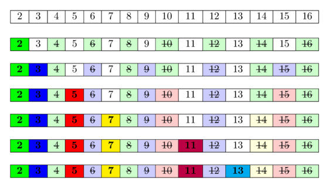

---
tags:
  - Translated
e_maxx_link: eratosthenes_sieve
---

# Sieve of Eratosthenes

Sieve of Eratosthenes is an algorithm for finding all the prime numbers in a segment $[1;n]$ using $O(n \log \log n)$ operations.

The algorithm is very simple:
at the beginning we write down all numbers between 2 and $n$.
We mark all proper multiples of 2 (since 2 is the smallest prime number) as composite.
A proper multiple of a number $x$, is a number greater than $x$ and divisible by $x$.
Then we find the next number that hasn't been marked as composite, in this case it is 3.
Which means 3 is prime, and we mark all proper multiples of 3 as composite.
The next unmarked number is 5, which is the next prime number, and we mark all proper multiples of it.
And we continue this procedure until we have processed all numbers in the row.

In the following image you can see a visualization of the algorithm for computing all prime numbers in the range $[1; 16]$. It can be seen, that quite often we mark numbers as composite multiple times.

<center></center>

The idea behind is this:
A number is prime, if none of the smaller prime numbers divides it.
Since we iterate over the prime numbers in order, we already marked all numbers, which are divisible by at least one of the prime numbers, as divisible.
Hence if we reach a cell and it is not marked, then it isn't divisible by any smaller prime number and therefore has to be prime.

## Implementation

```cpp
int n;
vector<bool> is_prime(n+1, true);
is_prime[0] = is_prime[1] = false;
for (int i = 2; i <= n; i++) {
    if (is_prime[i] && (long long)i * i <= n) {
        for (int j = i * i; j <= n; j += i)
            is_prime[j] = false;
    }
}
```

This code first marks all numbers except zero and one as potential prime numbers, then it begins the process of sifting composite numbers.
For this it iterates over all numbers from $2$ to $n$.
If the current number $i$ is a prime number, it marks all numbers that are multiples of $i$ as composite numbers, starting from $i^2$.
This is already an optimization over naive way of implementing it, and is allowed as all smaller numbers that are multiples of $i$ necessary also have a prime factor which is less than $i$, so all of them were already sifted earlier.
Since $i^2$ can easily overflow the type `int`, the additional verification is done using type `long long` before the second nested loop.

Using such implementation the algorithm consumes $O(n)$ of the memory (obviously) and performs $O(n \log \log n)$ (see next section).

## Asymptotic analysis

It's simple to prove a running time of $O(n \log n)$ without knowing anything about the distribution of primes - ignoring the `is_prime` check, the inner loop runs (at most) $n/i$ times for $i = 2, 3, 4, \dots$, leading the total number of operations in the inner loop to be a harmonic sum like $n(1/2 + 1/3 + 1/4 + \cdots)$, which is bounded by $O(n \log n)$.

Let's prove that algorithm's running time is $O(n \log \log n)$.
The algorithm will perform $\frac{n}{p}$ operations for every prime $p \le n$ in the inner loop.
Hence, we need to evaluate the next expression:

$$\sum_{\substack{p \le n, \\\ p \text{ prime}}} \frac n p = n \cdot \sum_{\substack{p \le n, \\\ p \text{ prime}}} \frac 1 p.$$

Let's recall two known facts.

  - The number of prime numbers less than or equal to $n$ is approximately $\frac n {\ln n}$.
  - The $k$-th prime number approximately equals $k \ln k$ (this follows from the previous fact).

Thus we can write down the sum in the following way:

$$\sum_{\substack{p \le n, \\\ p \text{ prime}}} \frac 1 p \approx \frac 1 2 + \sum_{k = 2}^{\frac n {\ln n}} \frac 1 {k \ln k}.$$

Here we extracted the first prime number 2 from the sum, because $k = 1$ in approximation $k \ln k$  is $0$ and causes a division by zero.

Now, let's evaluate this sum using the integral of a same function over $k$ from $2$ to $\frac n {\ln n}$ (we can make such approximation because, in fact, the sum is related to the integral as its approximation using the rectangle method):

$$\sum_{k = 2}^{\frac n {\ln n}} \frac 1 {k \ln k} \approx \int_2^{\frac n {\ln n}} \frac 1 {k \ln k} dk.$$

The antiderivative for the integrand is  $\ln \ln k$. Using a substitution and removing terms of lower order, we'll get the result:

$$\int_2^{\frac n {\ln n}} \frac 1 {k \ln k} dk = \ln \ln \frac n {\ln n} - \ln \ln 2 = \ln(\ln n - \ln \ln n) - \ln \ln 2 \approx \ln \ln n.$$

Now, returning to the original sum, we'll get its approximate evaluation:

$$\sum_{\substack{p \le n, \\\ p\ is\ prime}} \frac n p \approx n \ln \ln n + o(n).$$

You can find a more strict proof (that gives more precise evaluation which is accurate within constant multipliers) in the book authored by Hardy & Wright "An Introduction to the Theory of Numbers" (p. 349).

## Different optimizations of the Sieve of Eratosthenes

The biggest weakness of the algorithm is, that it "walks" along the memory multiple times, only manipulating single elements.
This is not very cache friendly.
And because of that, the constant which is concealed in $O(n \log \log n)$ is comparably big.

Besides, the consumed memory is a bottleneck for big $n$.

The methods presented below allow us to reduce the quantity of the performed operations, as well as to shorten the consumed memory noticeably.

### Sieving till root

Obviously, to find all the prime numbers until $n$, it will be enough just to perform the sifting only by the prime numbers, which do not exceed the root of $n$.

```cpp
int n;
vector<bool> is_prime(n+1, true);
is_prime[0] = is_prime[1] = false;
for (int i = 2; i * i <= n; i++) {
    if (is_prime[i]) {
        for (int j = i * i; j <= n; j += i)
            is_prime[j] = false;
    }
}
```

Such optimization doesn't affect the complexity (indeed, by repeating the proof presented above we'll get the evaluation $n \ln \ln \sqrt n + o(n)$, which is asymptotically the same according to the properties of logarithms), though the number of operations will reduce noticeably.

### Sieving by the odd numbers only

Since all even numbers (except $2$) are composite, we can stop checking even numbers at all. Instead, we need to operate with odd numbers only.

First, it will allow us to halve the needed memory. Second, it will reduce the number of operations performed by algorithm approximately in half.

### Memory consumption and speed of operations

We should notice, that these two implementations of the Sieve of Eratosthenes use $n$ bits of memory by using the data structure `vector<bool>`.
`vector<bool>` is not a regular container that stores a series of `bool` (as in most computer architectures a `bool` takes one byte of memory).
It's a memory-optimization specialization of `vector<T>`, that only consumes $\frac{N}{8}$ bytes of memory.

Modern processors architectures work much more efficiently with bytes than with bits as they usually cannot access bits directly.
So underneath the `vector<bool>` stores the bits in a large continuous memory, accesses the memory in blocks of a few bytes, and extracts/sets the bits with bit operations like bit masking and bit shifting.

Because of that there is a certain overhead when you read or write bits with a `vector<bool>`, and quite often using a `vector<char>` (which uses 1 byte for each entry, so 8x the amount of memory) is faster.

However, for the simple implementations of the Sieve of Eratosthenes using a `vector<bool>` is faster.
You are limited by how fast you can load the data into the cache, and therefore using less memory gives a big advantage.
A benchmark ([link](https://gist.github.com/jakobkogler/e6359ea9ced24fe304f1a8af3c9bee0e)) shows, that using a `vector<bool>` is between 1.4x and 1.7x faster than using a `vector<char>`.

The same considerations also apply to `bitset`.
It's also an efficient way of storing bits, similar to `vector<bool>`, so it takes only $\frac{N}{8}$ bytes of memory, but is a bit slower in accessing the elements.
In the benchmark above `bitset` performs a bit worse than `vector<bool>`.
Another drawback from `bitset` is that you need to know the size at compile time.

### Segmented Sieve

It follows from the optimization "sieving till root" that there is no need to keep the whole array `is_prime[1...n]` at all times.
For sieving it is enough to just keep the prime numbers until the root of $n$, i.e. `prime[1... sqrt(n)]`, split the complete range into blocks, and sieve each block separately.

Let $s$ be a constant which determines the size of the block, then we have $\lceil {\frac n s} \rceil$ blocks altogether, and the block $k$ ($k = 0 ... \lfloor {\frac n s} \rfloor$) contains the numbers in a segment $[ks; ks + s - 1]$.
We can work on blocks by turns, i.e. for every block $k$ we will go through all the prime numbers (from $1$ to $\sqrt n$) and perform sieving using them.
It is worth noting, that we have to modify the strategy a little bit when handling the first numbers: first, all the prime numbers from $[1; \sqrt n]$  shouldn't remove themselves; and second, the numbers $0$ and $1$ should be marked as non-prime numbers.
While working on the last block it should not be forgotten that the last needed number $n$ is not necessarily located at the end of the block.

As discussed previously, the typical implementation of the Sieve of Eratosthenes is limited by the speed how fast you can load data into the CPU caches.
By splitting the range of potential prime numbers $[1; n]$ into smaller blocks, we never have to keep multiple blocks in memory at the same time, and all operations are much more cache-friendlier.
As we are now no longer limited by the cache speeds, we can replace the `vector<bool>` with a `vector<char>`, and gain some additional performance as the processors can handle read and writes with bytes directly and don't need to rely on bit operations for extracting individual bits.
The benchmark ([link](https://gist.github.com/jakobkogler/e6359ea9ced24fe304f1a8af3c9bee0e)) shows, that using a `vector<char>` is about 3x faster in this situation than using a `vector<bool>`.
A word of caution: those numbers might differ depending on architecture, compiler, and optimization levels.

Here we have an implementation that counts the number of primes smaller than or equal to $n$ using block sieving.

```cpp
int count_primes(int n) {
    const int S = 10000;

    vector<int> primes;
    int nsqrt = sqrt(n);
    vector<char> is_prime(nsqrt + 2, true);
    for (int i = 2; i <= nsqrt; i++) {
        if (is_prime[i]) {
            primes.push_back(i);
            for (int j = i * i; j <= nsqrt; j += i)
                is_prime[j] = false;
        }
    }

    int result = 0;
    vector<char> block(S);
    for (int k = 0; k * S <= n; k++) {
        fill(block.begin(), block.end(), true);
        int start = k * S;
        for (int p : primes) {
            int start_idx = (start + p - 1) / p;
            int j = max(start_idx, p) * p - start;
            for (; j < S; j += p)
                block[j] = false;
        }
        if (k == 0)
            block[0] = block[1] = false;
        for (int i = 0; i < S && start + i <= n; i++) {
            if (block[i])
                result++;
        }
    }
    return result;
}
```

The running time of block sieving is the same as for regular sieve of Eratosthenes (unless the size of the blocks is very small), but the needed memory will shorten to $O(\sqrt{n} + S)$ and we have better caching results.
On the other hand, there will be a division for each pair of a block and prime number from $[1; \sqrt{n}]$, and that will be far worse for smaller block sizes.
Hence, it is necessary to keep balance when selecting the constant $S$.
We achieved the best results for block sizes between $10^4$ and $10^5$.

## Find primes in range

Sometimes we need to find all prime numbers in a range $[L,R]$ of small size (e.g. $R - L + 1 \approx 1e7$), where $R$ can be very large (e.g. $1e12$).

To solve such a problem, we can use the idea of the Segmented sieve.
We pre-generate all prime numbers up to $\sqrt R$, and use those primes to mark all composite numbers in the segment $[L, R]$.

```cpp
vector<char> segmentedSieve(long long L, long long R) {
    // generate all primes up to sqrt(R)
    long long lim = sqrt(R);
    vector<char> mark(lim + 1, false);
    vector<long long> primes;
    for (long long i = 2; i <= lim; ++i) {
        if (!mark[i]) {
            primes.emplace_back(i);
            for (long long j = i * i; j <= lim; j += i)
                mark[j] = true;
        }
    }

    vector<char> isPrime(R - L + 1, true);
    for (long long i : primes)
        for (long long j = max(i * i, (L + i - 1) / i * i); j <= R; j += i)
            isPrime[j - L] = false;
    if (L == 1)
        isPrime[0] = false;
    return isPrime;
}
```
Time complexity of this approach is $O((R - L + 1) \log \log (R) + \sqrt R \log \log \sqrt R)$.

It's also possible that we don't pre-generate all prime numbers:

```cpp
vector<char> segmentedSieveNoPreGen(long long L, long long R) {
    vector<char> isPrime(R - L + 1, true);
    long long lim = sqrt(R);
    for (long long i = 2; i <= lim; ++i)
        for (long long j = max(i * i, (L + i - 1) / i * i); j <= R; j += i)
            isPrime[j - L] = false;
    if (L == 1)
        isPrime[0] = false;
    return isPrime;
}
```

Obviously, the complexity is worse, which is $O((R - L + 1) \log (R) + \sqrt R)$. However, it still runs very fast in practice.

## Linear time modification

We can modify the algorithm in a such a way, that it only has linear time complexity.
This approach is described in the article [Linear Sieve](prime-sieve-linear.md).
However, this algorithm also has its own weaknesses.

## Practice Problems

* [Leetcode - Four Divisors](https://leetcode.com/problems/four-divisors/)
* [Leetcode - Count Primes](https://leetcode.com/problems/count-primes/)
* [SPOJ - Printing Some Primes](http://www.spoj.com/problems/TDPRIMES/)
* [SPOJ - A Conjecture of Paul Erdos](http://www.spoj.com/problems/HS08PAUL/)
* [SPOJ - Primal Fear](http://www.spoj.com/problems/VECTAR8/)
* [SPOJ - Primes Triangle (I)](http://www.spoj.com/problems/PTRI/)
* [Codeforces - Almost Prime](http://codeforces.com/contest/26/problem/A)
* [Codeforces - Sherlock And His Girlfriend](http://codeforces.com/contest/776/problem/B)
* [SPOJ - Namit in Trouble](http://www.spoj.com/problems/NGIRL/)
* [SPOJ - Bazinga!](http://www.spoj.com/problems/DCEPC505/)
* [Project Euler - Prime pair connection](https://www.hackerrank.com/contests/projecteuler/challenges/euler134)
* [SPOJ - N-Factorful](http://www.spoj.com/problems/NFACTOR/)
* [SPOJ - Binary Sequence of Prime Numbers](http://www.spoj.com/problems/BSPRIME/)
* [UVA 11353 - A Different Kind of Sorting](https://uva.onlinejudge.org/index.php?option=com_onlinejudge&Itemid=8&page=show_problem&problem=2338)
* [SPOJ - Prime Generator](http://www.spoj.com/problems/PRIME1/)
* [SPOJ - Printing some primes (hard)](http://www.spoj.com/problems/PRIMES2/)
* [Codeforces - Nodbach Problem](https://codeforces.com/problemset/problem/17/A)
* [Codeforces - Colliders](https://codeforces.com/problemset/problem/154/B)
