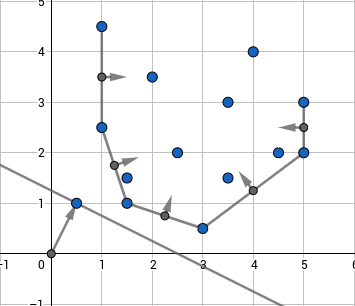

---
tags:
  - Original
---

# Convex hull trick and Li Chao tree

Consider the following problem. There are $n$ cities. You want to travel from city $1$ to city $n$ by car. To do this you have to buy some gasoline. It is known that a liter of gasoline costs $cost_k$ in the $k^{th}$ city. Initially your fuel tank is empty and you spend one liter of gasoline per kilometer. Cities are located on the same line in ascending order with $k^{th}$ city having coordinate $x_k$. Also you have to pay $toll_k$ to enter $k^{th}$ city. Your task is to make the trip with minimum possible cost. It's obvious that the solution can be calculated via dynamic programming:

$$dp_i = toll_i+\min\limits_{j<i}(cost_j \cdot (x_i - x_j)+dp_j)$$

Naive approach will give you $O(n^2)$ complexity which can be improved to $O(n \log n)$ or $O(n \log [C \varepsilon^{-1}])$ where $C$ is largest possible $|x_i|$ and $\varepsilon$ is precision with which $x_i$ is considered ($\varepsilon = 1$ for integers which is usually the case). To do this one should note that the problem can be reduced to adding linear functions $k \cdot x + b$ to the set and finding minimum value of the functions in some particular point $x$. There are two main approaches one can use here.

## Convex hull trick

The idea of this approach is to maintain a lower convex hull of linear functions.
Actually it would be a bit more convenient to consider them not as linear functions, but as points $(k;b)$ on the plane such that we will have to find the point which has the least dot product with a given point $(x;1)$, that is, for this point $kx+b$ is minimized which is the same as initial problem.
Such minimum will necessarily be on lower convex envelope of these points as can be seen below:

<center>  </center>

One has to keep points on the convex hull and normal vectors of the hull's edges.
When you have a $(x;1)$ query you'll have to find the normal vector closest to it in terms of angles between them, then the optimum linear function will correspond to one of its endpoints.
To see that, one should note that points having a constant dot product with $(x;1)$ lie on a line which is orthogonal to $(x;1)$, so the optimum linear function will be the one in which tangent to convex hull which is collinear with normal to $(x;1)$ touches the hull.
This point is the one such that normals of edges lying to the left and to the right of it are headed in different sides of $(x;1)$.

This approach is useful when queries of adding linear functions are monotone in terms of $k$ or if we work offline, i.e. we may firstly add all linear functions and answer queries afterwards.
So we cannot solve the cities/gasoline problems using this way.
That would require handling online queries.
When it comes to deal with online queries however, things will go tough and one will have to use some kind of set data structure to implement a proper convex hull.
Online approach will however not be considered in this article due to its hardness and because second approach (which is Li Chao tree) allows to solve the problem way more simply.
Worth mentioning that one can still use this approach online without complications by square-root-decomposition.
That is, rebuild convex hull from scratch each $\sqrt n$ new lines. 

To implement this approach one should begin with some geometric utility functions, here we suggest to use the C++ complex number type.

```cpp
typedef int ftype;
typedef complex<ftype> point;
#define x real
#define y imag
 
ftype dot(point a, point b) {
	return (conj(a) * b).x();
}
 
ftype cross(point a, point b) {
	return (conj(a) * b).y();
}
```

Here we will assume that when linear functions are added, their $k$ only increases and we want to find minimum values.
We will keep points in vector $hull$ and normal vectors in vector $vecs$.
When we add a new point, we have to look at the angle formed between last edge in convex hull and vector from last point in convex hull to new point.
This angle has to be directed counter-clockwise, that is the dot product of the last normal vector in the hull (directed inside hull) and the vector from the last point to the new one has to be non-negative.
As long as this isn't true, we should erase the last point in the convex hull alongside with the corresponding edge.

```cpp
vector<point> hull, vecs;
 
void add_line(ftype k, ftype b) {
    point nw = {k, b};
    while(!vecs.empty() && dot(vecs.back(), nw - hull.back()) < 0) {
        hull.pop_back();
        vecs.pop_back();
    }
    if(!hull.empty()) {
        vecs.push_back(1i * (nw - hull.back()));
    }
    hull.push_back(nw);
}
 
```
Now to get the minimum value in some point we will find the first normal vector in the convex hull that is directed counter-clockwise from $(x;1)$. The left endpoint of such edge will be the answer. To check if vector $a$ is not directed counter-clockwise of vector $b$, we should check if their cross product $[a,b]$ is positive.
```cpp
int get(ftype x) {
    point query = {x, 1};
    auto it = lower_bound(vecs.begin(), vecs.end(), query, [](point a, point b) {
        return cross(a, b) > 0;
    });
    return dot(query, hull[it - vecs.begin()]);
}
```

## Li Chao tree

Assume you're given a set of functions such that each two can intersect at most once. Let's keep in each vertex of a segment tree some function in such way, that if we go from root to the leaf it will be guaranteed that one of the functions we met on the path will be the one giving the minimum value in that leaf. Let's see how to construct it.

Assume we're in some vertex corresponding to half-segment $[l,r)$ and the function $f_{old}$ is kept there and we add the function $f_{new}$. Then the intersection point will be either in $[l;m)$ or in $[m;r)$ where $m=\left\lfloor\tfrac{l+r}{2}\right\rfloor$. We can efficiently find that out by comparing the values of the functions in points $l$ and $m$. If the dominating function changes, then it is in $[l;m)$ otherwise it is in $[m;r)$. Now for the half of the segment with no intersection we will pick the lower function and write it in the current vertex. You can see that it will always be the one which is lower in point $m$. After that we recursively go to the other half of the segment with the function which was the upper one. As you can see this will keep correctness on the first half of segment and in the other one correctness will be maintained during the recursive call. Thus we can add functions and check the minimum value in the point in $O(\log [C\varepsilon^{-1}])$.

Here is the illustration of what is going on in the vertex when we add new function:

<center></center>

Let's go to implementation now. Once again we will use complex numbers to keep linear functions.

```{.cpp file=lichaotree_line_definition}
typedef long long ftype;
typedef complex<ftype> point;
#define x real
#define y imag
 
ftype dot(point a, point b) {
    return (conj(a) * b).x();
}
 
ftype f(point a,  ftype x) {
    return dot(a, {x, 1});
}
```
We will keep functions in the array $line$ and use binary indexing of the segment tree. If you want to use it on large numbers or doubles, you should use a dynamic segment tree. 
The segment tree should be initialized with default values, e.g. with lines $0x + \infty$.

```{.cpp file=lichaotree_addline}
const int maxn = 2e5;
 
point line[4 * maxn];
 
void add_line(point nw, int v = 1, int l = 0, int r = maxn) {
    int m = (l + r) / 2;
    bool lef = f(nw, l) < f(line[v], l);
    bool mid = f(nw, m) < f(line[v], m);
    if(mid) {
        swap(line[v], nw);
    }
    if(r - l == 1) {
        return;
    } else if(lef != mid) {
        add_line(nw, 2 * v, l, m);
    } else {
        add_line(nw, 2 * v + 1, m, r);
    }
}
```
Now to get the minimum in some point $x$ we simply choose the minimum value along the path to the point.
```{.cpp file=lichaotree_getminimum}
ftype get(int x, int v = 1, int l = 0, int r = maxn) {
    int m = (l + r) / 2;
    if(r - l == 1) {
        return f(line[v], x);
    } else if(x < m) {
        return min(f(line[v], x), get(x, 2 * v, l, m));
    } else {
        return min(f(line[v], x), get(x, 2 * v + 1, m, r));
    }
}
```

## Problems

* [Codebreaker - TROUBLES](https://codeforces.com/gym/103536/problem/B) (simple application of Convex Hull Trick after a couple of observations)
* [CS Academy - Squared Ends](https://csacademy.com/contest/archive/task/squared-ends)
* [Codeforces - Escape Through Leaf](http://codeforces.com/contest/932/problem/F)
* [CodeChef - Polynomials](https://www.codechef.com/NOV17/problems/POLY)
* [Codeforces - Kalila and Dimna in the Logging Industry](https://codeforces.com/problemset/problem/319/C)
* [Codeforces - Product Sum](https://codeforces.com/problemset/problem/631/E)
* [Codeforces - Bear and Bowling 4](https://codeforces.com/problemset/problem/660/F)
* [APIO 2010 - Commando](https://dmoj.ca/problem/apio10p1)
