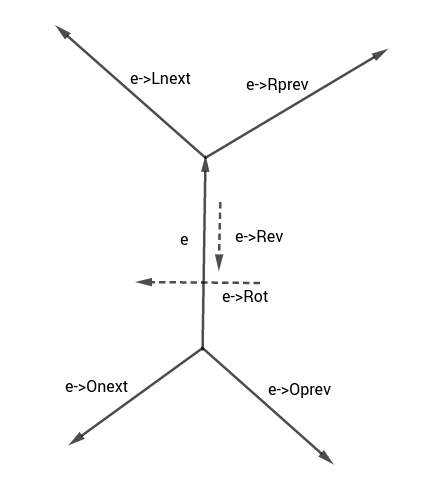

---
tags:
  - Translated
e_maxx_link: voronoi_diagram_2d_n4
---

# Delaunay triangulation and Voronoi diagram

Consider a set $\{p_i\}$ of points on the plane.
A **Voronoi diagram** $V(\{p_i\})$ of $\{p_i\}$ is a partition of the plane into $n$ regions $V_i$, where $V_i = \{p\in\mathbb{R}^2;\ \rho(p, p_i) = \min\ \rho(p, p_k)\}$.
The cells of the Voronoi diagram are polygons (possibly infinite).
A **Delaunay triangulation** $D(\{p_i\})$ of $\{p_i\}$ is a triangulation where every point $p_i$ is outside or on the boundary of the circumcircle of each triangle $T \in D(\{p_i\})$.

There is a nasty degenerated case when the Voronoi diagram isn't connected and Delaunay triangulation doesn't exist. This case is when all points are collinear.

## Properties

The Delaunay triangulation maximizes the minimum angle among all possible triangulations.

The Minimum Euclidean spanning tree of a point set is a subset of edges of its' Delaunay triangulation.

## Duality

Suppose that $\{p_i\}$ is not collinear and among $\{p_i\}$ no four points lie on one circle. Then $V(\{p_i\})$ and $D(\{p_i\})$ are dual, so if we obtain one of them, we may obtain the other in $O(n)$. What to do if it's not the case? The collinear case may be processed easily. Otherwise, $V$ and $D'$ are dual, where $D'$ is obtained from $D$ by removing all the edges such that two triangles on this edge share the circumcircle.

## Building Delaunay and Voronoi

Because of the duality, we only need a fast algorithm to compute only one of $V$ and $D$. We will describe how to build $D(\{p_i\})$ in $O(n\log n)$. The triangulation will be built via divide-and-conquer algorithm due to Guibas and Stolfi.

## Quad-edge data structure

During the algorithm $D$ will be stored inside the quad-edge data structure. This structure is described in the picture:
<center></center>

In the algorithm we will use the following functions on edges:

  1. `make_edge(a, b)`<br>
    This function creates an isolated edge from point `a` to point `b` together with its' reverse edge and both dual edges.
  2. `splice(a, b)`<br>
    This is a key function of the algorithm. It swaps `a->Onext` with `b->Onext` and `a->Onext->Rot->Onext` with `b->Onext->Rot->Onext`.
  3. `delete_edge(e)`<br>
    This function deletes e from the triangulation. To delete `e`, we may simply call `splice(e, e->Oprev)` and `splice(e->Rev, e->Rev->Oprev)`.
  4. `connect(a, b)`<br>
    This function creates a new edge `e` from `a->Dest` to `b->Org` in such a way that `a`, `b`, `e` all have the same left face. To do this, we call `e = make_edge(a->Dest, b->Org)`, `splice(e, a->Lnext)` and `splice(e->Rev, b)`.

## Algorithm

The algorithm will compute the triangulation and return two quad-edges: the counterclockwise convex hull edge out of the leftmost vertex and the clockwise convex hull edge out of the rightmost vertex.

Let's sort all points by x, and if $x_1 = x_2$ then by y. Let's solve the problem for some segment $(l, r)$ (initially $(l, r) = (0, n - 1)$). If $r - l + 1 = 2$, we will add an edge $(p[l], p[r])$ and return. If $r - l + 1 = 3$, we will firstly add the edges $(p[l], p[l + 1])$ and $(p[l + 1], p[r])$. We must also connect them using `splice(a->Rev, b)`. Now we must close the triangle. Our next action will depend on the orientation of $p[l], p[l + 1], p[r]$. If they are collinear, we can't make a triangle, so we simply return `(a, b->Rev)`. Otherwise, we create a new edge `c` by calling `connect(b, a)`. If the points are oriented counter-clockwise, we return `(a, b->Rev)`. Otherwise we return `(c->Rev, c)`.

Now suppose that $r - l + 1 \ge 4$. Firstly, let's solve $L = (l, \frac{l + r}{2})$ and $R = (\frac{l + r}{2} + 1, r)$ recursively. Now we have to merge these triangulations into one triangulation. Note that our points are sorted, so while merging we will add edges from L to R (so-called _cross_ edges) and remove some edges from L to L and from R to R.
What is the structure of the cross edges? All these edges must cross a line parallel to the y-axis and placed at the splitting x value. This establishes a linear ordering of the cross edges, so we can talk about successive cross edges, the bottom-most cross edge, etc. The algorithm will add the cross edges in ascending order. Note that any two adjacent cross edges will have a common endpoint, and the third side of the triangle they define goes from L to L or from R to R. Let's call the current cross edge the base. The successor of the base will either go from the left endpoint of the base to one of the R-neighbors of the right endpoint or vice versa.
Consider the circumcircle of base and the previous cross edge.
Suppose this circle is transformed into other circles having base as a chord but lying further into the Oy direction.
Our circle will go up for a while, but unless base is an upper tangent of L and R we will encounter a point belonging either to L or to R giving rise to a new triangle without any points in the circumcircle.
The new L-R edge of this triangle is the next cross edge added.
To do this efficiently, we compute two edges `lcand` and `rcand` so that `lcand` points to the first L point encountered in this process, and `rcand` points to the first R point.
Then we choose the one that would be encountered first. Initially base points to the lower tangent of L and R.

## Implementation

Note that the implementation of the in_circle function is GCC-specific.

```{.cpp file=delaunay}
typedef long long ll;

bool ge(const ll& a, const ll& b) { return a >= b; }
bool le(const ll& a, const ll& b) { return a <= b; }
bool eq(const ll& a, const ll& b) { return a == b; }
bool gt(const ll& a, const ll& b) { return a > b; }
bool lt(const ll& a, const ll& b) { return a < b; }
int sgn(const ll& a) { return a >= 0 ? a ? 1 : 0 : -1; }

struct pt {
    ll x, y;
    pt() { }
    pt(ll _x, ll _y) : x(_x), y(_y) { }
    pt operator-(const pt& p) const {
        return pt(x - p.x, y - p.y);
    }
    ll cross(const pt& p) const {
        return x * p.y - y * p.x;
    }
    ll cross(const pt& a, const pt& b) const {
        return (a - *this).cross(b - *this);
    }
    ll dot(const pt& p) const {
        return x * p.x + y * p.y;
    }
    ll dot(const pt& a, const pt& b) const {
        return (a - *this).dot(b - *this);
    }
    ll sqrLength() const {
        return this->dot(*this);
    }
    bool operator==(const pt& p) const {
        return eq(x, p.x) && eq(y, p.y);
    }
};

const pt inf_pt = pt(1e18, 1e18);

struct QuadEdge {
    pt origin;
    QuadEdge* rot = nullptr;
    QuadEdge* onext = nullptr;
    bool used = false;
    QuadEdge* rev() const {
        return rot->rot;
    }
    QuadEdge* lnext() const {
        return rot->rev()->onext->rot;
    }
    QuadEdge* oprev() const {
        return rot->onext->rot;
    }
    pt dest() const {
        return rev()->origin;
    }
};

QuadEdge* make_edge(pt from, pt to) {
    QuadEdge* e1 = new QuadEdge;
    QuadEdge* e2 = new QuadEdge;
    QuadEdge* e3 = new QuadEdge;
    QuadEdge* e4 = new QuadEdge;
    e1->origin = from;
    e2->origin = to;
    e3->origin = e4->origin = inf_pt;
    e1->rot = e3;
    e2->rot = e4;
    e3->rot = e2;
    e4->rot = e1;
    e1->onext = e1;
    e2->onext = e2;
    e3->onext = e4;
    e4->onext = e3;
    return e1;
}

void splice(QuadEdge* a, QuadEdge* b) {
    swap(a->onext->rot->onext, b->onext->rot->onext);
    swap(a->onext, b->onext);
}

void delete_edge(QuadEdge* e) {
    splice(e, e->oprev());
    splice(e->rev(), e->rev()->oprev());
    delete e->rev()->rot;
    delete e->rev();
    delete e->rot;
    delete e;
}

QuadEdge* connect(QuadEdge* a, QuadEdge* b) {
    QuadEdge* e = make_edge(a->dest(), b->origin);
    splice(e, a->lnext());
    splice(e->rev(), b);
    return e;
}

bool left_of(pt p, QuadEdge* e) {
    return gt(p.cross(e->origin, e->dest()), 0);
}

bool right_of(pt p, QuadEdge* e) {
    return lt(p.cross(e->origin, e->dest()), 0);
}

template <class T>
T det3(T a1, T a2, T a3, T b1, T b2, T b3, T c1, T c2, T c3) {
    return a1 * (b2 * c3 - c2 * b3) - a2 * (b1 * c3 - c1 * b3) +
           a3 * (b1 * c2 - c1 * b2);
}

bool in_circle(pt a, pt b, pt c, pt d) {
// If there is __int128, calculate directly.
// Otherwise, calculate angles.
#if defined(__LP64__) || defined(_WIN64)
    __int128 det = -det3<__int128>(b.x, b.y, b.sqrLength(), c.x, c.y,
                                   c.sqrLength(), d.x, d.y, d.sqrLength());
    det += det3<__int128>(a.x, a.y, a.sqrLength(), c.x, c.y, c.sqrLength(), d.x,
                          d.y, d.sqrLength());
    det -= det3<__int128>(a.x, a.y, a.sqrLength(), b.x, b.y, b.sqrLength(), d.x,
                          d.y, d.sqrLength());
    det += det3<__int128>(a.x, a.y, a.sqrLength(), b.x, b.y, b.sqrLength(), c.x,
                          c.y, c.sqrLength());
    return det > 0;
#else
    auto ang = [](pt l, pt mid, pt r) {
        ll x = mid.dot(l, r);
        ll y = mid.cross(l, r);
        long double res = atan2((long double)x, (long double)y);
        return res;
    };
    long double kek = ang(a, b, c) + ang(c, d, a) - ang(b, c, d) - ang(d, a, b);
    if (kek > 1e-8)
        return true;
    else
        return false;
#endif
}

pair<QuadEdge*, QuadEdge*> build_tr(int l, int r, vector<pt>& p) {
    if (r - l + 1 == 2) {
        QuadEdge* res = make_edge(p[l], p[r]);
        return make_pair(res, res->rev());
    }
    if (r - l + 1 == 3) {
        QuadEdge *a = make_edge(p[l], p[l + 1]), *b = make_edge(p[l + 1], p[r]);
        splice(a->rev(), b);
        int sg = sgn(p[l].cross(p[l + 1], p[r]));
        if (sg == 0)
            return make_pair(a, b->rev());
        QuadEdge* c = connect(b, a);
        if (sg == 1)
            return make_pair(a, b->rev());
        else
            return make_pair(c->rev(), c);
    }
    int mid = (l + r) / 2;
    QuadEdge *ldo, *ldi, *rdo, *rdi;
    tie(ldo, ldi) = build_tr(l, mid, p);
    tie(rdi, rdo) = build_tr(mid + 1, r, p);
    while (true) {
        if (left_of(rdi->origin, ldi)) {
            ldi = ldi->lnext();
            continue;
        }
        if (right_of(ldi->origin, rdi)) {
            rdi = rdi->rev()->onext;
            continue;
        }
        break;
    }
    QuadEdge* basel = connect(rdi->rev(), ldi);
    auto valid = [&basel](QuadEdge* e) { return right_of(e->dest(), basel); };
    if (ldi->origin == ldo->origin)
        ldo = basel->rev();
    if (rdi->origin == rdo->origin)
        rdo = basel;
    while (true) {
        QuadEdge* lcand = basel->rev()->onext;
        if (valid(lcand)) {
            while (in_circle(basel->dest(), basel->origin, lcand->dest(),
                             lcand->onext->dest())) {
                QuadEdge* t = lcand->onext;
                delete_edge(lcand);
                lcand = t;
            }
        }
        QuadEdge* rcand = basel->oprev();
        if (valid(rcand)) {
            while (in_circle(basel->dest(), basel->origin, rcand->dest(),
                             rcand->oprev()->dest())) {
                QuadEdge* t = rcand->oprev();
                delete_edge(rcand);
                rcand = t;
            }
        }
        if (!valid(lcand) && !valid(rcand))
            break;
        if (!valid(lcand) ||
            (valid(rcand) && in_circle(lcand->dest(), lcand->origin,
                                       rcand->origin, rcand->dest())))
            basel = connect(rcand, basel->rev());
        else
            basel = connect(basel->rev(), lcand->rev());
    }
    return make_pair(ldo, rdo);
}

vector<tuple<pt, pt, pt>> delaunay(vector<pt> p) {
    sort(p.begin(), p.end(), [](const pt& a, const pt& b) {
        return lt(a.x, b.x) || (eq(a.x, b.x) && lt(a.y, b.y));
    });
    auto res = build_tr(0, (int)p.size() - 1, p);
    QuadEdge* e = res.first;
    vector<QuadEdge*> edges = {e};
    while (lt(e->onext->dest().cross(e->dest(), e->origin), 0))
        e = e->onext;
    auto add = [&p, &e, &edges]() {
        QuadEdge* curr = e;
        do {
            curr->used = true;
            p.push_back(curr->origin);
            edges.push_back(curr->rev());
            curr = curr->lnext();
        } while (curr != e);
    };
    add();
    p.clear();
    int kek = 0;
    while (kek < (int)edges.size()) {
        if (!(e = edges[kek++])->used)
            add();
    }
    vector<tuple<pt, pt, pt>> ans;
    for (int i = 0; i < (int)p.size(); i += 3) {
        ans.push_back(make_tuple(p[i], p[i + 1], p[i + 2]));
    }
    return ans;
}
```

## Problems
 * [TIMUS 1504 Good Manners](http://acm.timus.ru/problem.aspx?space=1&num=1504)
 * [TIMUS 1520 Empire Strikes Back](http://acm.timus.ru/problem.aspx?space=1&num=1520)
 * [SGU 383 Caravans](https://codeforces.com/problemsets/acmsguru/problem/99999/383)
