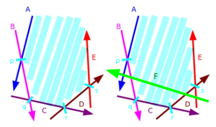

---
tags:
  - Original
---

# Half-plane intersection

In this article we will discuss the problem of computing the intersection of a set of half-planes. Such an intersection can be conveniently represented as a convex region/polygon, where every point inside of it is also inside all of the half-planes, and it is this polygon that we're trying to find or construct. We give some initial intuition for the problem, describe a $O(N \log N)$ approach known as the Sort-and-Incremental algorithm and give some sample applications of this technique.

It is strongly recommended for the reader to be familiar with basic geometrical primitives and operations (points, vectors, intersection of lines). Additionally, knowledge about [Convex Hulls](../geometry/convex-hull.md) or the [Convex Hull Trick](../geometry/convex_hull_trick.md) may help to better understand the concepts in this article, but they are not a prerequisite by any means.

## Initial clarifications and definitions

For the entire article, we will make some assumptions (unless specified otherwise):

1. We define $N$ to be the quantity of half-planes in the given set.
2. We will represent lines and half-planes by one point and one vector (any point that lies on the given line, and the direction vector of the line). In the case of half-planes, we assume that every half-plane allows the region to the left side of its direction vector. Additionally, we define the angle of a half-plane to be the polar angle of its direction vector. See image below for example.
3. We will assume that the resulting intersection is always either bounded or empty. If we need to handle the unbounded case, we can simply add 4 half-planes that define a large-enough bounding box. 
4. We will assume, for simplicity, that there are no parallel half-planes in the given set. Towards the end of the article we will discuss how to deal with such cases.

 

The half-plane $y \geq 2x - 2$ can be represented as the point $P = (1, 0)$ with direction vector $PQ = Q - P = (1, 2)$

## Brute force approach - $O(N^3)$ {data-toc-label="Brute force approach - O(N^3)"}

One of the most straightforward and obvious solutions would be to compute the intersection point of the lines of all pairs of half-planes and, for each point, check if it is inside all of the other half-planes. Since there are $O(N^2)$ intersection points, and for each of them we have to check $O(N)$ half-planes, the total time complexity is $O(N^3)$. The actual region of the intersection can then be reconstructed using, for example, a Convex Hull algorithm on the set of intersection points that were included in all the half-planes. 

It is fairly easy to see why this works: the vertices of the resulting convex polygon are all intersection points of the half-plane lines, and each of those vertices is obviously part of all the half-planes. The main advantage of this method is that its easy to understand, remember and code on-the-fly if you just need to check if the intersection is empty or not. However, it is awfully slow and unfit for most problems, so we need something faster.

## Incremental approach - $O(N^2)$ {data-toc-label="Incremental approach - O(N^2)"}

Another fairly straightforward approach is to incrementally construct the intersection of the half-planes, one at a time. This method is basically equivalent to cutting a convex polygon by a line $N$ times, and removing the redundant half-planes at every step. To do this, we can represent the convex polygon as a list of line segments, and to cut it with a half-plane we simply find the intersection points of the segments with the half-plane line (there will only be two intersection points if the line properly intersects the polygon), and replace all the line segments in-between with the new segment corresponding to the half-plane. Since such procedure can be implemented in linear time, we can simply start with a big bounding box and cut it down with each one of the half-planes, obtaining a total time complexity of $O(N^2)$.

This method is a big step in the right direction, but it does feel wasteful to have to iterate over $O(N)$ half-planes at every step. We will see next that, by making some clever observations, the ideas behind this incremental approach can be recycled to create a $O(N \log N)$ algorithm.

## Sort-and-Incremental algorithm - $O(N \log N)$ {data-toc-label="Sort-and-Incremental algorithm - O(N log N)"}

The first properly-documented source of this algorithm we could find was Zeyuan Zhu's thesis for Chinese Team Selecting Contest titled [New Algorithm for Half-plane Intersection and its Practical Value](http://people.csail.mit.edu/zeyuan/publications.htm), from the year 2006. The approach we'll describe next is based on this same algorithm, but instead of computing two separate intersections for the lower and upper halves of the intersections, we'll construct it all at once in one pass with a deque (double-ended queue).

The algorithm itself, as the name may spoil, takes advantage of the fact that the resulting region from the intersection of half-planes is convex, and thus it will consist of some segments of half-planes in order sorted by their angles. This leads to a crucial observation: if we incrementally intersect the half-planes in their order sorted by angle (as they would appear in the final, resulting shape of the intersection) and store them in a double-ended queue, then we will only ever need to remove half-planes from the front and the back of the deque.

To better visualize this fact, suppose we're performing the incremental approach described previously on a set of half-planes that is sorted by angle (in this case, we'll assume they're sorted from $-\pi$ to $\pi$), and suppose that we're about to start some arbitrary $k$'th step. This means we have already constructed the intersection of the first $k-1$ half-planes. Now, because the half-planes are sorted by angle, whatever the $k$'th half-plane is, we can be sure that it will form a convex turn with the $(K-1)$'th half-plane. For that reason, a few things may happen:

1. Some (possibly none) of the half-planes in the back of the intersection may become *redundant*. In this case, we need to pop these now-useless half-planes from the back of the deque. 
2. Some (possibly none) of the half-planes at the front may become *redundant*. Analogous to case 1, we just pop them from the front of the deque.
3. The intersection may become empty (after handling cases 1 and/or 2). In this case, we just report the intersection is empty and terminate the algorithm.

*We say a half-plane is "redundant" if it does not contribute anything to the intersection. Such a half-plane could be removed and the resulting intersection would not change at all.*

Here's a small example with an illustration:

Let $H = \{ A, B, C, D, E \}$ be the set of half-planes currently present in the intersection. Additionally, let $P = \{ p, q, r, s \}$ be the set of intersection points of adjacent half-planes in H. Now, suppose we wish to intersect it with the half-plane $F$, as seen in the illustration below:



Notice the half-plane $F$ makes $A$ and $E$ redundant in the intersection. So we remove both $A$ and $E$ from the front and back of the intersection, respectively, and add $F$ at the end. And we finally obtain the new intersection $H = \{ B, C, D, F\}$ with $P = \{ q, r, t, u \}$.


With all of this in mind, we have almost everything we need to actually implement the algorithm, but we still need to talk about some special cases. At the beginning of the article we said we would add a bounding box to take care of the cases where the intersection could be unbounded, so the only tricky case we actually need to handle is parallel half-planes. We can have two sub-cases: two half-planes can be parallel with the same direction or with opposite direction. The reason this case needs to be handled separately is because we will need to compute intersection points of half-plane lines to be able to check if a half-plane is redundant or not, and two parallel lines have no intersection point, so we need a special way to deal with them.

For the case of parallel half-planes of opposite orientation: Notice that, because we're adding the bounding box to deal with the unbounded case, this also deals with the case where we have two adjacent parallel half-planes with opposite directions after sorting, since there will have to be at least one of the bounding-box half-planes in between these two (remember they are sorted by angle). 

 * However, it is possible that, after removing some half-planes from the back of the deque, two parallel half-planes of opposite direction end up together. This case only happens, specifically, when these two half-planes form an empty intersection, as this last half-plane will cause everything to be removed from the deque. To avoid this problem, we have to manually check for parallel half-planes, and if they have opposite direction, we just instantly stop the algorithm and return an empty intersection.


Thus the only case we actually need to handle is having multiple half-planes with the same angle, and it turns out this case is fairly easy to handle: we only have keep the leftmost half-plane and erase the rest, since they will be completely redundant anyways.
To sum up, the full algorithm will roughly look as follows:

1. We begin by sorting the set of half-planes by angle, which takes $O(N \log N)$ time.
2. We will iterate over the set of half-planes, and for each one, we will perform the incremental procedure, popping from the front and the back of the double-ended queue as necessary. This will take linear time in total, as every half-plane can only be added or removed once.
3. At the end, the convex polygon resulting from the intersection can be simply obtained by computing the intersection points of adjacent half-planes in the deque at the end of the procedure. This will take linear time as well. It is also possible to store such points during step 2 and skip this step entirely, but we believe it is slightly easier (in terms of implementation) to compute them on-the-fly.

In total, we have achieved a time complexity of $O(N \log N)$. Since sorting is clearly the bottleneck, the algorithm can be made to run in linear time in the special case where we are given half-planes sorted in advance by their angles (an example of such a case would be obtaining the half-planes that define a convex polygon). 

### Direct implementation

Here is a sample, direct implementation of the algorithm, with comments explaining most parts: 

Simple point/vector and half-plane structs:

```cpp
// Redefine epsilon and infinity as necessary. Be mindful of precision errors.
const long double eps = 1e-9, inf = 1e9; 

// Basic point/vector struct.
struct Point { 

    long double x, y;
    explicit Point(long double x = 0, long double y = 0) : x(x), y(y) {}

    // Addition, substraction, multiply by constant, dot product, cross product.

    friend Point operator + (const Point& p, const Point& q) {
        return Point(p.x + q.x, p.y + q.y); 
    }

    friend Point operator - (const Point& p, const Point& q) { 
        return Point(p.x - q.x, p.y - q.y); 
    }

    friend Point operator * (const Point& p, const long double& k) { 
        return Point(p.x * k, p.y * k); 
    } 
    
    friend long double dot(const Point& p, const Point& q) {
    	return p.x * q.x + p.y * q.y;
    }

    friend long double cross(const Point& p, const Point& q) { 
        return p.x * q.y - p.y * q.x; 
    }
};

// Basic half-plane struct.
struct Halfplane { 

    // 'p' is a passing point of the line and 'pq' is the direction vector of the line.
    Point p, pq; 
    long double angle;

    Halfplane() {}
    Halfplane(const Point& a, const Point& b) : p(a), pq(b - a) {
        angle = atan2l(pq.y, pq.x);    
    }

    // Check if point 'r' is outside this half-plane. 
    // Every half-plane allows the region to the LEFT of its line.
    bool out(const Point& r) { 
        return cross(pq, r - p) < -eps; 
    }

    // Comparator for sorting. 
    bool operator < (const Halfplane& e) const { 
        return angle < e.angle;
    } 

    // Intersection point of the lines of two half-planes. It is assumed they're never parallel.
    friend Point inter(const Halfplane& s, const Halfplane& t) {
        long double alpha = cross((t.p - s.p), t.pq) / cross(s.pq, t.pq);
        return s.p + (s.pq * alpha);
    }
};
```

Algorithm: 

```cpp
// Actual algorithm
vector<Point> hp_intersect(vector<Halfplane>& H) { 

    Point box[4] = {  // Bounding box in CCW order
        Point(inf, inf), 
        Point(-inf, inf), 
        Point(-inf, -inf), 
        Point(inf, -inf) 
    };

    for(int i = 0; i<4; i++) { // Add bounding box half-planes.
        Halfplane aux(box[i], box[(i+1) % 4]);
        H.push_back(aux);
    }

    // Sort by angle and start algorithm
    sort(H.begin(), H.end());
    deque<Halfplane> dq;
    int len = 0;
    for(int i = 0; i < int(H.size()); i++) {

        // Remove from the back of the deque while last half-plane is redundant
        while (len > 1 && H[i].out(inter(dq[len-1], dq[len-2]))) {
            dq.pop_back();
            --len;
        }

        // Remove from the front of the deque while first half-plane is redundant
        while (len > 1 && H[i].out(inter(dq[0], dq[1]))) {
            dq.pop_front();
            --len;
        }
        
        // Special case check: Parallel half-planes
        if (len > 0 && fabsl(cross(H[i].pq, dq[len-1].pq)) < eps) {
        	// Opposite parallel half-planes that ended up checked against each other.
        	if (dot(H[i].pq, dq[len-1].pq) < 0.0)
        		return vector<Point>();
        	
        	// Same direction half-plane: keep only the leftmost half-plane.
        	if (H[i].out(dq[len-1].p)) {
        		dq.pop_back();
        		--len;
        	}
        	else continue;
        }
        
        // Add new half-plane
        dq.push_back(H[i]);
        ++len;
    }

    // Final cleanup: Check half-planes at the front against the back and vice-versa
    while (len > 2 && dq[0].out(inter(dq[len-1], dq[len-2]))) {
        dq.pop_back();
        --len;
    }

    while (len > 2 && dq[len-1].out(inter(dq[0], dq[1]))) {
        dq.pop_front();
        --len;
    }

    // Report empty intersection if necessary
    if (len < 3) return vector<Point>();

    // Reconstruct the convex polygon from the remaining half-planes.
    vector<Point> ret(len);
    for(int i = 0; i+1 < len; i++) {
        ret[i] = inter(dq[i], dq[i+1]);
    }
    ret.back() = inter(dq[len-1], dq[0]);
    return ret;
}
```


### Implementation discussion

A special thing to note is that, in case there multiple half-planes that intersect at the same point, then this algorithm could return repeated adjacent points in the final polygon. However, this should not have any impact on judging correctly whether the intersection is empty or not, and it does not affect the polygon area at all either. You may want to remove these duplicates depending on what tasks you need to do after. You can do this very easily with std::unique. We want to keep the repeat points during the execution of the algorithm so that the intersections with area equal to zero can be computed correctly (for example, intersections that consist of a single point, line or line-segment). I encourage the reader to test some small hand-made cases where the intersection results in a single point or line.

One more thing that should be talked about is what to do if we are given half-planes in the form of a linear constraint (for example, $ax + by + c \leq 0$). In such case, there are two options. You can either implement the algorithm with the corresponding modifications to work with such representation (essentially create your own half-plane struct, should be fairly straightforward if you're familiar with the convex hull trick), or you can transform the lines into the representation we used in this article by taking any 2 points of each line. In general, it is recommended to work with the representation that you're given in the problem to avoid additional precision issues.

## Problems, tasks and applications

Many problems that can be solved with half-plane intersection can also be solved without it, but with (usually) more complicated or uncommon approaches. Generally, half-plane intersection can appear when dealing with problems related to polygons (mostly convex), visibility in the plane and two-dimensional linear programming. Here are some sample tasks that can be solved with this technique: 

### Convex polygon intersection 

One of the classical applications of half-plane intersection: Given $N$ polygons, compute the region that is included inside all of the polygons. 

Since the intersection of a set of half-planes is a convex polygon, we can also represent a convex polygon as a set of half-planes (every edge of the polygon is a segment of a half-plane). Generate these half-planes for every polygon and compute the intersection of the whole set. The total time complexity is $O(S \log S)$, where S is the total number of sides of all the polygons. The problem can also theoretically be solved in $O(S \log N)$ by merging the $N$ sets of half-planes using a heap and then running the algorithm without the sorting step, but such solution has much worse constant factor than straightforward sorting and only provides minor speed gains for very small $N$.

### Visibility in the plane

Problems that require something among the lines of "determine if some line segments are visible from some point(s) in the plane" can usually be formulated as half-plane intersection problems. Take, for example, the following task: Given some simple polygon (not necessarily convex), determine if there's any point inside the polygon such that the whole boundary of the polygon can be observed from that point. This is also known as finding the [kernel of a polygon](https://en.wikipedia.org/wiki/Star-shaped_polygon) and can be solved by simple half-plane intersection, taking each edge of the polygon as a half-plane and then computing its intersection.

Here's a related, more interesting problem that was presented by Artem Vasilyev in one of his [Brazilian ICPC Summer School lectures](https://youtu.be/WKyZSitpm6M?t=6463): 
Given a set $p$ of points $p_1, p_2\ \dots \ p_n$ in the plane, determine if there's any point $q$ you can stand at such that you can see all the points of $p$ from left to right in increasing order of their index.

Such problem can be solved by noticing that being able to see some point $p_i$ to the left of $p_j$ is the same as being able to see the right side of the line segment from $p_i$ to $p_j$ (or equivalently, being able to see the left side of the segment from $p_j$ to $p_i$). With that in mind, we can simply create a half-plane for every line segment $p_i p_{i+1}$ (or $p_{i+1} p_i$ depending on the orientation you choose) and check if the intersection of the whole set is empty or not.

### Half-plane intersection with binary search

Another common application is utilizing half-plane intersection as a tool to validate the predicate of a binary search procedure. Here's an example of such a problem, also presented by Artem Vasilyev in the same lecture that was previously mentioned: Given a **convex** polygon $P$, find the biggest circumference that can be inscribed inside of it.

Instead of looking for some sort of closed-form solution, annoying formulas or obscure algorithmic solutions, lets instead try to binary search on the answer. Notice that, for some fixed $r$, a circle with radius $r$ can be inscribed inside $P$ only if there exists some point inside $P$ that has distance greater or equal than $r$ to all the points of the boundary of $P$. This condition can be validated by "shrinking" the polygon inwards by a distance of $r$ and checking that the polygon remains non-degenerate (or is a point/segment itself). Such procedure can be simulated by taking the half-planes of the polygon sides in counter-clockwise order, translating each of them by a distance of $r$ in the direction of the region they allow (that is, orthogonal to the direction vector of the half-plane), and checking if the intersection is not empty.

Clearly, if we can inscribe a circle of radius $r$, we can also inscribe any other circle of radius smaller than $r$. So we can perform a binary search on the radius $r$ and validate every step using half-plane intersection. Also, note that the half-planes of a convex polygon are already sorted by angle, so the sorting step can be skipped in the algorithm. Thus we obtain a total time complexity of $O(NK)$, where $N$ is the number of polygon vertices and $K$ is the number of iterations of the binary search (the actual value will depend on the range of possible answers and the desired precision).

### Two-dimensional linear programming

One more application of half-plane intersection is linear programming in two variables. All linear constraints for two variables can be expressed in the form of $Ax + By + C \leq 0$ (inequality comparator may vary). Clearly, these are just half-planes, so checking if a feasible solution exists for a set of linear constraints can be done with half-plane intersection. Additionally, for a given set of linear constraints, it is possible to compute the region of feasible solutions (i.e. the intersection of the half-planes) and then answer multiple queries of maximizing/minimizing some linear function $f(x, y)$ subject to the constraints in $O(\log N)$ per query using binary search (very similar to the convex hull trick).

It is worth mentioning that there also exists a fairly simple randomized algorithm that can check whether a set of linear constraints has a feasible solution or not, and maximize/minimize some linear function subject to the given constraints. This randomized algorithm was also explained nicely by Artem Vasilyev in the lecture mentioned earlier. Here are some additional resources on it, should the reader be interested: [CG - Lecture 4, parts 4 and 5](https://youtu.be/5dfc355t2y4) and [Petr Mitrichev's blog (which includes the solution to the hardest problem in the practice problems list below)](https://petr-mitrichev.blogspot.com/2016/07/a-half-plane-week.html).

## Practice problems

### Classic problems, direct application

* [Codechef - Animesh decides to settle down](https://www.codechef.com/problems/CHN02)
* [POJ - How I mathematician Wonder What You Are!](http://poj.org/problem?id=3130)
* [POJ - Rotating Scoreboard](http://poj.org/problem?id=3335)
* [POJ - Video Surveillance](http://poj.org/problem?id=1474)
* [POJ - Art Gallery](http://poj.org/problem?id=1279)
* [POJ - Uyuw's Concert](http://poj.org/problem?id=2451)

### Harder problems

* [POJ - Most Distant Point from the Sea - Medium](http://poj.org/problem?id=3525)
* [Baekjoon - Jeju's Island - Same as above but seemingly stronger test cases](https://www.acmicpc.net/problem/3903)
* [POJ - Feng Shui - Medium](http://poj.org/problem?id=3384)
* [POJ - Triathlon - Medium/hard](http://poj.org/problem?id=1755)
* [DMOJ - Arrow - Medium/hard](https://dmoj.ca/problem/ccoprep3p3)
* [POJ - Jungle Outpost - Hard](http://poj.org/problem?id=3968)
* [Codeforces - Jungle Outpost (alternative link, problem J) - Hard](https://codeforces.com/gym/101309/attachments?mobile=false) 
* [Yandex - Asymmetry Value (need virtual contest to see, problem F) - Very Hard](https://contest.yandex.com/contest/2540/enter/)

### Additional problems

* 40th Petrozavodsk Programming Camp, Winter 2021 - Day 1: Jagiellonian U Contest, Grand Prix of Krakow - Problem B: (Almost) Fair Cake-Cutting. At the time of writing the article, this problem was private and only accessible by participants of the Programming Camp.

## References, bibliography and other sources

### Main sources

* [New Algorithm for Half-plane Intersection and its Practical Value.](http://people.csail.mit.edu/zeyuan/publications.htm) Original paper of the algorithm.
* [Artem Vasilyev's Brazilian ICPC Summer School 2020 lecture.](https://youtu.be/WKyZSitpm6M?t=6463) Amazing lecture on half-plane intersection. Also covers other geometry topics.

### Good blogs (Chinese)

* [Fundamentals of Computational Geometry - Intersection of Half-planes.](https://zhuanlan.zhihu.com/p/83499723)
* [Detailed introduction to the half-plane intersection algorithm.](https://blog.csdn.net/qq_40861916/article/details/83541403)
* [Summary of Half-plane intersection problems.](https://blog.csdn.net/qq_40482358/article/details/87921815)
* [Sorting incremental method of half-plane intersection.](https://blog.csdn.net/u012061345/article/details/23872929)

### Randomized algorithm

* [Linear Programming and Half-Plane intersection - Parts 4 and 5.](https://youtu.be/5dfc355t2y4)
* [Petr Mitrichev's Blog: A half-plane week.](https://petr-mitrichev.blogspot.com/2016/07/a-half-plane-week.html)
