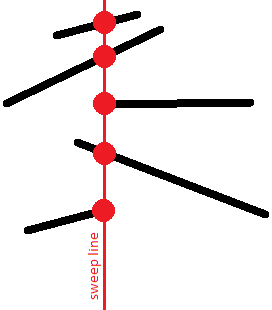

---
tags:
  - Translated
e_maxx_link: intersecting_segments
---

# Search for a pair of intersecting segments

Given $n$ line segments on the plane. It is required to check whether at least two of them intersect with each other.
If the answer is yes, then print this pair of intersecting segments; it is enough to choose any of them among several answers.

The naive solution algorithm is to iterate over all pairs of segments in $O(n^2)$ and check for each pair whether they intersect or not. This article describes an algorithm with the runtime time $O(n \log n)$, which is based on the **sweep line algorithm**.

## Algorithm

Let's draw a vertical line $x = -\infty$ mentally and start moving this line to the right.
In the course of its movement, this line will meet with segments, and at each time a segment intersect with our line it intersects in exactly one point (we will assume that there are no vertical segments).

<center></center>

Thus, for each segment, at some point in time, its point will appear on the sweep line, then with the movement of the line, this point will move, and finally, at some point, the segment will disappear from the line.

We are interested in the **relative order of the segments** along the vertical.
Namely, we will store a list of segments crossing the sweep line at a given time, where the segments will be sorted by their $y$-coordinate on the sweep line.

<center></center>

This order is interesting because intersecting segments will have the same $y$-coordinate at least at one time:

<center></center>

We formulate key statements:

  - To find an intersecting pair, it is sufficient to consider **only adjacent segments** at each fixed position of the sweep line.
  - It is enough to consider the sweep line not in all possible real positions $(-\infty \ldots +\infty)$, but **only in those positions when new segments appear or old ones disappear**. In other words, it is enough to limit yourself only to the positions equal to the abscissas of the end points of the segments.
  - When a new line segment appears, it is enough to **insert** it to the desired location in the list obtained for the previous sweep line. We should only check for the intersection of the **added segment with its immediate neighbors in the list above and below**.
  - If the segment disappears, it is enough to **remove** it from the current list. After that, it is necessary **check for the intersection of the upper and lower neighbors in the list**.
  - Other changes in the sequence of segments in the list, except for those described, do not exist. No other intersection checks are required.

To understand the truth of these statements, the following remarks are sufficient:

  - Two disjoint segments never change their **relative order**.<br>
    In fact, if one segment was first higher than the other, and then became lower, then between these two moments there was an intersection of these two segments.
  - Two non-intersecting segments also cannot have the same $y$-coordinates.
  - From this it follows that at the moment of the segment appearance we can find the position for this segment in the queue, and we will not have to rearrange this segment in the queue any more: **its order relative to other segments in the queue will not change**.
  - Two intersecting segments at the moment of their intersection point will be neighbors of each other in the queue.
  - Therefore, for finding pairs of intersecting line segments is sufficient to check the intersection of all and only those pairs of segments that sometime during the movement of the sweep line at least once were neighbors to each other. <br>
    It is easy to notice that it is enough only to check the added segment with its upper and lower neighbors, as well as when removing the segment — its upper and lower neighbors (which after removal will become neighbors of each other).<br>
  - It should be noted that at a fixed position of the sweep line, we must **first add all the segments** that start at this x-coordinate, and only **then remove all the segments** that end here.<br>
    Thus, we do not miss the intersection of segments on the vertex: i.e. such cases when two segments have a common vertex.
  - Note that **vertical segments** do not actually affect the correctness of the algorithm.<br>
    These segments are distinguished by the fact that they appear and disappear at the same time. However, due to the previous comment, we know that all segments will be added to the queue first, and only then they will be deleted. Therefore, if the vertical segment intersects with some other segment opened at that moment (including the vertical one), it will be detected.<br>
    **In what place of the queue to place vertical segments?** After all, a vertical segment does not have one specific $y$-coordinate, it extends for an entire segment along the $y$-coordinate. However, it is easy to understand that any coordinate from this segment can be taken as a $y$-coordinate.

Thus, the entire algorithm will perform no more than $2n$ tests on the intersection of a pair of segments, and will perform $O(n)$ operations with a queue of segments ($O(1)$ operations at the time of appearance and disappearance of each segment).

The final **asymptotic behavior of the algorithm** is thus $O(n \log n)$.

## Implementation

We present the full implementation of the described algorithm:

```cpp
const double EPS = 1E-9;

struct pt {
    double x, y;
};

struct seg {
    pt p, q;
    int id;

    double get_y(double x) const {
        if (abs(p.x - q.x) < EPS)
            return p.y;
        return p.y + (q.y - p.y) * (x - p.x) / (q.x - p.x);
    }
};

bool intersect1d(double l1, double r1, double l2, double r2) {
    if (l1 > r1)
        swap(l1, r1);
    if (l2 > r2)
        swap(l2, r2);
    return max(l1, l2) <= min(r1, r2) + EPS;
}

int vec(const pt& a, const pt& b, const pt& c) {
    double s = (b.x - a.x) * (c.y - a.y) - (b.y - a.y) * (c.x - a.x);
    return abs(s) < EPS ? 0 : s > 0 ? +1 : -1;
}

bool intersect(const seg& a, const seg& b)
{
    return intersect1d(a.p.x, a.q.x, b.p.x, b.q.x) &&
           intersect1d(a.p.y, a.q.y, b.p.y, b.q.y) &&
           vec(a.p, a.q, b.p) * vec(a.p, a.q, b.q) <= 0 &&
           vec(b.p, b.q, a.p) * vec(b.p, b.q, a.q) <= 0;
}

bool operator<(const seg& a, const seg& b)
{
    double x = max(min(a.p.x, a.q.x), min(b.p.x, b.q.x));
    return a.get_y(x) < b.get_y(x) - EPS;
}

struct event {
    double x;
    int tp, id;

    event() {}
    event(double x, int tp, int id) : x(x), tp(tp), id(id) {}

    bool operator<(const event& e) const {
        if (abs(x - e.x) > EPS)
            return x < e.x;
        return tp > e.tp;
    }
};

set<seg> s;
vector<set<seg>::iterator> where;

set<seg>::iterator prev(set<seg>::iterator it) {
    return it == s.begin() ? s.end() : --it;
}

set<seg>::iterator next(set<seg>::iterator it) {
    return ++it;
}

pair<int, int> solve(const vector<seg>& a) {
    int n = (int)a.size();
    vector<event> e;
    for (int i = 0; i < n; ++i) {
        e.push_back(event(min(a[i].p.x, a[i].q.x), +1, i));
        e.push_back(event(max(a[i].p.x, a[i].q.x), -1, i));
    }
    sort(e.begin(), e.end());

    s.clear();
    where.resize(a.size());
    for (size_t i = 0; i < e.size(); ++i) {
        int id = e[i].id;
        if (e[i].tp == +1) {
            set<seg>::iterator nxt = s.lower_bound(a[id]), prv = prev(nxt);
            if (nxt != s.end() && intersect(*nxt, a[id]))
                return make_pair(nxt->id, id);
            if (prv != s.end() && intersect(*prv, a[id]))
                return make_pair(prv->id, id);
            where[id] = s.insert(nxt, a[id]);
        } else {
            set<seg>::iterator nxt = next(where[id]), prv = prev(where[id]);
            if (nxt != s.end() && prv != s.end() && intersect(*nxt, *prv))
                return make_pair(prv->id, nxt->id);
            s.erase(where[id]);
        }
    }

    return make_pair(-1, -1);
}
```

The main function here is `solve()`, which returns the intersecting segments if exists, or $(-1, -1)$, if there are no intersections.

Checking for the intersection of two segments is carried out by the `intersect ()` function, using an **algorithm based on the oriented area of the triangle**.

The queue of segments is the global variable `s`, a `set<event>`. Iterators that specify the position of each segment in the queue (for convenient removal of segments from the queue) are stored in the global array `where`.

Two auxiliary functions `prev()` and `next()` are also introduced, which return iterators to the previous and next elements (or `end()`, if one does not exist).

The constant `EPS` denotes the error of comparing two real numbers (it is mainly used when checking two segments for intersection).

## Problems
 * [TIMUS 1469 No Smoking!](https://acm.timus.ru/problem.aspx?space=1&num=1469)
