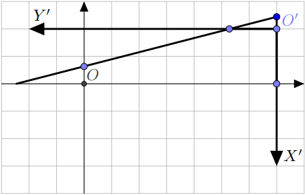

---
tags:
  - Original
---

# Lattice points inside non-lattice polygon

For lattice polygons there is Pick's formula to enumerate the lattice points inside the polygon.
What about polygons with arbitrary vertices?

Let's process each of the polygon's edges individually, and after that we may sum up the amounts of lattice points under each edge considering its orientations to choose a sign (like in calculating the area of a polygon using trapezoids).

First of all we should note that if current edge has endpoints in $A=(x_1;y_1)$ and $B=(x_2;y_2)$ then it can be represented as a linear function:

$$y=y_1+(y_2-y_1) \cdot \dfrac{x-x_1}{x_2-x_1}=\left(\dfrac{y_2-y_1}{x_2-x_1}\right)\cdot x + \left(\dfrac{y_1x_2-x_1y_2}{x_2-x_1}\right)$$

$$y = k \cdot x + b,~k = \dfrac{y_2-y_1}{x_2-x_1},~b = \dfrac{y_1x_2-x_1y_2}{x_2-x_1}$$

Now we will perform a substitution $x=x'+\lceil x_1 \rceil$ so that $b' = b + k \cdot \lceil x_1 \rceil$.
This allows us to work with $x_1'=0$ and $x_2'=x_2 - \lceil x_1 \rceil$.
Let's denote $n = \lfloor x_2' \rfloor$.

We will not sum up points at $x = n$ and on $y = 0$ for the integrity of the algorithm.
They may be added manually afterwards.
Thus we have to sum up $\sum\limits_{x'=0}^{n - 1} \lfloor k' \cdot x' + b'\rfloor$. We also assume that $k' \geq 0$ and $b'\geq 0$.
Otherwise one should substitute $x'=-t$ and add $\lceil|b'|\rceil$ to $b'$.

Let's discuss how we can evaluate a sum $\sum\limits_{x=0}^{n - 1} \lfloor k \cdot x + b\rfloor$.
We have two cases:

  - $k \geq 1$ or $b \geq 1$.
  
    Then we should start with summing up points below $y=\lfloor k \rfloor \cdot x + \lfloor b \rfloor$. Their amount equals to
    
    \[ \sum\limits_{x=0}^{n - 1} \lfloor k \rfloor \cdot x + \lfloor b \rfloor=\dfrac{(\lfloor k \rfloor(n-1)+2\lfloor b \rfloor) n}{2}. \]
    
    Now we are interested only in points $(x;y)$ such that $\lfloor k \rfloor \cdot x + \lfloor b \rfloor < y \leq k\cdot x + b$.
    This amount is the same as the number of points such that $0 < y \leq (k - \lfloor k \rfloor) \cdot x + (b - \lfloor b \rfloor)$.
    So we reduced our problem to $k'= k - \lfloor k \rfloor$, $b' = b - \lfloor b \rfloor$ and both $k'$ and $b'$ less than $1$ now.
    Here is a picture, we just summed up blue points and subtracted the blue linear function from the black one to reduce problem to smaller values for $k$ and $b$:
    <center></center>

  - $k < 1$ and $b < 1$.

    If $\lfloor k \cdot n + b\rfloor$ equals $0$, we can safely return $0$.
    If this is not the case, we can say that there are no lattice points such that $x < 0$ and $0 < y \leq k \cdot x + b$.
    That means that we will have the same answer if we consider new reference system in which $O'=(n;\lfloor k\cdot n + b\rfloor)$, axis $x'$ is directed down and axis $y'$ is directed to the left.
    For this reference system we are interested in lattice points on the set
    
    \[ \left\{(x;y)~\bigg|~0 \leq x < \lfloor k \cdot n + b\rfloor,~ 0 < y \leq \dfrac{x+(k\cdot n+b)-\lfloor k\cdot n + b \rfloor}{k}\right\} \]
    
    which returns us back to the case $k>1$.
    You can see new reference point $O'$ and axes $X'$ and $Y'$ in the picture below:
    <center></center>
    As you see, in new reference system linear function will have coefficient $\tfrac 1 k$ and its zero will be in the point $\lfloor k\cdot n + b \rfloor-(k\cdot n+b)$ which makes formula above correct.

## Complexity analysis

We have to count at most $\dfrac{(k(n-1)+2b)n}{2}$ points.
Among them we will count $\dfrac{\lfloor k \rfloor (n-1)+2\lfloor b \rfloor}{2}$ on the very first step.
We may consider that $b$ is negligibly small because we can start with making it less than $1$.
In that case we cay say that we count about $\dfrac{\lfloor k \rfloor}{k} \geq \dfrac 1 2$  of all points.
Thus we will finish in $O(\log n)$ steps.

## Implementation

Here is simple function which calculates number of integer points $(x;y)$ such for $0 \leq x < n$ and $0 < y \leq \lfloor k x+b\rfloor$:

```cpp
int count_lattices(Fraction k, Fraction b, long long n) {
    auto fk = k.floor();
    auto fb = b.floor();
    auto cnt = 0LL;
    if (k >= 1 || b >= 1) {
        cnt += (fk * (n - 1) + 2 * fb) * n / 2;
        k -= fk;
        b -= fb;
    }
    auto t = k * n + b;
    auto ft = t.floor();
    if (ft >= 1) {
        cnt += count_lattices(1 / k, (t - t.floor()) / k, t.floor());
    }
    return cnt;
}
```

Here `Fraction` is some class handling rational numbers.
On practice it seems that if all denominators and numerators are at most $C$ by absolute value then in the recursive calls they will be at most $C^2$ if you keep dividing numerators and denominators by their greatest common divisor.
Given this assumption we can say that one may use doubles and require accuracy of $\varepsilon^2$ where $\varepsilon$ is accuracy with which $k$ and $b$ are given.
That means that in floor one should consider numbers as integer if they differs at most by $\varepsilon^2$ from an integer.
