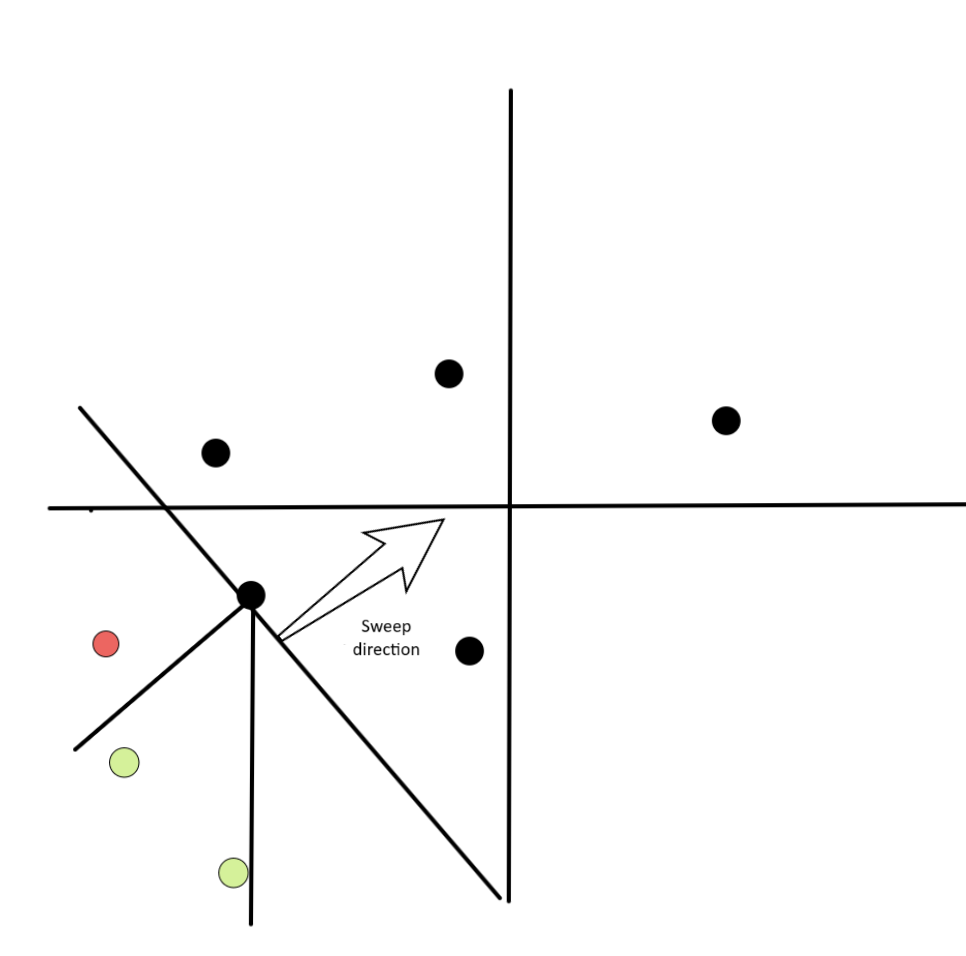
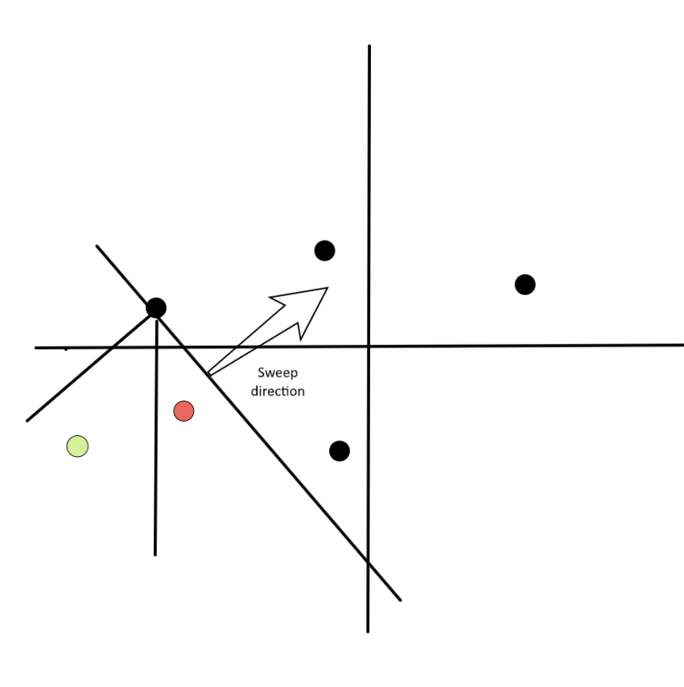

---
tags:
  - Original
---

# Manhattan Distance
	
## Definition
For points $p$ and $q$ on a plane, we can define the distance between them as the sum of the differences between their $x$ and $y$ coordinates: 

$$d(p,q) = |x_p - x_q| + |y_p - y_q|$$

Defined this way, the distance corresponds to the so-called [Manhattan (taxicab) geometry](https://en.wikipedia.org/wiki/Taxicab_geometry), in which the points are considered intersections in a well designed city, like Manhattan, where you can only move on the streets horizontally or vertically, as shown in the image below:

<center></center>

This images show some of the smallest paths from one black point to the other, all of them with length $12$.

There are some interesting tricks and algorithms that can be done with this distance, and we will show some of them here.

## Farthest pair of points in Manhattan distance

Given $n$ points $P$, we want to find the pair of points $p,q$ that are farther apart, that is, maximize $|x_p - x_q| + |y_p - y_q|$.

Let's think first in one dimension, so $y=0$. The main observation is that we can bruteforce if $|x_p - x_q|$ is equal to $x_p - x_q$ or $-x_p + x_q$, because if we "miss the sign" of the absolute value, we will get only a smaller value, so it can't affect the answer. More formally, it holds that:

$$|x_p - x_q| = \max(x_p - x_q, -x_p + x_q)$$

So, for example, we can try to have $p$ such that $x_p$ has the plus sign, and then $q$ must have the negative sign. This way we want to find:

$$\max\limits_{p, q \in P}(x_p + (-x_q)) = \max\limits_{p \in P}(x_p) + \max\limits_{q \in P}( - x_q ).$$

Notice that we can extend this idea further for 2 (or more!) dimensions. For $d$ dimensions, we must bruteforce $2^d$ possible values of the signs. For example, if we are in $2$ dimensions and bruteforce that $p$ has both the plus signs we want to find: 

$$\max\limits_{p, q \in P} [(x_p + (-x_q)) + (y_p + (-y_q))] = \max\limits_{p \in P}(x_p + y_p) + \max\limits_{q \in P}(-x_q - y_q).$$

As we made $p$ and $q$ independent, it is now easy to find the $p$ and $q$ that maximize the expression.

The code below generalizes this to $d$ dimensions and runs in $O(n \cdot 2^d \cdot d)$.

```cpp
long long ans = 0;
for (int msk = 0; msk < (1 << d); msk++) {
    long long mx = LLONG_MIN, mn = LLONG_MAX;
    for (int i = 0; i < n; i++) {
        long long cur = 0;
        for (int j = 0; j < d; j++) {
            if (msk & (1 << j)) cur += p[i][j];
            else cur -= p[i][j];
        }
        mx = max(mx, cur);
        mn = min(mn, cur);
    }
    ans = max(ans, mx - mn);
}
```

## Rotating the points and Chebyshev distance

It's well known that, for all $m, n \in \mathbb{R}$,

$$|m| + |n| = \text{max}(|m + n|, |m - n|).$$

To prove this, we just need to analyze the signs of $m$ and $n$. And it's left as an exercise.

We may apply this equation to the Manhattan distance formula to find out that

$$d((x_1, y_1), (x_2, y_2)) = |x_1 - x_2| + |y_1 - y_2| = \text{max}(|(x_1 + y_1) - (x_2 + y_2)|, |(x_1 - y_1) - (x_2 - y_2)|).$$

The last expression in the previous equation is the [Chebyshev distance](https://en.wikipedia.org/wiki/Chebyshev_distance) of the points $(x_1 + y_1, x_1 - y_1)$ and $(x_2 + y_2, x_2 - y_2)$. This means that, after applying the transformation

$$\alpha : (x, y) \to (x + y, x - y),$$

the Manhattan distance between the points $p$ and $q$ turns into the Chebyshev distance between $\alpha(p)$ and $\alpha(q)$.

Also, we may realize that $\alpha$ is a [spiral similarity](https://en.wikipedia.org/wiki/Spiral_similarity) (rotation of the plane followed by a dilation about a center $O$) with center $(0, 0)$, rotation angle of $45^{\circ}$ in clockwise direction and dilation by $\sqrt{2}$.

Here's an image to help visualizing the transformation:

<center></center>

## Manhattan Minimum Spanning Tree

The Manhattan MST problem consists of, given some points in the plane, find the edges that connect all the points and have a minimum total sum of weights. The weight of an edge that connects two points is their Manhattan distance. For simplicity, we assume that all points have different locations.
Here we show a way of finding the MST in $O(n \log{n})$ by finding for each point its nearest neighbor in each octant, as represented by the image below. This will give us $O(n)$ candidate edges, which, as we show below, will guarantee that they contain the MST. The final step is then using some standard MST, for example, [Kruskal algorithm using disjoint set union](https://cp-algorithms.com/graph/mst_kruskal_with_dsu.html).

<center>

*The 8 octants relative to a point S*</center>

The algorithm shown here was first presented in a paper from [H. Zhou, N. Shenoy, and W. Nichollos (2002)](https://ieeexplore.ieee.org/document/913303). There is also another know algorithm that uses a Divide and conquer approach by [J. Stolfi](https://www.academia.edu/15667173/On_computing_all_north_east_nearest_neighbors_in_the_L1_metric), which is also very interesting and only differ in the way they find the nearest neighbor in each octant. They both have the same complexity, but the one presented here is easier to implement and has a lower constant factor.

First, let's understand why it is enough to consider only the nearest neighbor in each octant. The idea is to show that for a point $s$ and any two other points $p$ and $q$ in the same octant, $d(p, q) < \max(d(s, p), d(s, q))$. This is important, because it shows that if there was a MST where $s$ is connected to both $p$ and $q$, we could erase one of these edges and add the edge $(p,q)$, which would decrease the total cost. To prove this, we assume without loss of generality that $p$ and $q$ are in the octanct $R_1$, which is defined by: $x_s \leq x$ and $x_s - y_s > x -  y$, and then do some casework. The image below give some intuition on why this is true.

<center>

*Intuitively, the limitation of the octant makes it impossible that $p$ and $q$ are both closer to $s$ than to each other*</center>


Therefore, the main question is how to find the nearest neighbor in each octant for every single of the $n$ points.

## Nearest Neighbor in each Octant in O(n log n)

For simplicity we focus on the NNE octant ($R_1$ in the image above). All other directions can be found with the same algorithm by rotating the input.

We will use a sweep-line approach. We process the points from south-west to north-east, that is, by non-decreasing $x + y$. We also keep a set of points which don't have their nearest neighbor yet, which we call "active set". We add the images below to help visualize the algorithm.

<center>

*In black with an arrow you can see the direction of the line-sweep. All the points below this lines are in the active set, and the points above are still not processed. In green we see the points which are in the octant of the processed point. In red the points that are not in the searched octant.*</center>

<center>

*In this image we see the active set after processing the point $p$. Note that the $2$ green points of the previous image had $p$ in its north-north-east octant and are not in the active set anymore, because they already found their nearest neighbor.*</center>

When we add a new point point $p$, for every point $s$ that has it in its octant we can safely assign $p$ as the nearest neighbor. This is true because their distance is $d(p,s) = |x_p - x_s| + |y_p - y_s| = (x_p + y_p) - (x_s + y_s)$, because $p$ is in the north-north-east octant. As all the next points will not have a smaller value of $x + y$ because of the sorting step, $p$ is guaranteed to have the smaller distance. We can then remove all such points from the active set, and finally add $p$ to the active set.

The next question is how to efficiently find which points $s$ have $p$ in the north-north-east octant. That is, which points $s$ satisfy:

- $x_s \leq x_p$
- $x_p - y_p < x_s - y_s$

Because no points in the active set are in the $R_1$ region of another, we also have that for two points $q_1$ and $q_2$ in the active set, $x_{q_1} \neq x_{q_2}$ and their ordering implies $x_{q_1} < x_{q_2} \implies x_{q_1} - y_{q_1} \leq x_{q_2} - y_{q_2}$.

You can try to visualize this on the images above by thinking of the ordering of $x - y$ as a "sweep-line" that goes from the north-west to the south-east, so perpendicular to the one that is drawn.

This means that if we keep the active set ordered by $x$ the candidates $s$ are consecutively placed. We can then find the largest $x_s \leq x_p$ and process the points in decreasing order of $x$ until the second condition $x_p - y_p < x_s - y_s$ breaks (we can actually allow that $x_p - y_p = x_s - y_s$ and that deals with the case of points with equal coordinates). Notice that because we remove from the set right after processing, this will have an amortized complexity of $O(n \log(n))$.
	Now that we have the nearest point in the north-east direction, we rotate the points and repeat. It is possible to show that actually we also find this way the nearest point in the south-west direction, so we can repeat only 4 times, instead of 8.

In summary we:

- Sort the points by $x + y$ in non-decreasing order;
- For every point, we iterate over the active set starting with the point with the largest $x$ such that $x \leq x_p$, and we break the loop if  $x_p - y_p \geq x_s - y_s$. For every valid point $s$ we add the edge $(s,p, d(s,p))$ in our list;
- We add the point $p$ to the active set;
- Rotate the points and repeat until we iterate over all the octants.
- Apply Kruskal algorithm in the list of edges to get the MST. 

Below you can find a implementation, based on the one from [KACTL](https://github.com/kth-competitive-programming/kactl/blob/main/content/geometry/ManhattanMST.h).

```{.cpp file=manhattan_mst}
struct point {
    long long x, y;
};

// Returns a list of edges in the format (weight, u, v). 
// Passing this list to Kruskal algorithm will give the Manhattan MST.
vector<tuple<long long, int, int>> manhattan_mst_edges(vector<point> ps) {
    vector<int> ids(ps.size());
    iota(ids.begin(), ids.end(), 0);
    vector<tuple<long long, int, int>> edges;
    for (int rot = 0; rot < 4; rot++) { // for every rotation
        sort(ids.begin(), ids.end(), [&](int i, int j){
            return (ps[i].x + ps[i].y) < (ps[j].x + ps[j].y);
        });
        map<int, int, greater<int>> active; // (xs, id)
        for (auto i : ids) {
            for (auto it = active.lower_bound(ps[i].x); it != active.end();
            active.erase(it++)) {
                int j = it->second;
                if (ps[i].x - ps[i].y > ps[j].x - ps[j].y) break;
                assert(ps[i].x >= ps[j].x && ps[i].y >= ps[j].y);
                edges.push_back({(ps[i].x - ps[j].x) + (ps[i].y - ps[j].y), i, j});
            }
            active[ps[i].x] = i;
        }
        for (auto &p : ps) { // rotate
            if (rot & 1) p.x *= -1;
            else swap(p.x, p.y);
        }
    }
    return edges;
}
```

## Problems
 * [AtCoder Beginner Contest 178E - Dist Max](https://atcoder.jp/contests/abc178/tasks/abc178_e)
 * [CodeForces 1093G - Multidimensional Queries](https://codeforces.com/contest/1093/problem/G)
 * [CodeForces 944F - Game with Tokens](https://codeforces.com/contest/944/problem/F)
 * [AtCoder Code Festival 2017D - Four Coloring](https://atcoder.jp/contests/code-festival-2017-quala/tasks/code_festival_2017_quala_d)
 * [The 2023 ICPC Asia EC Regionals Online Contest (I) - J. Minimum Manhattan Distance](https://codeforces.com/gym/104639/problem/J)
 * [Petrozavodsk Winter Training Camp 2016 Contest 4 - B. Airports](https://codeforces.com/group/eqgxxTNwgd/contest/100959/attachments)
