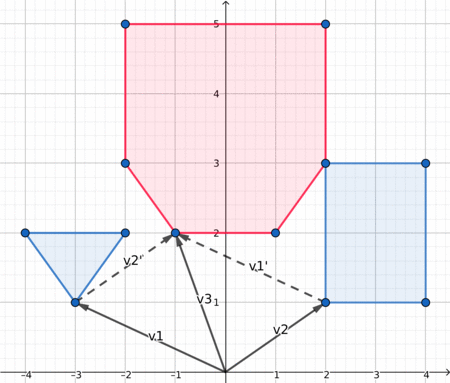

---
tags:
  - Original
---

# Minkowski sum of convex polygons

## Definition
Consider two sets $A$ and $B$ of points on a plane. Minkowski sum $A + B$ is defined as $\{a + b| a \in A, b \in B\}$.
Here we will consider the case when $A$ and $B$ consist of convex polygons $P$ and $Q$ with their interiors.
Throughout this article we will identify polygons with ordered sequences of their vertices, so that notation like $|P|$ or
$P_i$ makes sense.
It turns out that the sum of convex polygons $P$ and $Q$ is a convex polygon with at most $|P| + |Q|$ vertices.

## Algorithm

Here we consider the polygons to be cyclically enumerated, i. e. $P_{|P|} = P_0,\ Q_{|Q|} = Q_0$ and so on.

Since the size of the sum is linear in terms of the sizes of initial polygons, we should aim at finding a linear-time algorithm.
Suppose that both polygons are ordered counter-clockwise. Consider sequences of edges $\{\overrightarrow{P_iP_{i+1}}\}$
and $\{\overrightarrow{Q_jQ_{j+1}}\}$ ordered by polar angle. We claim that the sequence of edges of $P + Q$ can be obtained by merging
these two sequences preserving polar angle order and replacing consecutive co-directed vectors with their sum. Straightforward usage of this idea results
in a linear-time algorithm, however, restoring the vertices of $P + Q$ from the sequence of sides requires repeated addition of vectors,
which may introduce unwanted precision issues if we're working with floating-point coordinates, so we will describe a slight
modification of this idea.


Firstly we should reorder the vertices in such a way that the first vertex
of each polygon has the lowest y-coordinate (in case of several such vertices pick the one with the smallest x-coordinate). After that the sides of both polygons
will become sorted by polar angle, so there is no need to sort them manually.
Now we create two pointers $i$ (pointing to a vertex of $P$) and $j$ (pointing to a vertex of $Q$), both initially set to 0.
We repeat the following steps while $i < |P|$ or $j < |Q|$.

1. Append $P_i + Q_j$ to $P + Q$.

2. Compare polar angles of $\overrightarrow{P_iP_{i + 1}}$ and $\overrightarrow{Q_jQ_{j+1}}$.

3. Increment the pointer which corresponds to the smallest angle (if the angles are equal, increment both).

## Visualization

Here is a nice visualization, which may help you understand what is going on.

<center></center>

## Distance between two polygons
One of the most common applications of Minkowski sum is computing the distance between two convex polygons (or simply checking whether they intersect).
The distance between two convex polygons $P$ and $Q$ is defined as $\min\limits_{a \in P, b \in Q} ||a - b||$. One can note that
the distance is always attained between two vertices or a vertex and an edge, so we can easily find the distance in $O(|P||Q|)$. However,
with clever usage of Minkowski sum we can reduce the complexity to $O(|P| + |Q|)$.

If we reflect $Q$ through the point $(0, 0)$ obtaining polygon $-Q$, the problem boils down to finding the smallest distance between a point in
$P + (-Q)$ and $(0, 0)$. We can find that distance in linear time using the following idea.
If $(0, 0)$ is inside or on the boundary of polygon, the distance is $0$, otherwise the distance is attained between $(0, 0)$ and some vertex or edge of the polygon.
Since Minkowski sum can be computed
in linear time, we obtain a linear-time algorithm for finding the distance between two convex polygons.

## Implementation
Below is the implementation of Minkowski sum for polygons with integer points. Note that in this case all computations can be done in integers since
instead of computing polar angles and directly comparing them we can look at the sign of cross product of two vectors.

```{.cpp file=minkowski}
struct pt{
    long long x, y;
    pt operator + (const pt & p) const {
        return pt{x + p.x, y + p.y};
    }
    pt operator - (const pt & p) const {
        return pt{x - p.x, y - p.y};
    }
    long long cross(const pt & p) const {
        return x * p.y - y * p.x;
    }
};

void reorder_polygon(vector<pt> & P){
    size_t pos = 0;
    for(size_t i = 1; i < P.size(); i++){
        if(P[i].y < P[pos].y || (P[i].y == P[pos].y && P[i].x < P[pos].x))
            pos = i;
    }
    rotate(P.begin(), P.begin() + pos, P.end());
}

vector<pt> minkowski(vector<pt> P, vector<pt> Q){
    // the first vertex must be the lowest
    reorder_polygon(P);
    reorder_polygon(Q);
    // we must ensure cyclic indexing
    P.push_back(P[0]);
    P.push_back(P[1]);
    Q.push_back(Q[0]);
    Q.push_back(Q[1]);
    // main part
    vector<pt> result;
    size_t i = 0, j = 0;
    while(i < P.size() - 2 || j < Q.size() - 2){
        result.push_back(P[i] + Q[j]);
        auto cross = (P[i + 1] - P[i]).cross(Q[j + 1] - Q[j]);
        if(cross >= 0 && i < P.size() - 2)
            ++i;
        if(cross <= 0 && j < Q.size() - 2)
            ++j;
    }
    return result;
}

```

## Problems
 * [Codeforces 87E Mogohu-Rea Idol](https://codeforces.com/problemset/problem/87/E)
 * [Codeforces 1195F Geometers Anonymous Club](https://codeforces.com/contest/1195/problem/F)
 * [TIMUS 1894 Non-Flying Weather](https://acm.timus.ru/problem.aspx?space=1&num=1894)
