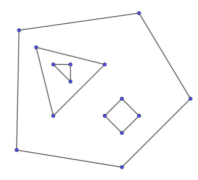

# Finding faces of a planar graph

Consider a graph $G$ with $n$ vertices and $m$ edges, which can be drawn on a plane in such a way that two edges intersect only at a common vertex (if it exists).
Such graphs are called **planar**. Now suppose that we are given a planar graph together with its straight-line drawing, which means that for each vertex $v$ we have a corresponding point $(x, y)$ and all edges are drawn as line segments between these points without intersection (such drawing always exists). These line segments split the plane into several regions, which are called faces. Exactly one of the faces is unbounded. This face is called **outer**, while the other faces are called **inner**.

In this article we will deal with finding both inner and outer faces of a planar graph. We will assume that the graph is connected.

## Some facts about planar graphs

In this section we present several facts about planar graphs without proof. Readers who are interested in proofs should refer to [Graph Theory by R. Diestel](https://sites.math.washington.edu/~billey/classes/562.winter.2018/articles/GraphTheory.pdf) or some other book.

### Euler's theorem
Euler's theorem states that any correct drawing of a connected planar graph with $n$ vertices, $m$ edges and $f$ faces satisfies:

$$n - m + f = 2$$

And more generally, every planar graph with $k$ connected components satisfies:

$$n - m + f = 1 + k$$

### Number of edges of a planar graph.
If $n \ge 3$ then the maximum number of edges of a planar graph with $n$ vertices is $3n - 6$. This number is achieved by any connected planar graph where each face is bounded by a triangle. In terms of complexity this fact means that $m = O(n)$ for any planar graph.

### Number of faces of a planar graph.
As a direct consequence of the above fact, if $n \ge 3$ then the maximum number of faces of a planar graph with $n$ vertices is $2n - 4$.

### Minimum vertex degree in a planar graph.
Every planar graph has a vertex of degree 5 or less.

## The algorithm

Firstly, sort the adjacent edges for each vertex by polar angle.
Now let's traverse the graph in the following way. Suppose that we entered vertex $u$ through the edge $(v, u)$ and $(u, w)$ is the next edge after $(v, u)$ in the sorted adjacency list of $u$. Then the next vertex will be $w$. It turns out that if we start this traversal at some edge $(v, u)$, we will traverse exactly one of the faces adjacent to $(v, u)$, the exact face depending on whether our first step is from $u$ to $v$ or from $v$ to $u$.

Now the algorithm is quite obvious. We must iterate over all edges of the graph and start the traversal for each edge that wasn't visited by one of the previous traversals. This way we will find each face exactly once, and each edge will be traversed twice (once in each direction).

### Finding the next edge
During the traversal we have to find the next edge in counter-clockwise order. The most obvious way to find the next edge is binary search by angle. However, given the counter-clockwise order of adjacent edges for each vertex, we can precompute the next edges and store them in a hash table. If the edges are already sorted by angle, the complexity of finding all faces in this case becomes linear.

### Finding the outer face
It's not hard to see that the algorithm traverses each inner face in a clockwise order and the outer face in the counter-clockwise order, so the outer face can be found by checking the order of each face.

### Complexity
It's quite clear that the complexity of the algorithm is $O(m \log m)$ because of sorting, and since $m = O(n)$, it's actually $O(n \log n)$. As mentioned before, without sorting the complexity becomes $O(n)$.

## What if the graph isn't connected?

At the first glance it may seem that finding faces of a disconnected graph is not much harder because we can run the same algorithm for each connected component. However, the components may be drawn in a nested way, forming **holes** (see the image below). In this case the inner face of some component becomes the outer face of some other components and has a complex disconnected border. Dealing with such cases is quite hard, one possible approach is to identify nested components with [point location](point-location.md) algorithms. 

<center></center>

## Implementation
The following implementation returns a vector of vertices for each face, outer face goes first.
Inner faces are returned in counter-clockwise orders and the outer face is returned in clockwise order.

For simplicity we find the next edge by doing binary search by angle.
```{.cpp file=planar}
struct Point {
    int64_t x, y;

    Point(int64_t x_, int64_t y_): x(x_), y(y_) {}

    Point operator - (const Point & p) const {
        return Point(x - p.x, y - p.y);
    }

    int64_t cross (const Point & p) const {
        return x * p.y - y * p.x;
    }

    int64_t cross (const Point & p, const Point & q) const {
        return (p - *this).cross(q - *this);
    }

    int half () const {
        return int(y < 0 || (y == 0 && x < 0));
    }
};

std::vector<std::vector<size_t>> find_faces(std::vector<Point> vertices, std::vector<std::vector<size_t>> adj) {
    size_t n = vertices.size();
    std::vector<std::vector<char>> used(n);
    for (size_t i = 0; i < n; i++) {
        used[i].resize(adj[i].size());
        used[i].assign(adj[i].size(), 0);
        auto compare = [&](size_t l, size_t r) {
            Point pl = vertices[l] - vertices[i];
            Point pr = vertices[r] - vertices[i];
            if (pl.half() != pr.half())
                return pl.half() < pr.half();
            return pl.cross(pr) > 0;
        };
        std::sort(adj[i].begin(), adj[i].end(), compare);
    }
    std::vector<std::vector<size_t>> faces;
    for (size_t i = 0; i < n; i++) {
        for (size_t edge_id = 0; edge_id < adj[i].size(); edge_id++) {
            if (used[i][edge_id]) {
                continue;
            }
            std::vector<size_t> face;
            size_t v = i;
            size_t e = edge_id;
            while (!used[v][e]) {
                used[v][e] = true;
                face.push_back(v);
                size_t u = adj[v][e];
                size_t e1 = std::lower_bound(adj[u].begin(), adj[u].end(), v, [&](size_t l, size_t r) {
                    Point pl = vertices[l] - vertices[u];
                    Point pr = vertices[r] - vertices[u];
                    if (pl.half() != pr.half())
                        return pl.half() < pr.half();
                    return pl.cross(pr) > 0;
                }) - adj[u].begin() + 1;
                if (e1 == adj[u].size()) {
                    e1 = 0;
                }
                v = u;
                e = e1;
            }
            std::reverse(face.begin(), face.end());
            int sign = 0;
            for (size_t j = 0; j < face.size(); j++) {
                size_t j1 = (j + 1) % face.size();
                size_t j2 = (j + 2) % face.size();
                int64_t val = vertices[face[j]].cross(vertices[face[j1]], vertices[face[j2]]);
                if (val > 0) {
                    sign = 1;
                    break;
                } else if (val < 0) {
                    sign = -1;
                    break;
                }
            }
            if (sign <= 0) {
                faces.insert(faces.begin(), face);
            } else {
                faces.emplace_back(face);
            }
        }
    }
    return faces;
}
```
## Problems
 * [TIMUS 1664 Pipeline Transportation](https://acm.timus.ru/problem.aspx?space=1&num=1664)
