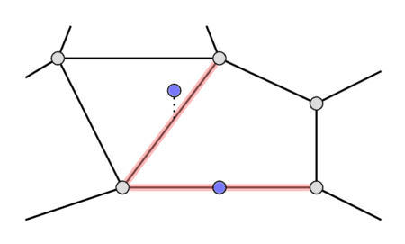
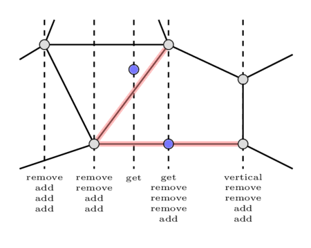

# Point location in $O(log n)$

Consider the following problem: you are given a [planar subdivision](https://en.wikipedia.org/wiki/Planar_straight-line_graph) without any vertices of degree one and zero, and a lot of queries.
Each query is a point, for which we should determine the face of the subdivision it belongs to.
We will answer each query in $O(\log n)$ offline.<br>
This problem may arise when you need to locate some points in a Voronoi diagram or in some simple polygon.

## Algorithm

Firstly, for each query point $p\ (x_0, y_0)$ we want to find such an edge that if the point belongs to any edge, the point lies on the edge we found, otherwise this edge must intersect the line $x = x_0$ at some unique point $(x_0, y)$ where $y < y_0$ and this $y$ is maximum among all such edges.
The following image shows both cases.

<center></center>

We will solve this problem offline using the sweep line algorithm. Let's iterate over x-coordinates of query points and edges' endpoints in increasing order and keep a set of edges $s$. For each x-coordinate we will add some events beforehand.

The events will be of four types: _add_, _remove_, _vertical_, _get_.
For each vertical edge (both endpoints have the same x-coordinate) we will add one _vertical_ event for the corresponding x-coordinate.
For every other edge we will add one _add_ event for the minimum of x-coordinates of the endpoints and one _remove_ event for the maximum of x-coordinates of the endpoints.
Finally, for each query point we will add one _get_ event for its x-coordinate.

For each x-coordinate we will sort the events by their types in order (_vertical_, _get_, _remove_, _add_).
The following image shows all events in sorted order for each x-coordinate.

<center></center>

We will keep two sets during the sweep-line process.
A set $t$ for all non-vertical edges, and one set $vert$ especially for the vertical ones.
We will clear the set $vert$ at the beginning of processing each x-coordinate.

Now let's process the events for a fixed x-coordinate.

 - If we got a _vertical_ event, we will simply insert the minimum y-coordinate of the corresponding edge's endpoints to $vert$.
 - If we got a _remove_ or _add_ event, we will remove the corresponding edge from $t$ or add it to $t$.
 - Finally, for each _get_ event we must check if the point lies on some vertical edge by performing a binary search in $vert$.
If the point doesn't lie on any vertical edge, we must find the answer for this query in $t$.
To do this, we again make a binary search.
In order to handle some degenerate cases (e.g. in case of the triangle $(0,~0)$, $(0,~2)$, $(1, 1)$ when we query the point $(0,~0)$), we must answer all _get_ events again after we processed all the events for this x-coordinate and choose the best of two answers.

Now let's choose a comparator for the set $t$.
This comparator should check if one edge doesn't lie above other for every x-coordinate they both cover. Suppose that we have two edges $(a, b)$ and $(c, d)$. Then the comparator is (in pseudocode):<br>

$val = sgn((b - a)\times(c - a)) + sgn((b - a)\times(d - a))$<br>
<b>if</b> $val \neq 0$<br>
<b>then return</b> $val > 0$<br>
$val = sgn((d - c)\times(a - c)) + sgn((d - c)\times(b - c))$<br>
<b>return</b> $val < 0$<br>

Now for every query we have the corresponding edge.
How to find the face?
If we couldn't find the edge it means that the point is in the outer face.
If the point belongs to the edge we found, the face is not unique.
Otherwise, there are two candidates - the faces that are bounded by this edge.
How to check which one is the answer? Note that the edge is not vertical.
Then the answer is the face that is above this edge.
Let's find such a face for each non-vertical edge.
Consider a counter-clockwise traversal of each face.
If during this traversal we increased x-coordinate while passing through the edge, then this face is the face we need to find for this edge.

## Notes

Actually, with persistent trees this approach can be used to answer the queries online.

## Implementation

The following code is implemented for integers, but it can be easily modified to work with doubles (by changing the compare methods and the point type).
This implementation assumes that the subdivision is correctly stored inside a [DCEL](https://en.wikipedia.org/wiki/Doubly_connected_edge_list) and the outer face is numbered $-1$.<br>
For each query a pair $(1, i)$ is returned if the point lies strictly inside the face number $i$, and a pair $(0, i)$ is returned if the point lies on the edge number $i$.

```{.cpp file=point-location}
typedef long long ll;

bool ge(const ll& a, const ll& b) { return a >= b; }
bool le(const ll& a, const ll& b) { return a <= b; }
bool eq(const ll& a, const ll& b) { return a == b; }
bool gt(const ll& a, const ll& b) { return a > b; }
bool lt(const ll& a, const ll& b) { return a < b; }
int sgn(const ll& x) { return le(x, 0) ? eq(x, 0) ? 0 : -1 : 1; }

struct pt {
    ll x, y;
    pt() {}
    pt(ll _x, ll _y) : x(_x), y(_y) {}
    pt operator-(const pt& a) const { return pt(x - a.x, y - a.y); }
    ll dot(const pt& a) const { return x * a.x + y * a.y; }
    ll dot(const pt& a, const pt& b) const { return (a - *this).dot(b - *this); }
    ll cross(const pt& a) const { return x * a.y - y * a.x; }
    ll cross(const pt& a, const pt& b) const { return (a - *this).cross(b - *this); }
    bool operator==(const pt& a) const { return a.x == x && a.y == y; }
};

struct Edge {
    pt l, r;
};

bool edge_cmp(Edge* edge1, Edge* edge2)
{
    const pt a = edge1->l, b = edge1->r;
    const pt c = edge2->l, d = edge2->r;
    int val = sgn(a.cross(b, c)) + sgn(a.cross(b, d));
    if (val != 0)
        return val > 0;
    val = sgn(c.cross(d, a)) + sgn(c.cross(d, b));
    return val < 0;
}

enum EventType { DEL = 2, ADD = 3, GET = 1, VERT = 0 };

struct Event {
    EventType type;
    int pos;
    bool operator<(const Event& event) const { return type < event.type; }
};

vector<Edge*> sweepline(vector<Edge*> planar, vector<pt> queries)
{
    using pt_type = decltype(pt::x);

    // collect all x-coordinates
    auto s =
        set<pt_type, std::function<bool(const pt_type&, const pt_type&)>>(lt);
    for (pt p : queries)
        s.insert(p.x);
    for (Edge* e : planar) {
        s.insert(e->l.x);
        s.insert(e->r.x);
    }

    // map all x-coordinates to ids
    int cid = 0;
    auto id =
        map<pt_type, int, std::function<bool(const pt_type&, const pt_type&)>>(
            lt);
    for (auto x : s)
        id[x] = cid++;

    // create events
    auto t = set<Edge*, decltype(*edge_cmp)>(edge_cmp);
    auto vert_cmp = [](const pair<pt_type, int>& l,
                       const pair<pt_type, int>& r) {
        if (!eq(l.first, r.first))
            return lt(l.first, r.first);
        return l.second < r.second;
    };
    auto vert = set<pair<pt_type, int>, decltype(vert_cmp)>(vert_cmp);
    vector<vector<Event>> events(cid);
    for (int i = 0; i < (int)queries.size(); i++) {
        int x = id[queries[i].x];
        events[x].push_back(Event{GET, i});
    }
    for (int i = 0; i < (int)planar.size(); i++) {
        int lx = id[planar[i]->l.x], rx = id[planar[i]->r.x];
        if (lx > rx) {
            swap(lx, rx);
            swap(planar[i]->l, planar[i]->r);
        }
        if (lx == rx) {
            events[lx].push_back(Event{VERT, i});
        } else {
            events[lx].push_back(Event{ADD, i});
            events[rx].push_back(Event{DEL, i});
        }
    }

    // perform sweep line algorithm
    vector<Edge*> ans(queries.size(), nullptr);
    for (int x = 0; x < cid; x++) {
        sort(events[x].begin(), events[x].end());
        vert.clear();
        for (Event event : events[x]) {
            if (event.type == DEL) {
                t.erase(planar[event.pos]);
            }
            if (event.type == VERT) {
                vert.insert(make_pair(
                    min(planar[event.pos]->l.y, planar[event.pos]->r.y),
                    event.pos));
            }
            if (event.type == ADD) {
                t.insert(planar[event.pos]);
            }
            if (event.type == GET) {
                auto jt = vert.upper_bound(
                    make_pair(queries[event.pos].y, planar.size()));
                if (jt != vert.begin()) {
                    --jt;
                    int i = jt->second;
                    if (ge(max(planar[i]->l.y, planar[i]->r.y),
                           queries[event.pos].y)) {
                        ans[event.pos] = planar[i];
                        continue;
                    }
                }
                Edge* e = new Edge;
                e->l = e->r = queries[event.pos];
                auto it = t.upper_bound(e);
                if (it != t.begin())
                    ans[event.pos] = *(--it);
                delete e;
            }
        }

        for (Event event : events[x]) {
            if (event.type != GET)
                continue;
            if (ans[event.pos] != nullptr &&
                eq(ans[event.pos]->l.x, ans[event.pos]->r.x))
                continue;

            Edge* e = new Edge;
            e->l = e->r = queries[event.pos];
            auto it = t.upper_bound(e);
            delete e;
            if (it == t.begin())
                e = nullptr;
            else
                e = *(--it);
            if (ans[event.pos] == nullptr) {
                ans[event.pos] = e;
                continue;
            }
            if (e == nullptr)
                continue;
            if (e == ans[event.pos])
                continue;
            if (id[ans[event.pos]->r.x] == x) {
                if (id[e->l.x] == x) {
                    if (gt(e->l.y, ans[event.pos]->r.y))
                        ans[event.pos] = e;
                }
            } else {
                ans[event.pos] = e;
            }
        }
    }
    return ans;
}

struct DCEL {
    struct Edge {
        pt origin;
        Edge* nxt = nullptr;
        Edge* twin = nullptr;
        int face;
    };
    vector<Edge*> body;
};

vector<pair<int, int>> point_location(DCEL planar, vector<pt> queries)
{
    vector<pair<int, int>> ans(queries.size());
    vector<Edge*> planar2;
    map<intptr_t, int> pos;
    map<intptr_t, int> added_on;
    int n = planar.body.size();
    for (int i = 0; i < n; i++) {
        if (planar.body[i]->face > planar.body[i]->twin->face)
            continue;
        Edge* e = new Edge;
        e->l = planar.body[i]->origin;
        e->r = planar.body[i]->twin->origin;
        added_on[(intptr_t)e] = i;
        pos[(intptr_t)e] =
            lt(planar.body[i]->origin.x, planar.body[i]->twin->origin.x)
                ? planar.body[i]->face
                : planar.body[i]->twin->face;
        planar2.push_back(e);
    }
    auto res = sweepline(planar2, queries);
    for (int i = 0; i < (int)queries.size(); i++) {
        if (res[i] == nullptr) {
            ans[i] = make_pair(1, -1);
            continue;
        }
        pt p = queries[i];
        pt l = res[i]->l, r = res[i]->r;
        if (eq(p.cross(l, r), 0) && le(p.dot(l, r), 0)) {
            ans[i] = make_pair(0, added_on[(intptr_t)res[i]]);
            continue;
        }
        ans[i] = make_pair(1, pos[(intptr_t)res[i]]);
    }
    for (auto e : planar2)
        delete e;
    return ans;
}
```

## Problems
 * [TIMUS 1848 Fly Hunt](http://acm.timus.ru/problem.aspx?space=1&num=1848&locale=en)
 * [UVA 12310 Point Location](https://onlinejudge.org/index.php?option=com_onlinejudge&Itemid=8&category=297&page=show_problem&problem=3732)
