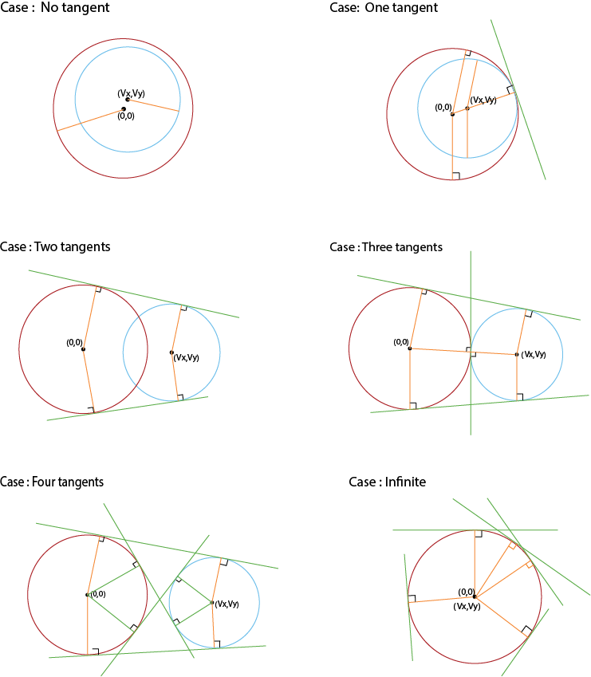

---
tags:
  - Translated
e_maxx_link: circle_tangents
---

# Finding common tangents to two circles

Given two circles. It is required to find all their common tangents, i.e. all such lines that touch both circles simultaneously.

The described algorithm will also work in the case when one (or both) circles degenerate into points. Thus, this algorithm can also be used to find tangents to a circle passing through a given point.


## The number of common tangents
The number of common tangents to two circles can be **0,1,2,3,4** and **infinite**.
Look at the images for different cases.
<center></center>

Here, we won't be considering **degenerate** cases, i.e *when the circles coincide (in this case they have infinitely many common tangents), or one circle lies inside the other (in this case they have no common tangents, or if the circles are tangent, there is one common tangent).*

In most cases, two circles have **four** common tangents.

If the circles **are tangent** , then they will have three common tangents, but this can be understood as a degenerate case: as if the two tangents coincided.

Moreover, the algorithm described below will work in the case when one or both circles have zero radius: in this case there will be, respectively, two or one common tangent.

Summing up, we will always look for **four tangents** for all cases except infinite tangents case (The infinite tangents case needs to be handled separately and it is not discussed here). In degenerate cases, some of tangents will coincide, but nevertheless, these cases will also fit into the big picture.


## Algorithm
For the sake of simplicity of the algorithm, we will assume, without losing generality, that the center of the first circle has coordinates $(0, 0)$. (If this is not the case, then this can be achieved by simply shifting the whole picture, and after finding a solution, by shifting the obtained straight lines back.)

Denote $r_1$ and $r_2$ the radii of the first and second circles, and by $(v_x,v_y)$ the coordinates of the center of the second circle and point $v$ different from origin. (Note: we are not considering the case in which both the circles are same).

To solve the problem, we approach it purely **algebraically** . We need to find all the lines of the form $ax + by + c = 0$ that lie at a distance $r_1$ from the origin of coordinates, and at a distance $r_2$ from a point $v$. In addition, we impose the condition of normalization of the straight line: the sum of the squares of the coefficients and must be equal to one (this is necessary, otherwise the same straight line will correspond to infinitely many representations of the form $ax + by + c = 0$). Total we get such a system of equations for the desired $a, b, c$:

$$\begin{align}
a^2 + b^2 &= 1 \\
\mid a \cdot 0 + b \cdot 0 + c \mid &= r_1 \\
\mid a \cdot v_x + b \cdot v_y + c \mid &= r_2
\end{align}$$

To get rid of the modulus, note that there are only four ways to open the modulus in this system. All these methods can be considered by the general case, if we understand the opening of the modulus as the fact that the coefficient on the right-hand side may be multiplied by -1. In other words, we turn to this system:

$$\begin{align}
a^2 + b^2 &= 1 \\
c &= \pm r_1 \\
a \cdot v_x + b \cdot v_y + c &= \pm r_2
\end{align}$$


Entering the notation $d_1 = \pm r_1$ and $d_2 = \pm r_2$ , we come to the conclusion that the system must have four solutions:

$$\begin{align}
a^2 + b^2 &= 1 \\
c &= d_1 \\
a \cdot v_x + b \cdot v_y + c &= d_2
\end{align}$$

The solution of this system is reduced to solving a quadratic equation. We will omit all the cumbersome calculations, and immediately give a ready answer:

$$\begin{align}
a &= {( d_2 - d_1 ) v_x \pm v_y \sqrt{v_x^2 + v_y^2-(d_2-d_1)^2} \over {v_x^2 + v_y^2} } \\
b &= {( d_2 - d_1 ) v_y \pm v_x \sqrt{v_x^2 + v_y^2-(d_2-d_1)^2} \over {v_x^2 + v_y^2} } \\
c &= d_1
\end{align}$$

Total we got eight solutions instead four. However, it is easy to understand where superfluous decisions arise: in fact, in the latter system, it is enough to take only one solution (for example, the first). In fact, the geometric meaning of what we take $\pm r_1$ and $\pm r_2$ is clear: we are actually sorting out which side of each circle there is a straight line. Therefore, the two methods that arise when solving the latter system are redundant: it is enough to choose one of the two solutions (only, of course, in all four cases, you must choose the same family of solutions).

The last thing that we have not yet considered is **how to shift the straight lines** in the case when the first circle was not originally located at the origin. However, everything is simple here: it follows from the linearity of the equation of a straight line that the value $a \cdot x_0 + b \cdot y_0$ (where $x_0$ and $y_0$ are the coordinates of the original center of the first circle) must be subtracted from the coefficient $c$.

##Implementation
We first describe all the necessary data structures and other auxiliary definitions:

```point-line-circle-struct
struct pt {
    double x, y;

    pt operator- (pt p) {
        pt res = { x-p.x, y-p.y };
        return res;
    }
};

struct circle : pt {
    double r;
};

struct line {
    double a, b, c;
};

const double EPS = 1E-9;

double sqr (double a) {
    return a * a;
}
```
Then the solution itself can be written this way (where the main function for the call is the second; and the first function is an auxiliary):

```find-tangents-to-two-circles
void tangents (pt c, double r1, double r2, vector<line> & ans) {
    double r = r2 - r1;
    double z = sqr(c.x) + sqr(c.y);
    double d = z - sqr(r);
    if (d < -EPS)  return;
    d = sqrt (abs (d));
    line l;
    l.a = (c.x * r + c.y * d) / z;
    l.b = (c.y * r - c.x * d) / z;
    l.c = r1;
    ans.push_back (l);
}

vector<line> tangents (circle a, circle b) {
    vector<line> ans;
    for (int i=-1; i<=1; i+=2)
        for (int j=-1; j<=1; j+=2)
            tangents (b-a, a.r*i, b.r*j, ans);
    for (size_t i=0; i<ans.size(); ++i)
        ans[i].c -= ans[i].a * a.x + ans[i].b * a.y;
    return ans;
}
```

## Problems

[TIMUS 1163 Chapaev](https://acm.timus.ru/problem.aspx?space=1&num=1163)
