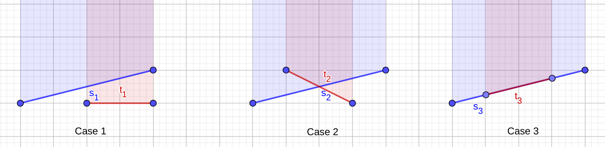

---
tags:
  - Translated
e_maxx_link: triangles_union
---

# Vertical decomposition

## Overview
Vertical decomposition is a powerful technique used in various geometry problems. The general idea is to cut the plane into several vertical stripes
with some "good" properties and solve the problem for these stripes independently. We will illustrate the idea on some examples.

## Area of the union of triangles
Suppose that there are $n$ triangles on a plane and we are to find the area of their union. The problem would be easy if the triangles didn't intersect, so
let's get rid of these intersections by dividing the plane into vertical stripes by drawing vertical lines through all vertices and all points of intersection of
sides of different triangles. There may be $O(n^2)$ such lines so we obtained $O(n^2)$ stripes. Now consider some vertical stripe. Each non-vertical segment either crosses it from left to right or doesn't cross at all.
Also, no two segments intersect strictly inside the stripe. It means that the part of the union of triangles that lies inside this stripe is composed of disjoint trapezoids with bases lying on the sides of the stripe.
This property allows us to compute the area inside each stripe with a following scanline algorithm. Each segment crossing the stripe is either upper or lower, depending on whether the interior of the corresponding triangle
is above or below the segment. We can visualize each upper segment as an opening bracket and each lower segment as a closing bracket and decompose the stripe into trapezoids by decomposing the bracket sequence into smaller correct bracket sequences. This algorithm requires $O(n^3\log n)$ time and $O(n^2)$ memory.
### Optimization 1
Firstly we will reduce the runtime to $O(n^2\log n)$. Instead of generating trapezoids for each stripe let's fix some triangle side (segment $s = (s_0, s_1)$) and find the set of stripes where this segment is a side of some trapezoid. Note that in this case we only have to find the stripes where the balance of brackets below (or above, in case of a lower segment) $s$ is zero. It means that instead of running vertical scanline for each stripe we can run a horizontal scanline for all parts of other segments which affect the balance of brackets with respect to $s$.
For simplicity we will show how to do this for an upper segment, the algorithm for lower segments is similar. Consider some other non-vertical segment $t = (t_0, t_1)$ and find the intersection $[x_1, x_2]$ of projections of $s$ and $t$ on $Ox$. If this intersection is empty or consists of one point, $t$ can be discarded since $s$ and $t$ do not intersect the interior of the same stripe. Otherwise consider the intersection $I$ of $s$ and $t$. There are three cases.

1.  $I = \varnothing$

    In this case $t$ is either above or below $s$ on $[x_1, x_2]$. If $t$ is above, it doesn't affect whether $s$ is a side of some trapezoid or not.
    If $t$ is below $s$, we should add $1$ or $-1$ to the balance of bracket sequences for all stripes in $[x_1, x_2]$, depending on whether $t$ is upper or lower.

2.  $I$ consists of a single point $p$

    This case can be reduced to the previous one by splitting $[x_1, x_2]$ into $[x_1, p_x]$ and $[p_x, x_2]$.

3.  $I$ is some segment $l$

    This case means that the parts of $s$ and $t$ for $x\in[x_1, x_2]$ coincide. If $t$ is lower, $s$ is clearly not a side of a trapezoid.
    Otherwise, it could happen that both $s$ and $t$ can be considered as a side of some trapezoid. In order to resolve this ambiguity, we can
    decide that only the segment with the lowest index should be considered as a side (here we suppose that triangle sides are enumerated in some way). So, if $index(s) < index(t)$, we should ignore this case,
    otherwise we should mark that $s$ can never be a side on $[x_1, x_2]$ (for example, by adding a corresponding event with balance $-2$).

Here is a graphic representation of the three cases.

<center></center>

Finally we should remark on processing all the additions of $1$ or $-1$ on all stripes in $[x_1, x_2]$. For each addition of $w$ on $[x_1, x_2]$ we can create events $(x_1, w),\ (x_2, -w)$
and process all these events with a sweep line.

### Optimization 2
Note that if we apply the previous optimization, we no longer have to find all stripes explicitly. This reduces the memory consumption to $O(n)$.

## Intersection of convex polygons
Another usage of vertical decomposition is to compute the intersection of two convex polygons in linear time. Suppose the plane is split into vertical stripes by vertical lines passing through each
vertex of each polygon. Then if we consider one of the input polygons and some stripe, their intersection is either a trapezoid, a triangle or a point. Therefore we can simply intersect these shapes for each vertical stripe and merge these intersections into a single polygon.

## Implementation

Below is the code that calculates area of the union of a set of triangles in $O(n^2\log n)$ time and $O(n)$ memory.

```{.cpp file=triangle_union}
typedef double dbl;

const dbl eps = 1e-9;
 
inline bool eq(dbl x, dbl y){
    return fabs(x - y) < eps;
}
 
inline bool lt(dbl x, dbl y){
    return x < y - eps;
}
 
inline bool gt(dbl x, dbl y){
    return x > y + eps;
}
 
inline bool le(dbl x, dbl y){
    return x < y + eps;
}
 
inline bool ge(dbl x, dbl y){
    return x > y - eps;
}
 
struct pt{
    dbl x, y;
    inline pt operator - (const pt & p)const{
        return pt{x - p.x, y - p.y};
    }
    inline pt operator + (const pt & p)const{
        return pt{x + p.x, y + p.y};
    }
    inline pt operator * (dbl a)const{
        return pt{x * a, y * a};
    }
    inline dbl cross(const pt & p)const{
        return x * p.y - y * p.x;
    }
    inline dbl dot(const pt & p)const{
        return x * p.x + y * p.y;
    }
    inline bool operator == (const pt & p)const{
        return eq(x, p.x) && eq(y, p.y);
    }
};
 
struct Line{
    pt p[2];
    Line(){}
    Line(pt a, pt b):p{a, b}{}
    pt vec()const{
        return p[1] - p[0];
    }
    pt& operator [](size_t i){
        return p[i];
    }
};
 
inline bool lexComp(const pt & l, const pt & r){
	if(fabs(l.x - r.x) > eps){
		return l.x < r.x;
	}
	else return l.y < r.y;
}
 
vector<pt> interSegSeg(Line l1, Line l2){
    if(eq(l1.vec().cross(l2.vec()), 0)){
        if(!eq(l1.vec().cross(l2[0] - l1[0]), 0))
            return {};
        if(!lexComp(l1[0], l1[1]))
            swap(l1[0], l1[1]);
        if(!lexComp(l2[0], l2[1]))
            swap(l2[0], l2[1]);
        pt l = lexComp(l1[0], l2[0]) ? l2[0] : l1[0];
        pt r = lexComp(l1[1], l2[1]) ? l1[1] : l2[1];
        if(l == r)
            return {l};
        else return lexComp(l, r) ? vector<pt>{l, r} : vector<pt>();
    }
    else{
        dbl s = (l2[0] - l1[0]).cross(l2.vec()) / l1.vec().cross(l2.vec());
        pt inter = l1[0] + l1.vec() * s;
        if(ge(s, 0) && le(s, 1) && le((l2[0] - inter).dot(l2[1] - inter), 0))
            return {inter};
        else
            return {};
    }
}
inline char get_segtype(Line segment, pt other_point){
    if(eq(segment[0].x, segment[1].x))
        return 0;
    if(!lexComp(segment[0], segment[1]))
        swap(segment[0], segment[1]);
    return (segment[1] - segment[0]).cross(other_point - segment[0]) > 0 ? 1 : -1;
}
 
dbl union_area(vector<tuple<pt, pt, pt> > triangles){
    vector<Line> segments(3 * triangles.size());
    vector<char> segtype(segments.size());
    for(size_t i = 0; i < triangles.size(); i++){
        pt a, b, c;
        tie(a, b, c) = triangles[i];
        segments[3 * i] = lexComp(a, b) ? Line(a, b) : Line(b, a);
        segtype[3 * i] = get_segtype(segments[3 * i], c);
        segments[3 * i + 1] = lexComp(b, c) ? Line(b, c) : Line(c, b);
        segtype[3 * i + 1] = get_segtype(segments[3 * i + 1], a);
        segments[3 * i + 2] = lexComp(c, a) ? Line(c, a) : Line(a, c);
        segtype[3 * i + 2] = get_segtype(segments[3 * i + 2], b);
    }
    vector<dbl> k(segments.size()), b(segments.size());
    for(size_t i = 0; i < segments.size(); i++){
        if(segtype[i]){
            k[i] = (segments[i][1].y - segments[i][0].y) / (segments[i][1].x - segments[i][0].x);
            b[i] = segments[i][0].y - k[i] * segments[i][0].x;
        }
    }
    dbl ans = 0;
    for(size_t i = 0; i < segments.size(); i++){
        if(!segtype[i])
            continue;
        dbl l = segments[i][0].x, r = segments[i][1].x;
        vector<pair<dbl, int> > evts;
        for(size_t j = 0; j < segments.size(); j++){
            if(!segtype[j] || i == j)
                continue;
            dbl l1 = segments[j][0].x, r1 = segments[j][1].x;
            if(ge(l1, r) || ge(l, r1))
                continue;
            dbl common_l = max(l, l1), common_r = min(r, r1);
            auto pts = interSegSeg(segments[i], segments[j]);
            if(pts.empty()){
                dbl yl1 = k[j] * common_l + b[j];
                dbl yl = k[i] * common_l + b[i];
                if(lt(yl1, yl) == (segtype[i] == 1)){
                    int evt_type = -segtype[i] * segtype[j];
                    evts.emplace_back(common_l, evt_type);
                    evts.emplace_back(common_r, -evt_type);
                }
            }
            else if(pts.size() == 1u){
                dbl yl = k[i] * common_l + b[i], yl1 = k[j] * common_l + b[j];
                int evt_type = -segtype[i] * segtype[j];
                if(lt(yl1, yl) == (segtype[i] == 1)){
                    evts.emplace_back(common_l, evt_type);
                    evts.emplace_back(pts[0].x, -evt_type);
                }
                yl = k[i] * common_r + b[i], yl1 = k[j] * common_r + b[j];
                if(lt(yl1, yl) == (segtype[i] == 1)){
                    evts.emplace_back(pts[0].x, evt_type);
                    evts.emplace_back(common_r, -evt_type);
                }
            }
            else{
                if(segtype[j] != segtype[i] || j > i){
                    evts.emplace_back(common_l, -2);
                    evts.emplace_back(common_r, 2);
                }
            }
        }
        evts.emplace_back(l, 0);
        sort(evts.begin(), evts.end());
        size_t j = 0;
        int balance = 0;
        while(j < evts.size()){
            size_t ptr = j;
            while(ptr < evts.size() && eq(evts[j].first, evts[ptr].first)){
                balance += evts[ptr].second;
                ++ptr;
            }
            if(!balance && !eq(evts[j].first, r)){
                dbl next_x = ptr == evts.size() ? r : evts[ptr].first;
                ans -= segtype[i] * (k[i] * (next_x + evts[j].first) + 2 * b[i]) * (next_x - evts[j].first);
            }
            j = ptr;
        }
    }
    return ans/2;
}

```

## Problems
 * [Codeforces 62C Inquisition](https://codeforces.com/contest/62/problem/C)
 * [Codeforces 107E Darts](https://codeforces.com/contest/107/problem/E)
