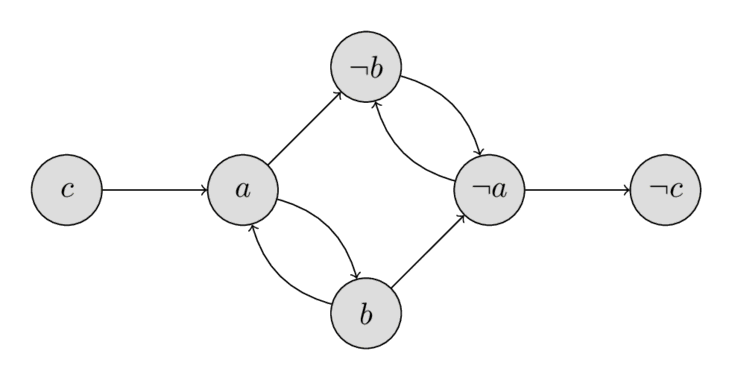
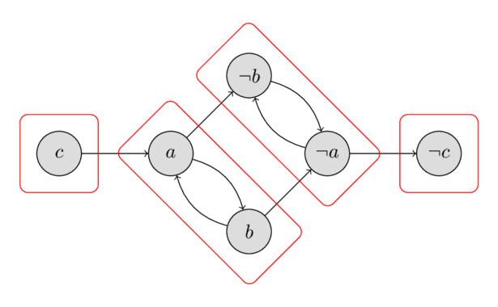

---
tags:
  - Translated
e_maxx_link: 2_sat
---

# 2-SAT 

SAT (Boolean satisfiability problem) is the problem of assigning Boolean values to variables to satisfy a given Boolean formula.
The Boolean formula will usually be given in CNF (conjunctive normal form), which is a conjunction of multiple clauses, where each clause is a disjunction of literals (variables or negation of variables).
2-SAT (2-satisfiability) is a restriction of the SAT problem, in 2-SAT every clause has exactly two literals.
Here is an example of such a 2-SAT problem.
Find an assignment of $a, b, c$ such that the following formula is true:

$$(a \lor \lnot b) \land (\lnot a \lor b) \land (\lnot a \lor \lnot b) \land (a \lor \lnot c)$$

SAT is NP-complete, there is no known efficient solution for it.
However 2SAT can be solved efficiently in $O(n + m)$ where $n$ is the number of variables and $m$ is the number of clauses.

## Algorithm:

First we need to convert the problem to a different form, the so-called implicative normal form.
Note that the expression $a \lor b$ is equivalent to $\lnot a \Rightarrow b \land \lnot b \Rightarrow a$ (if one of the two variables is false, then the other one must be true).

We now construct a directed graph of these implications:
for each variable $x$ there will be two vertices $v_x$ and $v_{\lnot x}$.
The edges will correspond to the implications.

Let's look at the example in 2-CNF form:

$$(a \lor \lnot b) \land (\lnot a \lor b) \land (\lnot a \lor \lnot b) \land (a \lor \lnot c)$$

The oriented graph will contain the following vertices and edges:

$$\begin{array}{cccc}
\lnot a \Rightarrow \lnot b & a \Rightarrow b & a \Rightarrow \lnot b & \lnot a \Rightarrow \lnot c\\
b \Rightarrow a & \lnot b \Rightarrow \lnot a & b \Rightarrow \lnot a & c \Rightarrow a
\end{array}$$

You can see the implication graph in the following image:

<center></center>

It is worth paying attention to the property of the implication graph:
if there is an edge $a \Rightarrow b$, then there also is an edge $\lnot b \Rightarrow \lnot a$. 

Also note, that if $x$ is reachable from $\lnot x$, and $\lnot x$ is reachable from $x$, then the problem has no solution.
Whatever value we choose for the variable $x$, it will always end in a contradiction - if $x$ will be assigned $\text{true}$ then the implication tell us that $\lnot x$ should also be $\text{true}$ and visa versa.
It turns out, that this condition is not only necessary, but also sufficient.
We will prove this in a few paragraphs below.
First recall, if a vertex is reachable from a second one, and the second one is reachable from the first one, then these two vertices are in the same strongly connected component.
Therefore we can formulate the criterion for the existence of a solution as follows:

In order for this 2-SAT problem to have a solution, it is necessary and sufficient that for any variable $x$ the vertices $x$ and $\lnot x$ are in different strongly connected components of the strong connection of the implication graph.

This criterion can be verified in $O(n + m)$ time by finding all strongly connected components.

The following image shows all strongly connected components for the example.
As we can check easily, neither of the four components contain a vertex $x$ and its negation $\lnot x$, therefore the example has a solution.
We will learn in the next paragraphs how to compute a valid assignment, but just for demonstration purposes the solution $a = \text{false}$, $b = \text{false}$, $c = \text{false}$ is given.

<center></center>

Now we construct the algorithm for finding the solution of the 2-SAT problem on the assumption that the solution exists.

Note that, in spite of the fact that the solution exists, it can happen that $\lnot x$ is reachable from $x$ in the implication graph, or that (but not simultaneously) $x$ is reachable from $\lnot x$.
In that case the choice of either $\text{true}$ or $\text{false}$ for $x$ will lead to a contradiction, while the choice of the other one will not.
Let's learn how to choose a value, such that we don't generate a contradiction.

Let us sort the strongly connected components in topological order (i.e. $\text{comp}[v] \le \text{comp}[u]$ if there is a path from $v$ to $u$) and let $\text{comp}[v]$ denote the index of strongly connected component to which the vertex $v$ belongs.
Then, if $\text{comp}[x] < \text{comp}[\lnot x]$ we assign $x$ with $\text{false}$ and $\text{true}$ otherwise.

Let us prove that with this assignment of the variables we do not arrive at a contradiction.
Suppose $x$ is assigned with $\text{true}$.
The other case can be proven in a similar way.

First we prove that the vertex $x$ cannot reach the vertex $\lnot x$.
Because we assigned $\text{true}$ it has to hold that the index of strongly connected component of $x$ is greater than the index of the component of $\lnot x$.
This means that $\lnot x$ is located on the left of the component containing $x$, and the later vertex cannot reach the first.

Secondly we prove that there doesn't exist a variable $y$, such that the vertices $y$ and $\lnot y$ are both reachable from $x$ in the implication graph.
This would cause a contradiction, because $x = \text{true}$ implies that $y = \text{true}$ and $\lnot y = \text{true}$.
Let us prove this by contradiction.
Suppose that $y$ and $\lnot y$ are both reachable from $x$, then by the property of the implication graph $\lnot x$ is reachable from both $y$ and $\lnot y$.
By transitivity this results that $\lnot x$ is reachable by $x$, which contradicts the assumption.

So we have constructed an algorithm that finds the required values of variables under the assumption that for any variable $x$ the vertices $x$ and $\lnot x$ are in different strongly connected components.
Above showed the correctness of this algorithm.
Consequently we simultaneously proved the above criterion for the existence of a solution.

## Implementation:

Now we can implement the entire algorithm.
First we construct the graph of implications and find all strongly connected components.
This can be accomplished with Kosaraju's algorithm in $O(n + m)$ time.
In the second traversal of the graph Kosaraju's algorithm visits the strongly connected components in topological order, therefore it is easy to compute $\text{comp}[v]$ for each vertex $v$.

Afterwards we can choose the assignment of $x$ by comparing $\text{comp}[x]$ and $\text{comp}[\lnot x]$. 
If $\text{comp}[x] = \text{comp}[\lnot x]$ we return $\text{false}$ to indicate that there doesn't exist a valid assignment that satisfies the 2-SAT problem.

Below is the implementation of the solution of the 2-SAT problem for the already constructed graph of implication $adj$ and the transpose graph $adj^{\intercal}$ (in which the direction of each edge is reversed).
In the graph the vertices with indices $2k$ and $2k+1$ are the two vertices corresponding to variable $k$ with $2k+1$ corresponding to the negated variable.

```{.cpp file=2sat}
struct TwoSatSolver {
    int n_vars;
    int n_vertices;
    vector<vector<int>> adj, adj_t;
    vector<bool> used;
    vector<int> order, comp;
    vector<bool> assignment;

    TwoSatSolver(int _n_vars) : n_vars(_n_vars), n_vertices(2 * n_vars), adj(n_vertices), adj_t(n_vertices), used(n_vertices), order(), comp(n_vertices, -1), assignment(n_vars) {
        order.reserve(n_vertices);
    }
    void dfs1(int v) {
        used[v] = true;
        for (int u : adj[v]) {
            if (!used[u])
                dfs1(u);
        }
        order.push_back(v);
    }

    void dfs2(int v, int cl) {
        comp[v] = cl;
        for (int u : adj_t[v]) {
            if (comp[u] == -1)
                dfs2(u, cl);
        }
    }

    bool solve_2SAT() {
        order.clear();
        used.assign(n_vertices, false);
        for (int i = 0; i < n_vertices; ++i) {
            if (!used[i])
                dfs1(i);
        }

        comp.assign(n_vertices, -1);
        for (int i = 0, j = 0; i < n_vertices; ++i) {
            int v = order[n_vertices - i - 1];
            if (comp[v] == -1)
                dfs2(v, j++);
        }

        assignment.assign(n_vars, false);
        for (int i = 0; i < n_vertices; i += 2) {
            if (comp[i] == comp[i + 1])
                return false;
            assignment[i / 2] = comp[i] > comp[i + 1];
        }
        return true;
    }

    void add_disjunction(int a, bool na, int b, bool nb) {
        // na and nb signify whether a and b are to be negated 
        a = 2 * a ^ na;
        b = 2 * b ^ nb;
        int neg_a = a ^ 1;
        int neg_b = b ^ 1;
        adj[neg_a].push_back(b);
        adj[neg_b].push_back(a);
        adj_t[b].push_back(neg_a);
        adj_t[a].push_back(neg_b);
    }

    static void example_usage() {
        TwoSatSolver solver(3); // a, b, c
        solver.add_disjunction(0, false, 1, true);  //     a  v  not b
        solver.add_disjunction(0, true, 1, true);   // not a  v  not b
        solver.add_disjunction(1, false, 2, false); //     b  v      c
        solver.add_disjunction(0, false, 0, false); //     a  v      a
        assert(solver.solve_2SAT() == true);
        auto expected = vector<bool>{{true, false, true}};
        assert(solver.assignment == expected);
    }
};
```

## Practice Problems
 * [Codeforces: The Door Problem](http://codeforces.com/contest/776/problem/D)
 * [Kattis: Illumination](https://open.kattis.com/problems/illumination)
 * [UVA: Rectangles](https://uva.onlinejudge.org/index.php?option=com_onlinejudge&Itemid=8&page=show_problem&problem=3081)
 * [Codeforces : Radio Stations](https://codeforces.com/problemset/problem/1215/F)
 * [CSES : Giant Pizza](https://cses.fi/problemset/task/1684)
 * [Codeforces: +-1](https://codeforces.com/contest/1971/problem/H)
