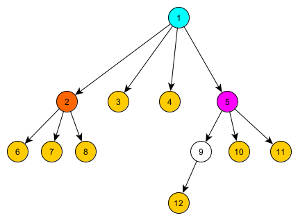

---
tags:
  - Original
---

# Centroid Decomposition

Prerequisite knowledge: [Depth First Search (DFS)](./depth-first-search.md), [Divide and Conquer](https://en.wikipedia.org/wiki/Divide-and-conquer_algorithm), [Trees](<https://en.wikipedia.org/wiki/Tree_(graph_theory)>).

## Introduction

**Centroid Decomposition** is a divide-and-conquer technique on trees. It is used to solve various problems that involve paths in a tree, such as counting paths with certain properties, finding distances, or answering queries on tree paths.

The key idea is to recursively decompose a tree by finding its **centroid**. This special vertex when removed splits the tree into components, each containing at most half of the original tree's vertices. This guarantees a logarithmic depth of recursion, leading to efficient algorithms.

## Properties and Definition of a Centroid

Let's first understand what a centroid is. A **centroid** of a tree is a vertex whose removal results in no subtree having more than $\frac{N}{2}$ vertices, where $N$ is the total number of vertices in the tree.

<div align="center">
    
</div>

For any given tree with $N$ vertices, either one or two centroids exist. If there are two centroids, they must, as well, be adjacent.

### Existence and Uniqueness

**Theorem**: Every tree has at least one centroid, and at most two centroids. If there are two centroids, they must be adjacent.

??? note "Proof"

    _Existence_: Start from any vertex and keep moving to the child with the largest subtree. Stop when no child has more than $\frac{N}{2}$ vertices. At this point, the current vertex $v$ is a centroid because (1) no child's subtree contains more than $\frac{N}{2}$ vertices (by stopping condition) (2) the "parent side" (all vertices except $v$'s subtree when $v$ was a child) contains at most $\frac{N}{2}$ vertices (otherwise we wouldn't have moved to $v$ from parent).

    It is easy to see that this process always terminates, proving at least one centroid exists.

    _Uniqueness_: Suppose there are two centroids $u$ and $v$. Consider the path between them. When we remove $u$, vertex $v$ must be in a component with at most $\frac{N}{2}$ vertices. Similarly, when we remove $v$, vertex $u$ must be in a component with at most $\frac{N}{2}$ vertices. This is only possible if $u$ and $v$ are adjacent; otherwise, removing either would place the other in a component with more than $\frac{N}{2}$ vertices. Furthermore, if two centroids exist, they must split the tree into two components of exactly $\frac{N}{2}$ vertices each, which is only possible when $N$ is even.

## Properties and Definition of Centroid Decomposition

Recursively finding centroids of a tree and decomposing the tree into its components creates a unique set of properties:

1. **Decomposition depth**: The depth is $O(\log N)$ because each level at least halves the component size.
2. **Path coverage**: Every path in the tree passes through the centroid of some component in the decomposition.

### Decomposition Depth

**Theorem**: The depth, or number of steps, when using centroid decomposition on any given tree is $O(\log N)$.

??? note "Proof"

    Consider any vertex $v$ in the original tree. We track how many times $v$ can be part of a component during the decomposition process.

    At the first level, $v$ is in a component of size $N$. When we remove the centroid of this component, $v$ ends up in a component of size at most $\frac{N}{2}$ (by the balance property).

    At the second level, $v$ is in a component of size at most $\frac{N}{2}$. Removing this component's centroid places $v$ in a component of size at most $\frac{N}{4}$.

    Continuing this pattern, at the $k$-th level, $v$ is in a component of size at most $\frac{N}{2^{k-1}}$.

    The decomposition stops when component sizes reach 1. This happens when $\frac{N}{2^{k-1}} \leq 1$, which gives us $k \leq \log_2 N + 1$.

    Therefore, the maximum depth of the centroid decomposition tree is $O(\log N)$.

**Consequence**: Since each vertex participates in at most $O(\log N)$ levels of decomposition, and we process each vertex once at each level, algorithms using centroid decomposition typically have a time complexity factor of $O(\log N)$ multiplied by the work done per vertex per level.

### Path Coverage

**Theorem**: Every path in the original tree passes through the centroid of some component in the decomposition.

??? note "Proof"

    Consider any path $P$ from vertex $u$ to vertex $v$ in the original tree. We need to show that this path passes through at least one centroid chosen during the decomposition process.

    We prove this by induction on the decomposition process.

    _Base case_: At the first level of decomposition, we select the centroid $c_1$ of the entire tree. If the path $P$ passes through $c_1$, we are done.

    _Inductive case_: Suppose path $P$ does not pass through $c_1$. When we remove $c_1$, the tree splits into multiple components. Since $P$ is a connected path, both $u$ and $v$ must lie in the same component $C$ after removing $c_1$ (otherwise, $P$ would have to pass through $c_1$ to connect them, which contradicts our assumption).

    Now we recursively decompose component $C$. By the inductive hypothesis applied to component $C$, the path $P$ (which is entirely contained in $C$) must pass through the centroid of some component in the decomposition of $C$.

    This process continues until we find a centroid through which $P$ passes. The process must terminate because at each level, the component containing $P$ gets strictly smaller (by the balance property), and eventually reduces to a single edge or vertex.

**Consequence**: This property is fundamental to the correctness of centroid decomposition algorithms. It ensures that when we process all paths through each centroid, we cover all possible paths in the tree exactly once at some level of the decomposition. This is why centroid decomposition can solve path-related problems efficiently: every path is considered exactly once, at the level where it first encounters a centroid.

## Finding a Centroid

To find a centroid of a tree efficiently:

1. Calculate subtree sizes for all vertices using Depth First Search (DFS)
2. Start from any vertex
3. Find a child $v$ whose subtree contains more than $\frac{N}{2}$ vertices
4. Move to $v$ and repeat step 3
5. If no such child exists, the current vertex is a centroid

Time complexity: $O(N)$.

Space complexity: $O(N)$.

## Algorithm Description

When using centroid decomposition, the general flow works as follows:

1. **Find the centroid** of the current tree/component
2. **Process** all paths passing through this centroid and do any desired calculations
3. **Remove** the centroid (mark it as used)
4. **Recursively decompose** each resulting subtree

This creates a **centroid tree**. Each node in this tree represents a centroid from some stage of decomposition. This means that the parent of a centroid (any given node) is the centroid that was found in the larger component containing it. The height of this tree is $O(\log N)$ as proven before.

<div align="center">
    
</div>

For example, in the above image, we have a centroid tree. Each node at each level of the tree is a centroid of that component (e.g. the root is the centroid of the entire tree, the left most child of the root is the centroid of the left most subtree of the root, etc.).

## Implementation

Here's an implementation of centroid decomposition solving a specific problem: **counting all paths in the tree with length exactly $K$**.

In this problem, we're given a tree with $N$ vertices and need to count how many paths have exactly $K$ edges. A path is defined by two distinct vertices.

```{.cpp file=centroid_decomposition}
const int MAXN = 1e5;
vector<int> adj[MAXN];
bool removed[MAXN];
int subtree_size[MAXN];
int K;  // Target path length
long long answer = 0;  // Count of paths with length K

int get_subtree_size(int v, int p = -1) {
    subtree_size[v] = 1;
    for (int u : adj[v]) {
        if (u == p || removed[u]) continue;
        subtree_size[v] += get_subtree_size(u, v);
    }
    return subtree_size[v];
}

int get_centroid(int v, int tree_size, int p = -1) {
    for (int u : adj[v]) {
        if (u == p || removed[u]) continue;
        if (subtree_size[u] * 2 > tree_size)
            return get_centroid(u, tree_size, v);
    }
    return v;
}

// Collect all distances from the centroid within a subtree
void get_distances(int v, int p, int dist, vector<int>& distances) {
    if (dist > K) return;  // Optimization: don't go beyond K
    distances.push_back(dist);
    for (int u : adj[v]) {
        if (u == p || removed[u]) continue;
        get_distances(u, v, dist + 1, distances);
    }
}

void process_centroid(int centroid) {
    // This function can be adapted to solve different problems using centroid decomposition.
    // In this specific case, we are solving the problem of counting all paths of length K.
    //
    // Strategy: For each centroid, we count paths that pass through it.
    // A path passing through the centroid consists of:
    // - A vertex in one subtree at distance d1 from the centroid
    // - A vertex in another subtree at distance d2 from the centroid
    // - Such that d1 + d2 = K

    vector<int> all_distances;
    all_distances.push_back(0);  // The centroid itself (distance 0)

    // Process each subtree of the centroid
    for (int u : adj[centroid]) {
        if (removed[u]) continue;

        vector<int> current_distances;
        get_distances(u, centroid, 1, current_distances);

        // Count paths between current subtree and all previously processed subtrees
        // For each distance d in current_distances, we need distance K-d in all_distances
        for (int d : current_distances) {
            if (K - d >= 0) {
                // Count how many vertices are at distance K-d in previous subtrees
                answer += count(all_distances.begin(), all_distances.end(), K - d);
            }
        }

        // Add current subtree's distances to all_distances for next iterations
        all_distances.insert(all_distances.end(), current_distances.begin(), current_distances.end());
    }
}

void decompose(int v) {
    int tree_size = get_subtree_size(v);
    int centroid = get_centroid(v, tree_size);

    process_centroid(centroid);

    removed[centroid] = true;

    // Recursively decompose each subtree
    for (int u : adj[centroid]) {
        if (!removed[u]) {
            decompose(u);
        }
    }
}
```

### Building the Centroid Tree

If you need to build an explicit centroid tree structure (useful for answering queries):

```cpp
int centroid_parent[MAXN];

int decompose(int v, int p = -1) {
    int tree_size = get_subtree_size(v);
    int centroid = get_centroid(v, tree_size);

    centroid_parent[centroid] = p;
    removed[centroid] = true;

    for (int u : adj[centroid]) {
        if (!removed[u]) {
            decompose(u, centroid);
        }
    }

    return centroid;
}
```

## Practice Problems

- [CSES - Finding a Centroid](https://cses.fi/problemset/task/2079) [difficulty: easy]
- [CSES - Fixed-Length Paths II](https://cses.fi/problemset/task/2081) [difficulty: easy]
- [Codeforces - Xenia and Tree](http://codeforces.com/problemset/problem/342/E) [difficulty: medium]
- [Codeforces - Digit Tree](http://codeforces.com/contest/716/problem/E) [difficulty: medium]
- [OJ - Race](https://oj.uz/problem/view/IOI11_race) [difficulty: medium]
- [SPOJ - QTREE5](http://www.spoj.com/problems/QTREE5/) [difficulty: hard]
