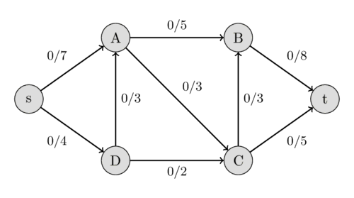
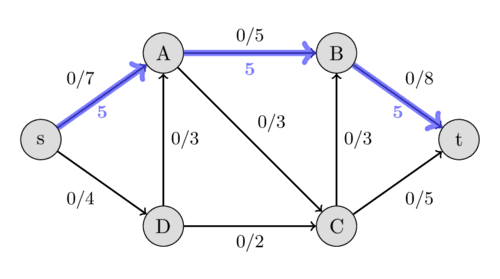
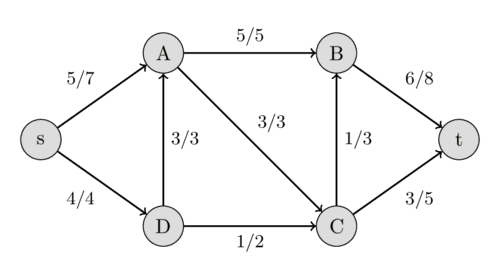
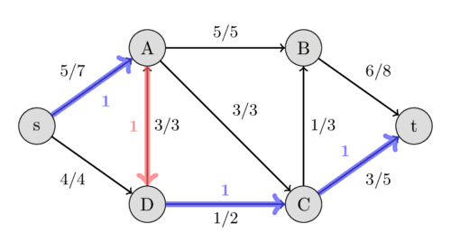

---
tags:
  - Translated
e_maxx_link: edmonds_karp
---

# Maximum flow - Ford-Fulkerson and Edmonds-Karp

The Edmonds-Karp algorithm is an implementation of the Ford-Fulkerson method for computing a maximal flow in a flow network.

## Flow network

First let's define what a **flow network**, a **flow**, and a **maximum flow** is.

A **network** is a directed graph $G$ with vertices $V$ and edges $E$ combined with a function $c$, which assigns each edge $e \in E$ a non-negative integer value, the **capacity** of $e$.
Such a network is called a **flow network**, if we additionally label two vertices, one as **source** and one as **sink**.

A **flow** in a flow network is function $f$, that again assigns each edge $e$ a non-negative integer value, namely the flow.
The function has to fulfill the following two conditions:

The flow of an edge cannot exceed the capacity.

$$f(e) \le c(e)$$

And the sum of the incoming flow of a vertex $u$ has to be equal to the sum of the outgoing flow of $u$ except in the source and sink vertices.

$$\sum_{(v, u) \in E} f((v, u)) = \sum_{(u, v) \in E} f((u, v))$$

The source vertex $s$ only has an outgoing flow, and the sink vertex $t$ has only incoming flow.

It is easy to see that the following equation holds:

$$\sum_{(s, u) \in E} f((s, u)) = \sum_{(u, t) \in E} f((u, t))$$

A good analogy for a flow network is the following visualization:
We represent edges as water pipes, the capacity of an edge is the maximal amount of water that can flow through the pipe per second, and the flow of an edge is the amount of water that currently flows through the pipe per second.
This motivates the first flow condition. There cannot flow more water through a pipe than its capacity.
The vertices act as junctions, where water comes out of some pipes, and then, these vertices distribute the water in some way to other pipes.
This also motivates the second flow condition.
All the incoming water has to be distributed to the other pipes in each junction.
It cannot magically disappear or appear.
The source $s$ is origin of all the water, and the water can only drain in the sink $t$.

The following image shows a flow network.
The first value of each edge represents the flow, which is initially 0, and the second value represents the capacity.
<center></center>

The value of the flow of a network is the sum of all the flows that get produced in the source $s$, or equivalently to the sum of all the flows that are consumed by the sink $t$.
A **maximal flow** is a flow with the maximal possible value.
Finding this maximal flow of a flow network is the problem that we want to solve.

In the visualization with water pipes, the problem can be formulated in the following way:
how much water can we push through the pipes from the source to the sink?

The following image shows the maximal flow in the flow network.
<center></center>

## Ford-Fulkerson method

Let's define one more thing.
A **residual capacity** of a directed edge is the capacity minus the flow.
It should be noted that if there is a flow along some directed edge $(u, v)$, then the reversed edge has capacity 0 and we can define the flow of it as $f((v, u)) = -f((u, v))$.
This also defines the residual capacity for all the reversed edges.
We can create a **residual network** from all these edges, which is just a network with the same vertices and edges, but we use the residual capacities as capacities.

The Ford-Fulkerson method works as follows.
First, we set the flow of each edge to zero.
Then we look for an **augmenting path** from $s$ to $t$.
An augmenting path is a simple path in the residual graph where residual capacity is positive for all the edges along that path.
If such a path is found, then we can increase the flow along these edges.
We keep on searching for augmenting paths and increasing the flow.
Once an augmenting path doesn't exist anymore, the flow is maximal.

Let us specify in more detail, what increasing the flow along an augmenting path means.
Let $C$ be the smallest residual capacity of the edges in the path.
Then we increase the flow in the following way:
we update $f((u, v)) ~\text{+=}~ C$ and $f((v, u)) ~\text{-=}~ C$ for every edge $(u, v)$ in the path.

Here is an example to demonstrate the method.
We use the same flow network as above.
Initially we start with a flow of 0.
<center></center>

We can find the path $s - A - B - t$ with the residual capacities 7, 5, and 8.
Their minimum is 5, therefore we can increase the flow along this path by 5.
This gives a flow of 5 for the network.
<center> </center>

Again we look for an augmenting path, this time we find $s - D - A - C - t$ with the residual capacities 4, 3, 3, and 5.
Therefore we can increase the flow by 3 and we get a flow of 8 for the network.
<center> </center>

This time we find the path $s - D - C - B - t$ with the residual capacities 1, 2, 3, and 3, and hence, we increase the flow by 1.
<center> </center>

This time we find the augmenting path $s - A - D - C - t$ with the residual capacities 2, 3, 1, and 2.
We can increase the flow by 1.
But this path is very interesting.
It includes the reversed edge $(A, D)$.
In the original flow network, we are not allowed to send any flow from $A$ to $D$.
But because we already have a flow of 3 from $D$ to $A$, this is possible.
The intuition of it is the following:
Instead of sending a flow of 3 from $D$ to $A$, we only send 2 and compensate this by sending an additional flow of 1 from $s$ to $A$, which allows us to send an additional flow of 1 along the path $D - C - t$.
<center> </center>

Now, it is impossible to find an augmenting path between $s$ and $t$, therefore this flow of $10$ is the maximal possible.
We have found the maximal flow.

It should be noted, that the Ford-Fulkerson method doesn't specify a method of finding the augmenting path.
Possible approaches are using [DFS](depth-first-search.md) or [BFS](breadth-first-search.md) which both work in $O(E)$.
If all the capacities of the network are integers, then for each augmenting path the flow of the network increases by at least 1 (for more details see [Integral flow theorem](#integral-theorem)).
Therefore, the complexity of Ford-Fulkerson is $O(E F)$, where $F$ is the maximal flow of the network.
In the case of rational capacities, the algorithm will also terminate, but the complexity is not bounded.
In the case of irrational capacities, the algorithm might never terminate, and might not even converge to the maximal flow.

## Edmonds-Karp algorithm

Edmonds-Karp algorithm is just an implementation of the Ford-Fulkerson method that uses [BFS](breadth-first-search.md) for finding augmenting paths.
The algorithm was first published by Yefim Dinitz in 1970, and later independently published by Jack Edmonds and Richard Karp in 1972.

The complexity can be given independently of the maximal flow.
The algorithm runs in $O(V E^2)$ time, even for irrational capacities.
The intuition is, that every time we find an augmenting path one of the edges becomes saturated, and the distance from the edge to $s$ will be longer if it appears later again in an augmenting path.
The length of the simple paths is bounded by $V$.

### Implementation

The matrix `capacity` stores the capacity for every pair of vertices.
`adj` is the adjacency list of the **undirected graph**, since we have also to use the reversed of directed edges when we are looking for augmenting paths.

The function `maxflow` will return the value of the maximal flow.
During the algorithm, the matrix `capacity` will actually store the residual capacity of the network.
The value of the flow in each edge will actually not be stored, but it is easy to extend the implementation - by using an additional matrix - to also store the flow and return it.

```{.cpp file=edmondskarp}
int n;
vector<vector<int>> capacity;
vector<vector<int>> adj;

int bfs(int s, int t, vector<int>& parent) {
    fill(parent.begin(), parent.end(), -1);
    parent[s] = -2;
    queue<pair<int, int>> q;
    q.push({s, INF});

    while (!q.empty()) {
        int cur = q.front().first;
        int flow = q.front().second;
        q.pop();

        for (int next : adj[cur]) {
            if (parent[next] == -1 && capacity[cur][next]) {
                parent[next] = cur;
                int new_flow = min(flow, capacity[cur][next]);
                if (next == t)
                    return new_flow;
                q.push({next, new_flow});
            }
        }
    }

    return 0;
}

int maxflow(int s, int t) {
    int flow = 0;
    vector<int> parent(n);
    int new_flow;

    while (new_flow = bfs(s, t, parent)) {
        flow += new_flow;
        int cur = t;
        while (cur != s) {
            int prev = parent[cur];
            capacity[prev][cur] -= new_flow;
            capacity[cur][prev] += new_flow;
            cur = prev;
        }
    }

    return flow;
}
```

## Integral flow theorem ## { #integral-theorem}

The theorem says, that if every capacity in the network is an integer, then the size of the maximum flow is an integer, and there is a maximum flow such that the flow in each edge is an integer as well. In particular, Ford-Fulkerson method finds such a flow.

## Max-flow min-cut theorem

A **$s$-$t$-cut** is a partition of the vertices of a flow network into two sets, such that a set includes the source $s$ and the other one includes the sink $t$.
The capacity of a $s$-$t$-cut is defined as the sum of capacities of the edges from the source side to the sink side.

Obviously, we cannot send more flow from $s$ to $t$ than the capacity of any $s$-$t$-cut.
Therefore, the maximum flow is bounded by the minimum cut capacity.

The max-flow min-cut theorem goes even further.
It says that the capacity of the maximum flow has to be equal to the capacity of the minimum cut.

In the following image, you can see the minimum cut of the flow network we used earlier.
It shows that the capacity of the cut $\{s, A, D\}$ and $\{B, C, t\}$ is $5 + 3 + 2 = 10$, which is equal to the maximum flow that we found.
Other cuts will have a bigger capacity, like the capacity between $\{s, A\}$ and $\{B, C, D, t\}$ is $4 + 3 + 5 = 12$.
<center></center>

A minimum cut can be found after performing a maximum flow computation using the Ford-Fulkerson method.
One possible minimum cut is the following:
the set of all the vertices that can be reached from $s$ in the residual graph (using edges with positive residual capacity), and the set of all the other vertices.
This partition can be easily found using [DFS](depth-first-search.md) starting at $s$.

## Practice Problems
- [Codeforces - Array and Operations](https://codeforces.com/contest/498/problem/c)
- [Codeforces - Red-Blue Graph](https://codeforces.com/contest/1288/problem/f)
- [CSES - Download Speed](https://cses.fi/problemset/task/1694)
- [CSES - Police Chase](https://cses.fi/problemset/task/1695)
- [CSES - School Dance](https://cses.fi/problemset/task/1696)
- [CSES - Distinct Routes](https://cses.fi/problemset/task/1711)
