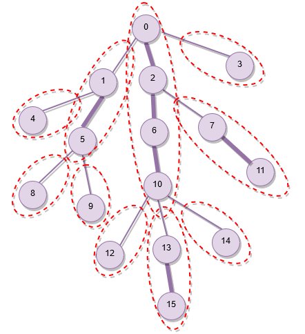

---
tags:
  - Translated
e_maxx_link: heavy_light
---

# Heavy-light decomposition

**Heavy-light decomposition** is a fairly general technique that allows us to effectively solve many problems that come down to **queries on a tree** .


## Description

Let there be a tree $G$ of $n$ vertices, with an arbitrary root.

The essence of this tree decomposition is to **split the tree into several paths** so that we can reach the root vertex from any $v$ by traversing at most $\log n$ paths. In addition, none of these paths should intersect with another.

It is clear that if we find such a decomposition for any tree, it will allow us to reduce certain single queries of the form *“calculate something on the path from $a$ to $b$”* to several queries of the type *”calculate something on the segment $[l, r]$ of the $k^{th}$ path”*.


### Construction algorithm

We calculate for each vertex $v$ the size of its subtree  $s(v)$, i.e. the number of vertices in the subtree of the vertex $v$ including itself.

Next, consider all the edges leading to the children of a vertex $v$. We call an edge  **heavy** if it leads to a vertex $c$ such that:

$$
s(c) \ge \frac{s(v)}{2} \iff \text{edge }(v, c)\text{ is heavy}
$$

All other edges are labeled **light**.

It is obvious that at most one heavy edge can emanate from one vertex downward, because otherwise the vertex $v$ would have at least two children of size $\ge \frac{s(v)}{2}$, and therefore the size of subtree of $v$ would be too big, $s(v) \ge 1 + 2 \frac{s(v)}{2} > s(v)$, which leads to a contradiction.

Now we will decompose the tree into disjoint paths. Consider all the vertices from which no heavy edges come down. We will go up from each such vertex until we reach the root of the tree or go through a light edge. As a result, we will get several paths which are made up of zero or more heavy edges plus one light edge. The path which has an end at the root is an exception to this and will not have a light edge. Let these be called **heavy paths** - these are the desired paths of heavy-light decomposition.


### Proof of correctness

First, we note that the heavy paths obtained by the algorithm will be **disjoint** . In fact, if two such paths have a common edge, it would imply that there are two heavy edges coming out of one vertex, which is impossible.

Secondly, we will show that going down from the root of the tree to an arbitrary vertex, we will **change no more than $\log n$ heavy paths along the way** . Moving down a light edge reduces the size of the current subtree to half or lower:

$$
s(c) < \frac{s(v)}{2} \iff \text{edge }(v, c)\text{ is light}
$$


Thus, we can go through at most $\log n$ light edges before subtree size reduces to one.

Since we can move from one heavy path to another only through a light edge (each heavy path, except the one starting at the root, has one light edge), we cannot change heavy paths more than $\log n$ times along the path from the root to any vertex, as required.


The following image illustrates the decomposition of a sample tree. The heavy edges are thicker than the light edges. The heavy paths are marked by dotted boundaries.

<center></center>


## Sample problems

When solving problems, it is sometimes more convenient to consider the heavy-light decomposition as a set of **vertex disjoint** paths (rather than edge disjoint paths). To do this, it suffices to exclude the last edge from each heavy path if it is a light edge, then no properties are violated, but now each vertex belongs to exactly one heavy path.

Below we will look at some typical tasks that can be solved with the help of heavy-light decomposition.

Separately, it is worth paying attention to the problem of the **sum of numbers on the path**, since this is an example of a problem that can be solved by simpler techniques.


### Maximum value on the path between two vertices

Given a tree, each vertex is assigned a value. There are queries of the form $(a, b)$, where $a$ and $b$ are two vertices in the tree, and it is required to find the maximum value on the path between the vertices $a$ and $b$.

We construct in advance a heavy-light decomposition of the tree. Over each heavy path we will construct a [segment tree](../data_structures/segment_tree.md), which will allow us to search for a vertex with the maximum assigned value in the specified segment of the specified heavy path in $\mathcal{O}(\log n)$.  Although the number of heavy paths in heavy-light decomposition can reach $n - 1$, the total size of all paths is bounded by $\mathcal{O}(n)$, therefore the total size of the segment trees will also be linear.

In order to answer a query $(a, b)$, we find the [lowest common ancestor](https://en.wikipedia.org/wiki/Lowest_common_ancestor) of $a$ and $b$ as $l$, by any preferred method. Now the task has been reduced to two queries $(a, l)$ and $(b, l)$, for each of which we can do the following: find the heavy path that the lower vertex lies in, make a query on this path, move to the top of this path, again determine which heavy path we are on and make a query on it, and so on, until we get to the path containing $l$.

One should be careful with the case when, for example, $a$ and $l$ are on the same heavy path - then the maximum query on this path should be done not on any prefix, but on the internal section between $a$ and $l$.

Responding to the subqueries $(a, l)$ and $(b, l)$ each requires going through $\mathcal{O}(\log n)$ heavy paths and for each path a maximum query is made on some section of the path, which again requires $\mathcal{O}(\log n)$ operations in the segment tree.
Hence, one query $(a, b)$ takes $\mathcal{O}(\log^2 n)$ time.

If you additionally calculate and store maximums of all prefixes for each heavy path, then you get a $\mathcal{O}(\log n)$ solution because all maximum queries are on prefixes except at most once when we reach the ancestor $l$.


###  Sum of the numbers on the path between two vertices

Given a tree, each vertex is assigned a value. There are queries of the form $(a, b)$, where $a$ and $b$ are two vertices in the tree, and it is required to find the sum of the values on the path between the vertices $a$ and $b$. A variant of this task is possible where additionally there are update operations that change the number assigned to one or more vertices.

This task can be solved similar to the previous problem of maximums with the help of heavy-light decomposition by building segment trees on heavy paths. Prefix sums can be used instead if there are no updates. However, this problem can be solved by simpler techniques too.

If there are no updates, then it is possible to find out the sum on the path between two vertices in parallel with the LCA search of two vertices by [binary lifting](lca_binary_lifting.md) — for this, along with the $2^k$-th ancestors of each vertex it is also necessary to store the sum on the paths up to those ancestors during the preprocessing.

There is a fundamentally different approach to this problem - to consider the [Euler tour](https://en.wikipedia.org/wiki/Euler_tour_technique) of the tree, and build a segment tree on it. This algorithm is considered in an [article about a similar problem](tree_painting.md). Again, if there are no updates, storing prefix sums is enough and a segment tree is not required.

Both of these methods provide relatively simple solutions taking $\mathcal{O}(\log n)$ for one query.

### Repainting the edges of the path between two vertices

Given a tree, each edge is initially painted white. There are updates of the form $(a, b, c)$, where $a$ and $b$ are two vertices and $c$ is a color, which instructs that all the edges on the path from $a$ to $b$ must be repainted with color $c$. After all repaintings, it is required to report how many edges of each color were obtained.

Similar to the above problems, the solution is to simply apply heavy-light decomposition and make a [segment tree](../data_structures/segment_tree.md) over each heavy path.

Each repainting on the path $(a, b)$ will turn into two updates $(a, l)$ and $(b, l)$, where $l$ is the lowest common ancestor of the vertices $a$ and $b$.   
$\mathcal{O}(\log n)$ per path for $\mathcal{O}(\log n)$ paths leads to a complexity of $\mathcal{O}(\log^2 n)$ per update.

## Implementation

Certain parts of the above discussed approach can be modified to make implementation easier without losing efficiency.

* The definition of **heavy edge** can be changed to **the edge leading to the child with largest subtree**, with ties broken arbitrarily. This may result is some light edges being converted to heavy, which means some heavy paths will combine to form a single path, but all heavy paths will remain disjoint. It is also still guaranteed that going down a light edge reduces subtree size to half or less.
* Instead of a building segment tree over every heavy path, a single segment tree can be used with disjoint segments allocated to each heavy path.
* It has been mentioned that answering queries requires calculation of the LCA. While LCA can be calculated separately, it is also possible to integrate LCA calculation in the process of answering queries.

To perform heavy-light decomposition:

```cpp
vector<int> parent, depth, heavy, head, pos;
int cur_pos;

int dfs(int v, vector<vector<int>> const& adj) {
    int size = 1;
    int max_c_size = 0;
    for (int c : adj[v]) {
        if (c != parent[v]) {
            parent[c] = v, depth[c] = depth[v] + 1;
            int c_size = dfs(c, adj);
            size += c_size;
            if (c_size > max_c_size)
                max_c_size = c_size, heavy[v] = c;
        }
    }
    return size;
}

void decompose(int v, int h, vector<vector<int>> const& adj) {
    head[v] = h, pos[v] = cur_pos++;
    if (heavy[v] != -1)
        decompose(heavy[v], h, adj);
    for (int c : adj[v]) {
        if (c != parent[v] && c != heavy[v])
            decompose(c, c, adj);
    }
}

void init(vector<vector<int>> const& adj) {
    int n = adj.size();
    parent = vector<int>(n);
    depth = vector<int>(n);
    heavy = vector<int>(n, -1);
    head = vector<int>(n);
    pos = vector<int>(n);
    cur_pos = 0;

    dfs(0, adj);
    decompose(0, 0, adj);
}
```

The adjacency list of the tree must be passed to the `init` function, and decomposition is performed assuming vertex `0` as root.

The `dfs` function is used to calculate `heavy[v]`, the child at the other end of the heavy edge from `v`, for every vertex `v`. Additionally `dfs` also stores the parent and depth of each vertex, which will be useful later during queries.

The `decompose` function assigns for each vertex `v` the values `head[v]` and `pos[v]`, which are respectively the head of the heavy path `v` belongs to and the position of `v` on the single segment tree that covers all vertices.

To answer queries on paths, for example the maximum query discussed, we can do something like this:

```cpp
int query(int a, int b) {
    int res = 0;
    for (; head[a] != head[b]; b = parent[head[b]]) {
        if (depth[head[a]] > depth[head[b]])
            swap(a, b);
        int cur_heavy_path_max = segment_tree_query(pos[head[b]], pos[b]);
        res = max(res, cur_heavy_path_max);
    }
    if (depth[a] > depth[b])
        swap(a, b);
    int last_heavy_path_max = segment_tree_query(pos[a], pos[b]);
    res = max(res, last_heavy_path_max);
    return res;
}
```

## Practice problems

- [SPOJ - QTREE - Query on a tree](https://www.spoj.com/problems/QTREE/)
