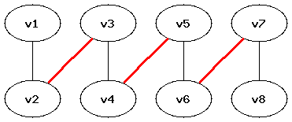
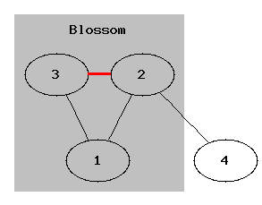
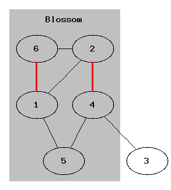
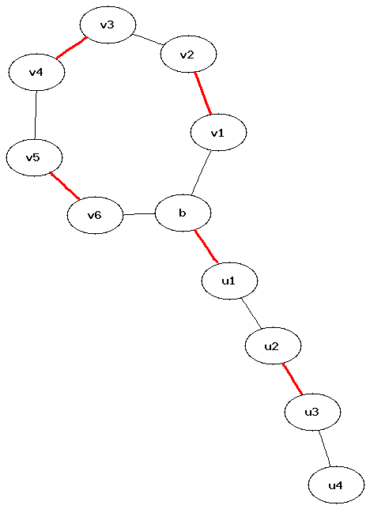
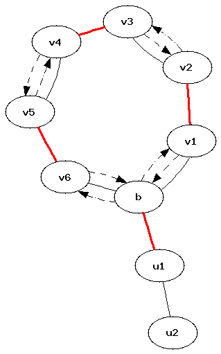

---
tags:
  - Translated
e_maxx_link: matching_edmonds
---

# Edmonds' Blossom Algorithm for Maximum Matching in General Graphs

Let an undirected unweighted graph $G$ with $n$ vertices be given. We have to find a **maximum matching** in it, i.e. a set of as many edges as possible such that no two selected edges have a common endpoint.

Unlike the case of a bipartite graph (see [Kuhn's algorithm](kuhn_maximum_bipartite_matching.md)), the graph $G$ may contain odd cycles, which makes the search for augmenting paths much more difficult.

We first give Berge's theorem. It shows that, just as for bipartite graphs, a maximum matching can be found with the help of augmenting paths.

## Augmenting paths. Berge's theorem

Fix some matching $M$. A simple path $P = (v_1, v_2, \ldots, v_k)$ is called **alternating** if its edges alternately do and do not belong to $M$. An alternating path is called **augmenting** if its first and last vertices are not matched. In other words, the simple path $P$ is augmenting if and only if $v_1$ is free, $(v_2,v_3) \in M$, $(v_4,v_5) \in M$, $\ldots$, $(v_{k-2},v_{k-1}) \in M$, and $v_k$ is free.

<div style="text-align: center;">
  
</div>

**Berge's theorem** (Claude Berge, 1957). A matching $M$ is maximum if and only if there is no augmenting path with respect to it.

??? note "Proof"

    **Proof of necessity.** Suppose that an augmenting path $P$ exists for the matching $M$. We show how to obtain a matching with larger cardinality. Alternate the matching along $P$: add the edges $(v_1,v_2)$, $(v_3,v_4)$, $\ldots$, $(v_{k-1},v_k)$ to the matching and remove the edges $(v_2,v_3)$, $(v_4,v_5)$, $\ldots$, $(v_{k-2},v_{k-1})$. The result is again a valid matching, and it contains one more edge than $M$.

    **Proof of sufficiency.** Suppose that there is no augmenting path for $M$. We prove that $M$ is maximum. Let $\overline M$ be a maximum matching and consider the symmetric difference

    $$
    \overline G = M \oplus \overline M.
    $$

    Thus, $\overline G$ contains the edges which belong to exactly one of the two matchings. Every connected component of $\overline G$ is a simple path or a cycle: otherwise some vertex would be incident to two edges from the same matching. For the same reason, every cycle has even length and its edges alternate between $M$ and $\overline M$.

    A path in $\overline G$ cannot have odd length either. Such a path would be augmenting for $M$, contrary to our assumption, or augmenting for $\overline M$, contrary to the fact that $\overline M$ is maximum. Therefore, every component contains the same number of edges from $M$ and $\overline M$. It follows that $|M| = |\overline M|$, and so $M$ is a maximum matching.

Berge's theorem gives the basis of Edmonds' algorithm: find augmenting paths and alternate the matching along them while such paths exist.

## Edmonds' algorithm. Blossom shrinking

The main problem is how to find an augmenting path. When the graph contains odd cycles, a usual [depth-first](depth-first-search.md) or [breadth-first](breadth-first-search.md) search is not enough.

Here is a simple counterexample. Take a triangle with an extra edge hanging from one of its vertices: the edges are $1-2$, $2-3$, $3-1$, $2-4$, and the edge $2-3$ belongs to the matching. If a search starting at vertex $1$ first goes to vertex $2$, it gets stuck at vertex $3$ instead of finding the augmenting path $1-3-2-4$. In this example, a search starting at vertex $4$ would still find the path.

<div style="text-align: center;">
  
</div>

Still, it is possible to construct a graph where, for a certain order of the adjacency lists, Kuhn's algorithm gets stuck completely. One example has $6$ vertices and the $7$ edges $1-2$, $1-6$, $2-6$, $2-4$, $4-3$, $1-5$, $4-5$. Kuhn's algorithm may first find the matching $1-6$, $2-4$. It then has to discover the augmenting path $5-1-6-2-4-3$, but may fail to do so: from vertex $5$ it can go to $4$ before $1$, and in the search from vertex $3$ it can go from $2$ to $1$ before $6$.

<div style="text-align: center;">
  
</div>

As this example shows, when the search enters an odd cycle, it may go around the cycle in the wrong direction. In fact, we are interested only in odd alternating cycles of length $2k+1$ which contain $k$ matching edges. Such a cycle has exactly one vertex not matched by an edge of the cycle; this vertex is called the **base**, and the odd cycle itself is called a **blossom**. An alternating path of even (possibly zero) length starts at a free vertex and ends at the base; it is called the **stem**.

<div style="text-align: center;">
  
</div>

The idea of Edmonds' algorithm (Jack Edmonds, 1965) is **blossom shrinking**. We contract the whole odd cycle into one pseudo-vertex; all edges incident to vertices of the cycle become incident to this pseudo-vertex. Edmonds' algorithm finds blossoms in the graph and shrinks them. After that, there are no troublesome odd cycles left in the contracted graph (also called the **surface graph**), and an augmenting path can be found by an ordinary traversal. The blossoms are then expanded to restore an augmenting path in the original graph.

It is not immediately clear that shrinking a blossom preserves what we need: if an augmenting path existed in $G$, it should also exist in the graph $\overline G$ obtained by shrinking the blossom, and conversely.

**Edmonds' theorem.** There is an augmenting path in $\overline G$ if and only if there is an augmenting path in $G$.

??? note "Proof sketch"

    Suppose $\overline G$ is obtained from $G$ by shrinking one blossom. Denote the cycle of the blossom by $B$ and the corresponding contracted vertex by $\overline B$.

    First notice that it is enough to consider the case where the base of the blossom is free. Otherwise, the stem is an alternating path of even length from a free vertex to the base. Alternating the matching along the stem does not change the size of the matching and makes the base free. The old and new matchings have the same cardinality, so one is maximum if and only if the other is. By Berge's theorem, an augmenting path exists for one matching if and only if it exists for the other.

    Suppose first that $P$ is an augmenting path in $G$. If it does not pass through $B$, it stays an augmenting path in $\overline G$. Otherwise, walk along $P$ from one of its free endpoints until it first reaches the cycle. All vertices of $B$ except its base are matched by edges of the cycle, so the edge by which $P$ enters $B$ is not in the matching. After the contraction, the prefix of $P$ up to this edge is therefore an augmenting path ending at the free vertex $\overline B$. If an endpoint of $P$ itself lies in $B$, this endpoint can only be the base, and the same argument applies after reversing $P$ if necessary.

    Now suppose that $\overline P$ is an augmenting path in $\overline G$. Again, if it does not pass through $\overline B$, nothing has to be changed.

    The vertex $\overline B$ is free in the contracted graph, so it cannot be an internal vertex of $\overline P$. It remains to consider the case where $\overline P$ starts at $\overline B$, i.e. it has the form $(\overline B,c,\ldots)$. In the blossom there is a vertex $v$ joined to $c$ by the corresponding non-matching edge. Of the two paths around the odd cycle from the base $b$ to $v$, one is an alternating path of even length. Replacing $\overline B$ by this path gives $(b,\ldots,v,c,\ldots)$, which is an augmenting path in $G$.

    This proves both directions of the theorem.

The general scheme of Edmonds' algorithm is the following:

```text
for every free vertex root:
    search for an augmenting path starting at root using BFS:
        for every edge from the current vertex:
            if it closes an odd cycle, shrink the blossom
            if it reaches a free vertex, return the path
            otherwise add the vertex matched with it to the queue
    if a path was found, alternate the matching along it
```

## Efficient implementation

Let us estimate the running time first. There are $n$ iterations, and each of them performs a breadth-first search in $O(m)$. There can also be $O(n)$ blossom contractions during one search. If one blossom can be shrunk in $O(n)$, the total complexity is

$$
O\left(n(m+n^2)\right) = O(n^3).
$$

The blossom contractions are the main difficulty. If we really merge adjacency lists and remove the extra vertices, one contraction takes $O(m)$ and expanding the blossoms afterwards also becomes complicated.

Instead, for every vertex of the original graph we keep a pointer to the base of the blossom containing it (or to the vertex itself if it does not belong to a contracted blossom). We need to contract a blossom in $O(n)$ and, at the same time, keep enough information to alternate the matching along the path later.

One iteration of the algorithm is a breadth-first search from a given free vertex `root`. During the search we build a tree in which the path from the root to any vertex is alternating. For convenience, only vertices at even distance from the root are put into the queue. These are the root and the far endpoints of matching edges.

The tree is stored in the parent array `p`. For every odd vertex, `p` stores its even parent. To restore a path we alternately use `p` and `match`, where `match[v]` is the vertex matched with `v`, or $-1$ if `v` is free.

Now we can detect an odd cycle. Suppose that, while processing an even vertex $v$, the search follows an edge to a vertex $u$ which is either the root or is matched and already belongs to the search tree (that is, `p[match[u]] != -1`). Then both $v$ and $u$ are even. Their distances to their lowest common ancestor have the same parity, and the edge $(v,u)$ closes an odd cycle.

### Finding the base

Suppose the blossom was detected while considering an edge $(v,u)$ between two even vertices. Their lowest common ancestor $b$ is the base of the blossom. The base is also even, because every odd vertex in the search tree has only one child. Notice that $b$ may itself be a pseudo-vertex: in that case we find the base of the already contracted blossom which is the lowest common ancestor of $v$ and $u$.

The lowest common ancestor can be found directly in $O(n)$:

```cpp
int lca(int a, int b) {
    bool used_lca[MAXN] = {};
    for (;;) {
        a = base[a];
        used_lca[a] = true;
        if (match[a] == -1)
            break;
        a = p[match[a]];
    }
    for (;;) {
        b = base[b];
        if (used_lca[b])
            return b;
        b = p[match[b]];
    }
}
```

### Shrinking a blossom

We have to identify the cycle by walking from $v$ and $u$ to its base $b$. For now it is enough to mark all its vertices in a boolean array `blossom`. To simulate a BFS from the contracted pseudo-vertex, we then put every vertex of the cycle into the queue. This avoids any real merging of adjacency lists.

One problem is still left: restoring the augmenting path after the BFS finishes. For this we have kept the parent array `p`, but after a contraction the BFS continues from all vertices of the cycle, including odd ones. Also, an augmenting path through the blossom may go around the cycle in the direction which looks like going down the old search tree.

This is handled by changing the parents of every even vertex of the cycle, except for the base, so that they point to the neighboring vertex in the proper direction around the cycle. For $u$ and $v$, if they are not the base, the parent pointers are directed toward each other. Then, if path restoration enters a blossom at an odd vertex, following the parent pointers correctly walks around the cycle and eventually reaches its base.

<div style="text-align: center;">
  
</div>

The contraction begins as follows:

```cpp
int curbase = lca(v, u);
memset(blossom, false, sizeof blossom);
mark_path(v, curbase, u);
mark_path(u, curbase, v);
```

The function `mark_path` walks from a vertex to the base, marks both ends of every matching edge of this part of the cycle, and fixes the parents of the even vertices. The parameter `children` is the child of the first vertex; it is used to close the cycle in the parent pointers.

```cpp
void mark_path(int v, int b, int children) {
    while (base[v] != b) {
        blossom[base[v]] = blossom[base[match[v]]] = true;
        p[v] = children;
        children = match[v];
        v = p[match[v]];
    }
}
```

After both sides of the cycle have been marked, the contraction is completed by changing their bases and adding the necessary vertices to the queue:

```cpp
for (int i = 0; i < n; ++i) {
    if (blossom[base[i]]) {
        base[i] = curbase;
        if (!used[i]) {
            used[i] = true;
            q[qt++] = i;
        }
    }
}
```

### Searching for an augmenting path

The function `find_path(root)` searches for an augmenting path from a free vertex `root`. It returns the other free endpoint, or $-1$ if no path was found.

At the start of each search, no blossom is contracted, so `base[i] = i`. The arrays `used` and `p` are cleared. While processing an edge $(v,to)$ there are three cases:

1. If `base[v] == base[to]`, the two vertices belong to the same contracted pseudo-vertex and the edge does not exist in the current surface graph. We also skip the edge if `match[v] == to`, because it is the matching edge going back towards the parent of the even vertex $v$.

2. If `to` is the root, or if it is matched and its partner already has a parent, the edge closes an odd cycle. We find its base and shrink the blossom as described above.

3. Otherwise it is an ordinary BFS edge. To check whether `to` was visited, we look at `p[to]`, since `p` is filled for the visited odd vertices. If `to` is free, an augmenting path has been found. If it is matched, its partner is an even vertex and is added to the queue.

Here is the complete implementation. The graph is stored in adjacency lists and vertices are numbered from $0$ to $n-1$. The constant `MAXN` has to be at least the maximum possible number of vertices in the input.

```{.cpp file=edmonds_blossom}
const int MAXN = 500;

int n;
vector<int> g[MAXN];
int match[MAXN], p[MAXN], base[MAXN], q[MAXN];
bool used[MAXN], blossom[MAXN];

int lca(int a, int b) {
    bool used_lca[MAXN] = {};
    for (;;) {
        a = base[a];
        used_lca[a] = true;
        if (match[a] == -1)
            break;
        a = p[match[a]];
    }
    for (;;) {
        b = base[b];
        if (used_lca[b])
            return b;
        b = p[match[b]];
    }
}

void mark_path(int v, int b, int children) {
    while (base[v] != b) {
        blossom[base[v]] = blossom[base[match[v]]] = true;
        p[v] = children;
        children = match[v];
        v = p[match[v]];
    }
}

int find_path(int root) {
    memset(used, false, sizeof used);
    memset(p, -1, sizeof p);
    for (int i = 0; i < n; ++i)
        base[i] = i;

    used[root] = true;
    int qh = 0, qt = 0;
    q[qt++] = root;
    while (qh < qt) {
        int v = q[qh++];
        for (int to : g[v]) {
            if (base[v] == base[to] || match[v] == to)
                continue;
            if (to == root || (match[to] != -1 && p[match[to]] != -1)) {
                int curbase = lca(v, to);
                memset(blossom, false, sizeof blossom);
                mark_path(v, curbase, to);
                mark_path(to, curbase, v);
                for (int i = 0; i < n; ++i) {
                    if (blossom[base[i]]) {
                        base[i] = curbase;
                        if (!used[i]) {
                            used[i] = true;
                            q[qt++] = i;
                        }
                    }
                }
            } else if (p[to] == -1) {
                p[to] = v;
                if (match[to] == -1)
                    return to;
                to = match[to];
                used[to] = true;
                q[qt++] = to;
            }
        }
    }
    return -1;
}

int maximum_matching() {
    memset(match, -1, sizeof match);
    int matching = 0;
    for (int i = 0; i < n; ++i) {
        if (match[i] == -1) {
            int v = find_path(i);
            if (v == -1)
                continue;
            ++matching;
            while (v != -1) {
                int pv = p[v];
                int ppv = match[pv];
                match[v] = pv;
                match[pv] = v;
                v = ppv;
            }
        }
    }
    return matching;
}
```

## Optimization: constructing an initial matching

As with Kuhn's algorithm, before running Edmonds' algorithm we can build some initial matching by a simple algorithm. For example, the following greedy algorithm can be used:

```cpp
for (int i = 0; i < n; ++i) {
    if (match[i] == -1) {
        for (int to : g[i]) {
            if (match[to] == -1) {
                match[to] = i;
                match[i] = to;
                break;
            }
        }
    }
}
```

On random graphs this optimization can speed up the algorithm considerably, sometimes by several times. After building this matching, the main loop of `maximum_matching` should be run without clearing `match`, and the initial number of matched pairs should be counted.

## The bipartite case

A bipartite graph has no odd cycles, so the code which shrinks blossoms is never executed. If all blossom-related parts are removed from the implementation, what remains is almost exactly Kuhn's algorithm. Thus, on bipartite graphs Edmonds' algorithm reduces to Kuhn's algorithm and works in $O(nm)$.

## Further optimization

The operations with blossoms described above resemble operations on disjoint sets. An implementation using an ordinary [disjoint set union](../data_structures/disjoint_set_union.md) can run in $O(nm\alpha(m,n))$, where $\alpha$ is the inverse Ackermann function. With a specialized linear-time set-union structure this can be improved to $O(nm)$. Thus the same $O(nm)$ bound as for Kuhn's algorithm can be obtained for general graphs as well, but the resulting algorithm is noticeably more complicated.

## Practice Problems

- [Library Checker - Matching on General Graph](https://judge.yosupo.jp/problem/general_matching)
