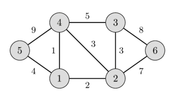
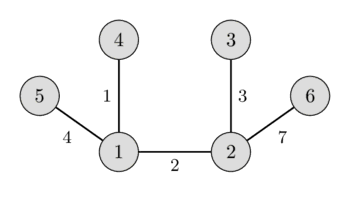

---
tags:
  - Translated
e_maxx_link: mst_kruskal
---

# Minimum spanning tree - Kruskal's algorithm

Given a weighted undirected graph.
We want to find a subtree of this graph which connects all vertices (i.e. it is a spanning tree) and has the least weight (i.e. the sum of weights of all the edges is minimum) of all possible spanning trees.
This spanning tree is called a minimum spanning tree.

In the left image you can see a weighted undirected graph, and in the right image you can see the corresponding minimum spanning tree.

 

This article will discuss few important facts associated with minimum spanning trees, and then will give the simplest implementation of Kruskal's algorithm for finding minimum spanning tree.

## Properties of the minimum spanning tree

* A minimum spanning tree of a graph is unique, if the weight of all the edges are distinct. Otherwise, there may be multiple minimum spanning trees.
  (Specific algorithms typically output one of the possible minimum spanning trees).
* Minimum spanning tree is also the tree with minimum product of weights of edges.
  (It can be easily proved by replacing the weights of all edges with their logarithms)
* In a minimum spanning tree of a graph, the maximum weight of an edge is the minimum possible from all possible spanning trees of that graph.
  (This follows from the validity of Kruskal's algorithm).
* The maximum spanning tree (spanning tree with the sum of weights of edges being maximum) of a graph can be obtained similarly to that of the minimum spanning tree, by changing the signs of the weights of all the edges to their opposite and then applying any of the minimum spanning tree algorithm.

## Kruskal's algorithm

This algorithm was described by Joseph Bernard Kruskal, Jr. in 1956.

Kruskal's algorithm initially places all the nodes of the original graph isolated from each other, to form a forest of single node trees, and then gradually merges these trees, combining at each iteration any two of all the trees with some edge of the original graph. Before the execution of the algorithm, all edges are sorted by weight (in non-decreasing order). Then begins the process of unification: pick all edges from the first to the last (in sorted order), and if the ends of the currently picked edge belong to different subtrees, these subtrees are combined, and the edge is added to the answer. After iterating through all the edges, all the vertices will belong to the same sub-tree, and we will get the answer.

## The simplest implementation

The following code directly implements the algorithm described above, and is having $O(M \log M + N^2)$ time complexity.
Sorting edges requires $O(M \log N)$ (which is the same as $O(M \log M)$) operations.
Information regarding the subtree to which a vertex belongs is maintained with the help of an array `tree_id[]` - for each vertex `v`, `tree_id[v]` stores the number of the tree , to which `v` belongs.
For each edge, whether it belongs to the ends of different trees, can be determined in $O(1)$.
Finally, the union of the two trees is carried out in $O(N)$ by a simple pass through `tree_id[]` array.
Given that the total number of merge operations is $N-1$, we obtain the asymptotic behavior of $O(M \log N + N^2)$.

```cpp
struct Edge {
    int u, v, weight;
    bool operator<(Edge const& other) {
        return weight < other.weight;
    }
};

int n;
vector<Edge> edges;

int cost = 0;
vector<int> tree_id(n);
vector<Edge> result;
for (int i = 0; i < n; i++)
    tree_id[i] = i;

sort(edges.begin(), edges.end());
   
for (Edge e : edges) {
    if (tree_id[e.u] != tree_id[e.v]) {
        cost += e.weight;
        result.push_back(e);

        int old_id = tree_id[e.u], new_id = tree_id[e.v];
        for (int i = 0; i < n; i++) {
            if (tree_id[i] == old_id)
                tree_id[i] = new_id;
        }
    }
}
```

## Proof of correctness

Why does Kruskal's algorithm give us the correct result?

If the original graph was connected, then also the resulting graph will be connected.
Because otherwise there would be two components that could be connected with at least one edge. Though this is impossible, because Kruskal would have chosen one of these edges, since the ids of the components are different.
Also the resulting graph doesn't contain any cycles, since we forbid this explicitly in the algorithm.
Therefore the algorithm generates a spanning tree.

So why does this algorithm give us a minimum spanning tree?

We can show the proposal "if $F$ is a set of edges chosen by the algorithm at any stage in the algorithm, then there exists a MST that contains all edges of $F$" using induction.

The proposal is obviously true at the beginning, the empty set is a subset of any MST.

Now let's assume $F$ is some edge set at any stage of the algorithm, $T$ is a MST containing $F$ and $e$ is the new edge we want to add using Kruskal.

If $e$ generates a cycle, then we don't add it, and so the proposal is still true after this step.

In case that $T$ already contains $e$, the proposal is also true after this step.

In case $T$ doesn't contain the edge $e$, then $T + e$ will contain a cycle $C$.
This cycle will contain at least one edge $f$, that is not in $F$.
The set of edges $T - f + e$ will also be a spanning tree. 
Notice that the weight of $f$ cannot be smaller than the weight of $e$, because otherwise Kruskal would have chosen $f$ earlier.
It also cannot have a bigger weight, since that would make the total weight of $T - f + e$ smaller than the total weight of $T$, which is impossible since $T$ is already a MST.
This means that the weight of $e$ has to be the same as the weight of $f$.
Therefore $T - f + e$ is also a MST, and it contains all edges from $F + e$.
So also here the proposal is still fulfilled after the step.

This proves the proposal.
Which means that after iterating over all edges the resulting edge set will be connected, and will be contained in a MST, which means that it has to be a MST already.

## Improved implementation

We can use the [**Disjoint Set Union** (DSU)](../data_structures/disjoint_set_union.md) data structure to write a faster implementation of the Kruskal's algorithm with the time complexity of about $O(M \log N)$. [This article](mst_kruskal_with_dsu.md) details such an approach.

## Practice Problems

* [SPOJ - Koicost](http://www.spoj.com/problems/KOICOST/)
* [SPOJ - MaryBMW](http://www.spoj.com/problems/MARYBMW/)
* [Codechef - Fullmetal Alchemist](https://www.codechef.com/ICL2016/problems/ICL16A)
* [Codeforces - Edges in MST](http://codeforces.com/contest/160/problem/D)
* [UVA 12176 - Bring Your Own Horse](https://uva.onlinejudge.org/index.php?option=com_onlinejudge&Itemid=8&page=show_problem&problem=3328)
* [UVA 10600 - ACM Contest and Blackout](https://uva.onlinejudge.org/index.php?option=com_onlinejudge&Itemid=8&page=show_problem&problem=1541)
* [UVA 10724 - Road Construction](https://uva.onlinejudge.org/index.php?option=onlinejudge&page=show_problem&problem=1665)
* [Hackerrank - Roads in HackerLand](https://www.hackerrank.com/contests/june-world-codesprint/challenges/johnland/problem)
* [UVA 11710 - Expensive subway](https://uva.onlinejudge.org/index.php?option=com_onlinejudge&Itemid=8&page=show_problem&problem=2757)
* [Codechef - Chefland and Electricity](https://www.codechef.com/problems/CHEFELEC)
* [UVA 10307 - Killing Aliens in Borg Maze](https://uva.onlinejudge.org/index.php?option=com_onlinejudge&Itemid=8&page=show_problem&problem=1248)
* [Codeforces - Flea](http://codeforces.com/problemset/problem/32/C)
* [Codeforces - Igon in Museum](http://codeforces.com/problemset/problem/598/D)
* [Codeforces - Hongcow Builds a Nation](http://codeforces.com/problemset/problem/744/A)
* [UVA - 908 - Re-connecting Computer Sites](https://uva.onlinejudge.org/index.php?option=com_onlinejudge&Itemid=8&page=show_problem&problem=849)
* [UVA 1208 - Oreon](https://uva.onlinejudge.org/index.php?option=com_onlinejudge&Itemid=8&page=show_problem&problem=3649)
* [UVA 1235 - Anti Brute Force Lock](https://uva.onlinejudge.org/index.php?option=com_onlinejudge&Itemid=8&page=show_problem&problem=3676)
* [UVA 10034 - Freckles](https://uva.onlinejudge.org/index.php?option=com_onlinejudge&Itemid=8&page=show_problem&problem=975)
* [UVA 11228 - Transportation system](https://uva.onlinejudge.org/index.php?option=onlinejudge&page=show_problem&problem=2169)
* [UVA 11631 - Dark roads](https://uva.onlinejudge.org/index.php?option=com_onlinejudge&Itemid=8&page=show_problem&problem=2678)
* [UVA 11733 - Airports](https://uva.onlinejudge.org/index.php?option=com_onlinejudge&Itemid=8&page=show_problem&problem=2833)
* [UVA 11747 - Heavy Cycle Edges](https://uva.onlinejudge.org/index.php?option=com_onlinejudge&Itemid=8&page=show_problem&problem=2847)
* [SPOJ - Blinet](http://www.spoj.com/problems/BLINNET/)
* [SPOJ - Help the Old King](http://www.spoj.com/problems/IITKWPCG/)
* [Codeforces - Hierarchy](http://codeforces.com/contest/17/problem/B)
* [SPOJ - Modems](https://www.spoj.com/problems/EC_MODE/)
* [CSES - Road Reparation](https://cses.fi/problemset/task/1675)
* [CSES - Road Construction](https://cses.fi/problemset/task/1676)
