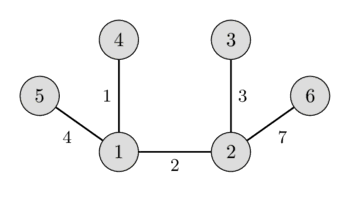

---
tags:
  - Translated
e_maxx_link: mst_prim
---

# Minimum spanning tree - Prim's algorithm

Given a weighted, undirected graph $G$ with $n$ vertices and $m$ edges.
You want to find a spanning tree of this graph which connects all vertices and has the least weight (i.e. the sum of weights of edges is minimal).
A spanning tree is a set of edges such that any vertex can reach any other by exactly one simple path.
The spanning tree with the least weight is called a minimum spanning tree.

In the left image you can see a weighted undirected graph, and in the right image you can see the corresponding minimum spanning tree.

<center> </center>

It is easy to see that any spanning tree will necessarily contain $n-1$ edges.

This problem appears quite naturally in a lot of problems.
For instance in the following problem:
there are $n$ cities and for each pair of cities we are given the cost to build a road between them (or we know that is physically impossible to build a road between them).
We have to build roads, such that we can get from each city to every other city, and the cost for building all roads is minimal.

## Prim's Algorithm

This algorithm was originally discovered by the Czech mathematician Vojtěch Jarník in 1930.
However this algorithm is mostly known as Prim's algorithm after the American mathematician Robert Clay Prim, who rediscovered and republished it in 1957.
Additionally Edsger Dijkstra published this algorithm in 1959.

### Algorithm description

Here we describe the algorithm in its simplest form.
The minimum spanning tree is built gradually by adding edges one at a time.
At first the spanning tree consists only of a single vertex (chosen arbitrarily).
Then the minimum weight edge outgoing from this vertex is selected and added to the spanning tree.
After that the spanning tree already consists of two vertices.
Now select and add the edge with the minimum weight that has one end in an already selected vertex (i.e. a vertex that is already part of the spanning tree), and the other end in an unselected vertex.
And so on, i.e. every time we select and add the edge with minimal weight that connects one selected vertex with one unselected vertex.
The process is repeated until the spanning tree contains all vertices (or equivalently until we have $n - 1$ edges).

In the end the constructed spanning tree will be minimal.
If the graph was originally not connected, then there doesn't exist a spanning tree, so the number of selected edges will be less than $n - 1$.

### Proof

Let the graph $G$ be connected, i.e. the answer exists.
We denote by $T$ the resulting graph found by Prim's algorithm, and by $S$ the minimum spanning tree.
Obviously $T$ is indeed a spanning tree and a subgraph of $G$.
We only need to show that the weights of $S$ and $T$ coincide.

Consider the first time in the algorithm when we add an edge to $T$ that is not part of $S$.
Let us denote this edge with $e$, its ends by $a$ and $b$, and the set of already selected vertices as $V$ ($a \in V$ and $b \notin V$, or vice versa).

In the minimal spanning tree $S$ the vertices $a$ and $b$ are connected by some path $P$.
On this path we can find an edge $f$ such that one end of $f$ lies in $V$ and the other end doesn't.
Since the algorithm chose $e$ instead of $f$, it means that the weight of $f$ is greater or equal to the weight of $e$.

We add the edge $e$ to the minimum spanning tree $S$ and remove the edge $f$.
By adding $e$ we created a cycle, and since $f$ was also part of the only cycle, by removing it the resulting graph is again free of cycles.
And because we only removed an edge from a cycle, the resulting graph is still connected.

The resulting spanning tree cannot have a larger total weight, since the weight of $e$ was not larger than the weight of $f$, and it also cannot have a smaller weight since $S$ was a minimum spanning tree.
This means that by replacing the edge $f$ with $e$ we generated a different minimum spanning tree.
And $e$ has to have the same weight as $f$.

Thus all the edges we pick in Prim's algorithm have the same weights as the edges of any minimum spanning tree, which means that Prim's algorithm really generates a minimum spanning tree.

## Implementation

The complexity of the algorithm depends on how we search for the next minimal edge among the appropriate edges.
There are multiple approaches leading to different complexities and different implementations.

### Trivial implementations: $O(n m)$ and $O(n^2 + m \log n)$

If we search the edge by iterating over all possible edges, then it takes $O(m)$ time to find the edge with the minimal weight.
The total complexity will be $O(n m)$.
In the worst case this is $O(n^3)$, really slow.

This algorithm can be improved if we only look at one edge from each already selected vertex.
For example we can sort the edges from each vertex in ascending order of their weights, and store a pointer to the first valid edge (i.e. an edge that goes to an non-selected vertex).
Then after finding and selecting the minimal edge, we update the pointers.
This give a complexity of $O(n^2 + m)$, and for sorting the edges an additional $O(m \log n)$, which gives the complexity $O(n^2 \log n)$ in the worst case.

Below we consider two slightly different algorithms, one for dense and one for sparse graphs, both with a better complexity.

### Dense graphs: $O(n^2)$

We approach this problem from a different angle:
for every not yet selected vertex we will store the minimum edge to an already selected vertex.

Then during a step we only have to look at these minimum weight edges, which will have a complexity of $O(n)$.

After adding an edge some minimum edge pointers have to be recalculated.
Note that the weights only can decrease, i.e. the minimal weight edge of every not yet selected vertex might stay the same, or it will be updated by an edge to the newly selected vertex.
Therefore this phase can also be done in $O(n)$.

Thus we received a version of Prim's algorithm with the complexity $O(n^2)$.

In particular this implementation is very convenient for the Euclidean Minimum Spanning Tree problem:
we have $n$ points on a plane and the distance between each pair of points is the Euclidean distance between them, and we want to find a minimum spanning tree for this complete graph.
This task can be solved by the described algorithm in $O(n^2)$ time and $O(n)$ memory, which is not possible with [Kruskal's algorithm](mst_kruskal.md).

```cpp
int n;
vector<vector<int>> adj; // adjacency matrix of graph
const int INF = 1000000000; // weight INF means there is no edge

struct Edge {
    int w = INF, to = -1;
};

void prim() {
    int total_weight = 0;
    vector<bool> selected(n, false);
    vector<Edge> min_e(n);
    min_e[0].w = 0;

    for (int i=0; i<n; ++i) {
        int v = -1;
        for (int j = 0; j < n; ++j) {
            if (!selected[j] && (v == -1 || min_e[j].w < min_e[v].w))
                v = j;
        }

        if (min_e[v].w == INF) {
            cout << "No MST!" << endl;
            exit(0);
        }

        selected[v] = true;
        total_weight += min_e[v].w;
        if (min_e[v].to != -1)
            cout << v << " " << min_e[v].to << endl;

        for (int to = 0; to < n; ++to) {
            if (adj[v][to] < min_e[to].w)
                min_e[to] = {adj[v][to], v};
        }
    }

    cout << total_weight << endl;
}
```

The adjacency matrix `adj[][]` of size $n \times n$ stores the weights of the edges, and it uses the weight `INF` if there doesn't exist an edge between two vertices.
The algorithm uses two arrays: the flag `selected[]`, which indicates which vertices we already have selected, and the array `min_e[]` which stores the edge with minimal weight to an selected vertex for each not-yet-selected vertex (it stores the weight and the end vertex).
The algorithm does $n$ steps, in each iteration the vertex with the smallest edge weight is selected, and the `min_e[]` of all other vertices gets updated.

### Sparse graphs: $O(m \log n)$

In the above described algorithm it is possible to interpret the operations of finding the minimum and modifying some values as set operations.
These two classical operations are supported by many data structure, for example by `set` in C++ (which are implemented via red-black trees).

The main algorithm remains the same, but now we can find the minimum edge in $O(\log n)$ time.
On the other hand recomputing the pointers will now take $O(n \log n)$ time, which is worse than in the previous algorithm.

But when we consider that we only need to update $O(m)$ times in total, and perform $O(n)$ searches for the minimal edge, then the total complexity will be $O(m \log n)$.
For sparse graphs this is better than the above algorithm, but for dense graphs this will be slower.

```cpp
const int INF = 1000000000;

struct Edge {
    int w = INF, to = -1;
    bool operator<(Edge const& other) const {
        return make_pair(w, to) < make_pair(other.w, other.to);
    }
};

int n;
vector<vector<Edge>> adj;

void prim() {
    int total_weight = 0;
    vector<Edge> min_e(n);
    min_e[0].w = 0;
    set<Edge> q;
    q.insert({0, 0});
    vector<bool> selected(n, false);
    for (int i = 0; i < n; ++i) {
        if (q.empty()) {
            cout << "No MST!" << endl;
            exit(0);
        }

        int v = q.begin()->to;
        selected[v] = true;
        total_weight += q.begin()->w;
        q.erase(q.begin());

        if (min_e[v].to != -1)
            cout << v << " " << min_e[v].to << endl;

        for (Edge e : adj[v]) {
            if (!selected[e.to] && e.w < min_e[e.to].w) {
                q.erase({min_e[e.to].w, e.to});
                min_e[e.to] = {e.w, v};
                q.insert({e.w, e.to});
            }
        }
    }

    cout << total_weight << endl;
}
```

Here the graph is represented via a adjacency list `adj[]`, where `adj[v]` contains all edges (in form of weight and target pairs) for the vertex `v`.
`min_e[v]` will store the weight of the smallest edge from vertex `v` to an already selected vertex (again in the form of a weight and target pair).
In addition the queue `q` is filled with all not yet selected vertices in the order of increasing weights `min_e`.
The algorithm does `n` steps, on each of which it selects the vertex `v` with the smallest weight `min_e` (by extracting it from the beginning of the queue), and then looks through all the edges from this vertex and updates the values in `min_e` (during an update we also need to also remove the old edge from the queue `q` and put in the new edge).
