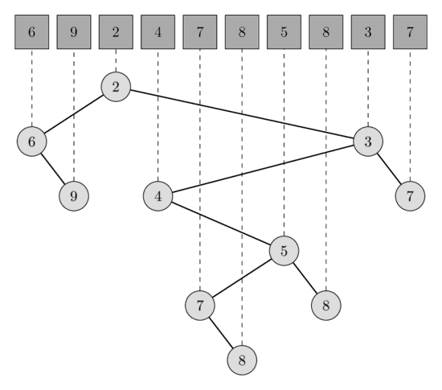
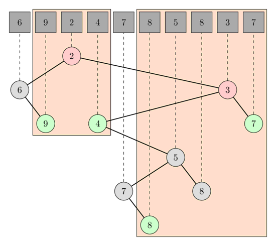

---
tags:
  - Translated
e_maxx_link: rmq_linear
---

# Solve RMQ (Range Minimum Query) by finding LCA (Lowest Common Ancestor)

Given an array `A[0..N-1]`.
For each query of the form `[L, R]` we want to find the minimum in the array `A` starting from position `L` and ending with position `R`.
We will assume that the array `A` doesn't change in the process, i.e. this article describes a solution to the static RMQ problem

Here is a description of an asymptotically optimal solution.
It stands apart from other solutions for the RMQ problem, since it is very different from them:
it reduces the RMQ problem to the LCA problem, and then uses the [Farach-Colton and Bender algorithm](lca_farachcoltonbender.md), which reduces the LCA problem back to a specialized RMQ problem and solves that.

## Algorithm

We construct a **Cartesian tree** from the array `A`.
A Cartesian tree of an array `A` is a binary tree with the min-heap property (the value of parent node has to be smaller or equal than the value of its children) such that the in-order traversal of the tree visits the nodes in the same order as they are in the array `A`.

In other words, a Cartesian tree is a recursive data structure.
The array `A` will be partitioned into 3 parts: the prefix of the array up to the minimum, the minimum, and the remaining suffix.
The root of the tree will be a node corresponding to the minimum element of the array `A`, the left subtree will be the Cartesian tree of the prefix, and the right subtree will be a Cartesian tree of the suffix.

In the following image you can see one array of length 10 and the corresponding Cartesian tree.
<center></center>

The range minimum query `[l, r]` is equivalent to the lowest common ancestor query `[l', r']`, where `l'` is the node corresponding to the element `A[l]` and `r'` the node corresponding to the element `A[r]`.
Indeed the node corresponding to the smallest element in the range has to be an ancestor of all nodes in the range, therefor also from `l'` and `r'`.
This automatically follows from the min-heap property.
And is also has to be the lowest ancestor, because otherwise `l'` and `r'` would be both in the left or in the right subtree, which generates a contradiction since in such a case the minimum wouldn't even be in the range.

In the following image you can see the LCA queries for the RMQ queries `[1, 3]` and `[5, 9]`.
In the first query the LCA of the nodes `A[1]` and `A[3]` is the node corresponding to `A[2]` which has the value 2, and in the second query the LCA of `A[5]` and `A[9]` is the node corresponding to `A[8]` which has the value 3.
<center></center>

Such a tree can be built in $O(N)$ time and the Farach-Colton and Benders algorithm can preprocess the tree in $O(N)$ and find the LCA in $O(1)$.

## Construction of a Cartesian tree

We will build the Cartesian tree by adding the elements one after another.
In each step we maintain a valid Cartesian tree of all the processed elements.
It is easy to see, that adding an element `s[i]` can only change the nodes in the most right path - starting at the root and repeatedly taking the right child - of the tree.
The subtree of the node with the smallest, but greater or equal than `s[i]`, value becomes the left subtree of `s[i]`, and the tree with root `s[i]` will become the new right subtree of the node with the biggest, but smaller than `s[i]` value.

This can be implemented by using a stack to store the indices of the most right nodes.

```cpp
vector<int> parent(n, -1);
stack<int> s;
for (int i = 0; i < n; i++) {
    int last = -1;
    while (!s.empty() && A[s.top()] >= A[i]) {
        last = s.top();
        s.pop();
    }
    if (!s.empty())
        parent[i] = s.top();
    if (last >= 0)
        parent[last] = i;
    s.push(i);
}
```
