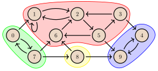

---
tags:
  - Translated
e_maxx_link: strong_connected_components
---

# Strongly connected components and the condensation graph

## Definitions
Let $G=(V,E)$ be a directed graph with vertices $V$ and edges $E \subseteq V \times V$. We denote with $n=|V|$ the number of vertices and with $m=|E|$ the number of edges in $G$. It is easy to extend all definitions in this article to multigraphs, but we will not focus on that.

A subset of vertices $C \subseteq V$ is called a **strongly connected component** if the following conditions hold:

- for all $u,v\in C$, if $u \neq v$ there exists a path from $u$ to $v$ and a path from $v$ to $u$, and
- $C$ is maximal, in the sense that no vertex can be added without violating the above condition.

We denote with $\text{SCC}(G)$ the set of strongly connected components of $G$. These strongly connected components do not intersect with each other, and cover all vertices in the graph. Thus, the set $\text{SCC}(G)$ is a partition of $V$. 

Consider this graph $G_\text{example}$, in which the strongly connected components are highlighted:

<center></center>

Here we have $\text{SCC}(G_\text{example})=\{\{0,7\},\{1,2,3,5,6\},\{4,9\},\{8\}\}.$ We can confirm that within each strongly connected component, all vertices are reachable from each other.

We define the **condensation graph** $G^{\text{SCC}}=(V^{\text{SCC}}, E^{\text{SCC}})$ as follows:

- the vertices of $G^{\text{SCC}}$ are the strongly connected components of $G$; i.e., $V^{\text{SCC}} = \text{SCC}(G)$, and
- for all vertices $C_i,C_j$ of the condensation graph, there is an edge from $C_i$ to $C_j$ if and only if $C_i \neq C_j$ and there exist $a\in C_i$ and $b\in C_j$ such that there is an edge from $a$ to $b$ in $G$.

The condensation graph of $G_\text{example}$ looks as follows:

<center></center>


The most important property of the condensation graph is that it is **acyclic**. Indeed, there are no 'self-loops' in the condensation graph by definition, and if there were a cycle going through two or more vertices (strongly connected components) in the condensation graph, then due to reachability, the union of these strongly connected components would have to be one strongly connected component itself: contradiction.

The algorithm described in the next section finds all strongly connected components in a given graph. After that, the condensation graph can be constructed.

## Kosaraju's algorithm

### Description of the algorithm
The described algorithm was independently suggested by Kosaraju and Sharir around 1980. It is based on two series of [depth first search](depth-first-search.md), with a runtime of $O(n + m)$.

In the first step of the algorithm, we perform a sequence of depth first searches (`dfs`), visiting the entire graph. That is, as long as there are still unvisited vertices, we take one of them, and initiate a depth first search from that vertex. For each vertex, we keep track of the *exit time* $t_\text{out}[v]$. This is the 'timestamp' at which the execution of `dfs` on vertex $v$ finishes, i.e., the moment at which all vertices reachable from $v$ have been visited and the algorithm is back at $v$. The timestamp counter should *not* be reset between consecutive calls to `dfs`. The exit times play a key role in the algorithm, which will become clear when we discuss the following theorem.

First, we define the exit time $t_\text{out}[C]$ of a strongly connected component $C$ as the maximum of the values $t_\text{out}[v]$ for all $v \in C.$ Furthermore, in the proof of the theorem, we will mention the *entry time* $t_{\text{in}}[v]$ for each vertex $v\in G$. The number $t_{\text{in}}[v]$ represents the 'timestamp' at which the recursive function `dfs` is called on vertex $v$ in the first step of the algorithm. For a strongly connected component $C$, we define $t_{\text{in}}[C]$ to be the minimum of the values $t_{\text{in}}[v]$ for all $v \in C$.

!!! info "Theorem"

    Let $C$ and $C'$ be two different strongly connected components, and let there be an edge from $C$ to $C'$ in the condensation graph. Then, $t_\text{out}[C] > t_\text{out}[C']$.

??? note "Proof"

    There are two different cases, depending on which component will first be reached by depth first search:

    - Case 1: the component $C$ was reached first (i.e., $t_{\text{in}}[C] < t_{\text{in}}[C']$). In this case, depth first search visits some vertex $v \in C$ at some moment at which all other vertices of the components $C$ and $C'$ are not visited yet. Since there is an edge from $C$ to $C'$ in the condensation graph, not only are all other vertices in $C$ reachable from $v$ in $G$, but all vertices in $C'$ are reachable as well. This means that this `dfs` execution, which is running from vertex $v$, will also visit all other vertices of the components $C$ and $C'$ in the future, so these vertices will be descendants of $v$ in the depth first search tree. This implies that for each vertex $u \in (C \cup C')\setminus \{v\},$ we have that $t_\text{out}[v] > t_\text{out}[u]$. Therefore, $t_\text{out}[C] > t_\text{out}[C']$, which completes this case of the proof.

    - Case 2: the component $C'$ was reached first (i.e., $t_{\text{in}}[C] > t_{\text{in}}[C']$). In this case, depth first search visits some vertex $v \in C'$ at some moment at which all other vertices of the components $C$ and $C'$ are not visited yet. Since there is an edge from $C$ to $C'$ in the condensation graph, $C$ is not reachable from $C'$, by the acyclicity property. Hence, the `dfs` execution that is running from vertex $v$ will not reach any vertices of $C$, but it will visit all vertices of $C'$. The vertices of $C$ will be visited by some `dfs` execution later during this step of the algorithm, so indeed we have $t_\text{out}[C] > t_\text{out}[C']$. This completes the proof.

The proved theorem is very important for finding strongly connected components. It means that any edge in the condensation graph goes from a component with a larger value of $t_\text{out}$ to a component with a smaller value.

If we sort all vertices $v \in V$ in decreasing order of their exit time $t_\text{out}[v]$, then the first vertex $u$ will belong to the "root" strongly connected component, which has no incoming edges in the condensation graph. Now we want to run some type of search from this vertex $u$ so that it will visit all vertices in its strongly connected component, but not other vertices. By repeatedly doing so, we can gradually find all strongly connected components: we remove all vertices belonging to the first found component, then we find the next remaining vertex with the largest value of $t_\text{out}$, and run this search from it, and so on. In the end, we will have found all strongly connected components. In order to find a search method that behaves like we want, we consider the following theorem:

!!! info "Theorem"

    Let $G^T$ denote the *transpose graph* of $G$, obtained by reversing the edge directions in $G$. Then, $\text{SCC}(G)=\text{SCC}(G^T)$. Furthermore, the condensation graph of $G^T$ is the transpose of the condensation graph of $G$.

The proof is omitted (but straightforward). As a consequence of this theorem, there will be no edges from the "root" component to the other components in the condensation graph of $G^T$. Thus, in order to visit the whole "root" strongly connected component, containing vertex $v$, we can just run a depth first search from vertex $v$ in the transpose graph $G^T$! This will visit precisely all vertices of this strongly connected component. As was mentioned before, we can then remove these vertices from the graph. Then, we find the next vertex with a maximal value of $t_\text{out}[v]$, and run the search in the transpose graph starting from that vertex to find the next strongly connected component. Repeating this, we find all strongly connected components.

Thus, in summary, we discussed the following algorithm to find strongly connected components:

 - Step 1. Run a sequence of depth first searches on $G$, which will yield some list (e.g. `order`) of vertices, sorted on increasing exit time $t_\text{out}$.

- Step 2. Build the transpose graph $G^T$, and run a series of depth first searches on the vertices in reverse order (i.e., in decreasing order of exit times). Each depth first search will yield one strongly connected component.

- Step 3 (optional). Build the condensation graph.

The runtime complexity of the algorithm is $O(n + m)$, because depth first search is performed twice. Building the condensation graph is also $O(n+m).$

Finally, it is appropriate to mention [topological sort](topological-sort.md) here. In step 1, we find the vertices in the order of increasing exit time. If $G$ is acyclic, this corresponds to a (reversed) topological sort of $G$. In step 2, the algorithm finds strongly connected components in decreasing order of their exit times. Thus, it finds components - vertices of the condensation graph - in an order corresponding to a topological sort of the condensation graph.

### Implementation
```{.cpp file=strongly_connected_components}
vector<bool> visited; // keeps track of which vertices are already visited

// runs depth first search starting at vertex v.
// each visited vertex is appended to the output vector when dfs leaves it.
void dfs(int v, vector<vector<int>> const& adj, vector<int> &output) {
    visited[v] = true;
    for (auto u : adj[v])
        if (!visited[u])
            dfs(u, adj, output);
    output.push_back(v);
}

// input: adj -- adjacency list of G
// output: components -- the strongy connected components in G
// output: adj_cond -- adjacency list of G^SCC (by root vertices)
void strongly_connected_components(vector<vector<int>> const& adj,
                                  vector<vector<int>> &components,
                                  vector<vector<int>> &adj_cond) {
    int n = adj.size();
    components.clear(), adj_cond.clear();

    vector<int> order; // will be a sorted list of G's vertices by exit time

    visited.assign(n, false);

    // first series of depth first searches
    for (int i = 0; i < n; i++)
        if (!visited[i])
            dfs(i, adj, order);

    // create adjacency list of G^T
    vector<vector<int>> adj_rev(n);
    for (int v = 0; v < n; v++)
        for (int u : adj[v])
            adj_rev[u].push_back(v);

    visited.assign(n, false);
    reverse(order.begin(), order.end());

    vector<int> roots(n, 0); // gives the root vertex of a vertex's SCC

    // second series of depth first searches
    for (auto v : order)
        if (!visited[v]) {
            std::vector<int> component;
            dfs(v, adj_rev, component);
            components.push_back(component);
            int root = *component.begin();
            for (auto u : component)
                roots[u] = root;
        }

    // add edges to condensation graph
    adj_cond.assign(n, {});
    for (int v = 0; v < n; v++)
        for (auto u : adj[v])
            if (roots[v] != roots[u])
                adj_cond[roots[v]].push_back(roots[u]);
}
```

The function `dfs` implements depth first search. It takes as input an adjacency list and a starting vertex. It also takes a reference to the vector `output`: each visited vertex will be appended to `output` when `dfs` leaves that vertex.

Note that we use the function `dfs` both in the first and second step of the algorithm. In the first step, we pass in the adjacency list of $G$, and during consecutive calls to `dfs`, we keep passing in the same 'output vector' `order`, so that eventually we obtain a list of vertices in increasing order of exit times. In the second step, we pass in the adjacency list of $G^T$, and in each call, we pass in an empty 'output vector' `component`, which will give us one strongly connected component at a time.

## Tarjan's strongly connected components algorithm

### Description of the algorithm

The described algorithm was first suggested by Tarjan in 1972.
It is based on performing a sequence of DFS calls, using information inherent to its structure to determine the strongly connected components (SCC), with a runtime of $O(n+m)$.

When applying the DFS on a vertex, we will traverse its adjacency list, and in case we find a vertex that hasn't been visited, we recursively apply the DFS to it.

Let's consider the tree induced by the sequence of DFS calls, which we will call **DFS tree**.
Once we first call a DFS on a vertex from an SCC, all the vertices of its SCC will be visited before this call ends, since they are all reachable from each other.
In the DFS tree, this first vertex will be a common ancestor to all other vertices of the SCC; we define this vertex to be the **root of the SCC**.

!!! info "Theorem"

    All vertices of an SCC induce a connected subgraph of the DFS tree.

??? note "Proof"

    We have determined that all vertices of an SCC have a common ancestor, the first vertex to be visited by a DFS call.
    Let's consider a vertex $v$ and its root, vertex $r$.
    All the vertices in the path from $r$ to $v$ belong to the same SCC. All these vertices are reachable from $r$, and all of them reach $v$, and since by definition $v$ reaches $r$, all these vertices reach each other.
    Since all paths from a root to every other vertex of the SCC belong to the same SCC, the subgraph formed is connected.

Note that the SCCs perfectly split the DFS tree in connected subgraphs.

The idea of the algorithm is then the following:

- We perform a sequence of DFS calls, recursively applying them to vertices of the adjacency lists.

- Once we finish traversing the adjacency list of a vertex, we somehow are able to determine whether it is a root or not.
This method will be explained later.

- In case the vertex is a root, we will then immediately find and claim all the vertices of its SCC.

When all calls finish, all roots will have been detected and all vertices will have been claimed as part of some SCC.

Let's now analyze the properties of the DFS when this claiming process is introduced.

!!! info "Theorem"

    Let's consider vertex $v$ and let's consider we just finished traversing its adjacency list.
    All unclaimed vertices in its subtree belong to the same SCC.

??? note "Proof"

    The algorithm will claim the vertices of an SCC when its root is found.
    Since the adjacency list of $v$ has been traversed, all DFS calls on its subtree have finished, the roots have been detected and the vertices belonging to their SCCs have been claimed.
    The root of the remaining unclaimed vertices will be an ancestor whose claiming process has not yet executed, so it's either $v$ or an ancestor of $v$.
    Since $v$ is in the path from all vertices to their root and SCCs must induce a connected subgraph of the tree, both $v$ and all the remaining vertices belong to the same SCC.

!!! info "Theorem"

    Let's consider vertex $v$ and let's consider we are traversing it's adjacency list, currently processing edge $(v, u)$.
    If $u$ was already visited by some DFS call and remains unclaimed, $v$ and $u$ belong to the same SCC.

??? note "Proof"

    There are different cases depending on the kind of edge:

    - Tree-edge: if this is a tree-edge, this is the first time we are finding vertex $u$. This means we must first recursively apply the DFS call on $u$ and consider it after its DFS call has finished. If vertex $u$ remains unclaimed, its root is either $v$ or an ancestor of $v$, so they must belong to the same SCC.

    - Back-edge: this is the simpler case, if $u$ is an ancestor of $v$, they are reachable from each other and by definition belong to the same SCC.

    - Forward-edge: before this edge was processed, there was a sequence of DFS calls that finished without finding the root of $u$, having returned to $v$ whose DFS call proceeded.
    The root of $u$ will then be an ancestor whose claiming process has not yet executed, so it's either $v$ or an ancestor of $v$, so they must belong to the same SCC.

    - Cross-edge: similarly, before this edge was processed, there was a sequence of DFS calls that finished without finding the root of $u$, having returned to a common ancestor of $u$ and $v$ whose DFS call proceeded and initiated a new sequence of DFS calls that lead to a call on $v$.
    The root of $u$ will then be an ancestor whose claiming process has not yet executed, and all of the possible candidates are common ancestors with $v$.
    Since the root of $u$ is an ancestor of $v$, it reaches $v$, and since $v$ now reaches $u$, they must belong to the same SCC.

Note, when two vertices belong to the same component, their root must be a common ancestor of both vertices.

!!! info "Theorem"

    Let $v$ be a vertex. The following statements are equivalent:

    1. Some vertex in the subtree of $v$ reaches an unclaimed vertex outside of the subtree.
    2. $v$ is not the root of an SCC.

??? note "Proof"

    - $1. \implies 2.$:
    Let's assume some vertex $u$ in the subtree of $v$ reaches an unclaimed vertex $w$ outside of the subtree.
    We have established that $u$ and $w$ belong to the same SCC and that their root must be a common ancestor to both of them.
    This common ancestor is necessarily outside of the subtree, and it will also be an ancestor of $v$.
    Since $v$ is in the path from the root to $u$, it must belong to the same SCC, the root of which is not $v$.

    - $\neg 1. \implies \neg 2.$:
    Let's assume no vertex in the subtree of $v$ reaches an unclaimed vertex outside of the subtree.
    This must mean that no vertex in the subtree of $v$ reaches an ancestor of $v$.
    The only possible edges to vertices outside of the subtree are cross-edges to vertices that have already been claimed;
    these vertices cannot reach an ancestor of $v$, since if they did, they would belong to the same SCC as $v$, which is impossible since their SCC has already been determined.
    Since no ancestor of $v$ is reachable from its subtree, the root of $v$ must be $v$ itself.

Now, we must find the method that lets us determine if a vertex is a root or not, and the claiming process properties are necessary for its correctness.
To this end, we define the entry time $t_{in}[v]$ for each vertex $v \in G$ which corresponds to the 'timestamp' at which the DFS was called on $v$.
By definition, the root is the first vertex of an SCC to be visited by the DFS so it will have the minimal value of $t_{in}$ of its SCC.

Let $v$ be a vertex and let's consider its subtree.
At the moment we finish traversing its adjacency list, any vertex already visited by a DFS outside of the subtree will have a smaller value of $t_{in}$, since the DFS was first called on them before it started on $v$.

When considering the claiming process, the value of $t_{in}$ of all unclaimed vertices outside of the subtree of $v$ is smaller than $t_{in}[v]$.
Now we can see how to use $t_{in}$ to determine the roots.
We consider the minimal value of $t_{in}$ of the unclaimed vertices we can reach and we propagate this information to the ancestors through tree-edges.
We will call the propagated value $t_{low}$.

More formally, we define $t_{low}[v]$ to be the lowest value of $t_{in}$ a vertex in the subtree of $v$ can reach through a direct edge.
We therefore can detect whether a vertex $v$ is a root or not by checking if $t_{low}[v] < t_{in}[v]$.

Lastly, to claim the vertices, there are many ways to do it, such as another graph traversal algorithm, but it's also possible to use a simple data structure to keep track of the unclaimed vertices.
To determine the data structure from first principles, let's go through the methods it must implement, which are only two:

- When we first visit a vertex, we must simply insert it in the data structure, since this vertex is unclaimed.

- When we find a root, we must find all the remaining unclaimed vertices in its subtree and remove them from the data structure.

We can find an alternative way to describe the removal operation by noticing that immediately after traversing the adjacency list of a vertex $v$, all the vertices placed in the data structure after $v$ all belong to its subtree.
If $v$ is a root, all the vertices remaining that were inserted after $v$ must be removed.
So the removal operation can instead be described as:

- When we find a root, we must find and remove all the remaining vertices that were inserted after it.

We can now see that this can be implemented with a stack:

- When we first visit a vertex, we push it onto the stack.

- When we find a root, we pop all the elements until we pop the root itself.

This finally lets us implement the algorithm.

The runtime complexity of the sequence of DFS calls is $O(n + m)$.
Considering the stack, its complexity amortizes to $O(n)$ since each node is only pushed and popped once.
The total runtime complexity is therefore $O(n + m)$.

As an additional remark, the roots are found in reversed topological order.
In the algorithm, the vertex is a root if there are no edges to unclaimed vertices outside of its subtree, meaning all other reachable components are either in its subtree (and therefore their roots were already found) or they connect to already claimed vertices outside of the subtree (whose roots were also already found).
So all reachable components were already found, meaning they are introduced in a valid reversed topological ordering of the condensation graph.

### Implementation

```{.cpp file=tarjan_scc}
vector<int> st;    // - stack holding the unclaimed vertices
vector<int> roots; // - keeps track of the SCC roots of the vertices
int timer;         // - dfs timestamp counter
vector<int> t_in;  // - keeps track of the dfs timestamp of the vertices
vector<int> t_low; // - keeps track of the lowest t_in of unclaimed vertices
                   // reachable in the subtree

// implements the tarjan algorithm for strongly connected components
void dfs(int v, vector<vector<int>> const &adj, vector<vector<int>> &components) {

  t_low[v] = t_in[v] = timer++;
  st.push_back(v);

  for (auto u : adj[v]) {
    if (t_in[u] == -1) { // tree-edge
      dfs(u, adj, components);
      t_low[v] = min(t_low[v], t_low[u]);
    } else if (roots[u] == -1) { // back-edge, cross-edge or forward-edge to an unclaimed vertex
      t_low[v] = min(t_low[v], t_in[u]);
    }
  }

  if (t_low[v] == t_in[v]) { // vertex is a root
    components.push_back({v}); // initializes a new component with root v
    while (true) {
      int u = st.back();
      st.pop_back();
      roots[u] = v; // claims the vertex
      if (u == v)
        break;
      components.back().push_back(u); // adds vertex u to the component of v
    }
  }
}

// input: adj -- adjacency list of G
// output: components -- the strongy connected components in G
// output: adj_cond -- adjacency list of G^SCC (by root vertices)
void strongly_connected_components(vector<vector<int>> const &adj,
                                   vector<vector<int>> &components,
                                   vector<vector<int>> &adj_cond) {
  components.clear();
  adj_cond.clear();

  int n = adj.size();

  st.clear();
  roots.assign(n, -1);
  timer = 0;
  t_in.assign(n, -1);
  t_low.assign(n, -1);

  // applies the tarjan algorithm to all the vertices
  // adds vertices to the components in reverse topological order
  for (int v = 0; v < n; v++) {
    if (t_in[v] == -1) {
      dfs(v, adj, components);
    }
  }

  // adds edges to the condensation graph
  adj_cond.assign(n, {});
  for (int v = 0; v < n; v++) {
    for (auto u : adj[v])
      if (roots[v] != roots[u])
        adj_cond[roots[v]].push_back(roots[u]);
  }
}
```

We have an [accepted submission](https://judge.yosupo.jp/submission/334251) with this code in Library Checker.

As a last remark, there's an alternative way to iterate through the adjacency list.
Currently, we are doing the following:

```c++
for (auto u : adj[v]) {
  if (t_in[u] == -1) { // tree-edge
    dfs(u, adj);
    t_low[v] = min(t_low[v], t_low[u]);
  } else if (roots[u] == -1) { // back-edge, cross-edge or forward-edge to an unclaimed vertex
    t_low[v] = min(t_low[v], t_in[u]);
  }
}
```

Alternatively, we could do:

```c++
for (auto u : adj[v]) {
  if (t_in[u] == -1) // vertex is not visited
    dfs(u, adj);
  if (roots[u] == -1) // vertex has not been claimed
    t_low[v] = min(t_low[v], t_low[u]);
}
```

$t_{low}$ is used to propagate the information to the root, and when we perform `t_low[v] = min(t_low[v], t_in[u])`, we know that $u$ and $v$ belong to the same SCC.
If $t_{low}[u]$ is propagated until the root of $u$, it can also be propagated through $v$ since the root is the same.
Since $t_{low}[u] \leq t_{in}[u]$, this does not introduce any conflicts, instead only improving the bound on the root of $v$.

## Building the Condensation Graph

When building the adjacency list of the condensation graph, we select the *root* of each component as the first vertex in its list of vertices (this is an arbitrary choice). This root vertex represents its entire SCC. For each vertex `v`, the value `roots[v]` indicates the root vertex of the SCC which `v` belongs to.

Our condensation graph is now given by the vertices `components` (one strongly connected component corresponds to one vertex in the condensation graph), and the adjacency list is given by `adj_cond`, using only the root vertices of the strongly connected components. Notice that we generate one edge from $C$ to $C'$ in $G^\text{SCC}$ for each edge from some $a\in C$ to some $b\in C'$ in $G$ (if $C\neq C'$). This implies that in our implementation, we can have multiple edges between two components in the condensation graph.

## Literature

* Thomas Cormen, Charles Leiserson, Ronald Rivest, Clifford Stein. Introduction to Algorithms [2005].
* M. Sharir. A strong-connectivity algorithm and its applications in data-flow analysis [1979].
* Robert Tarjan. Depth-first search and linear graph algorithms [1972].

## Practice Problems

* [SPOJ - Good Travels](http://www.spoj.com/problems/GOODA/)
* [SPOJ - Lego](http://www.spoj.com/problems/LEGO/)
* [Codechef - Chef and Round Run](https://www.codechef.com/AUG16/problems/CHEFRRUN)
* [UVA - 11838 - Come and Go](https://uva.onlinejudge.org/index.php?option=com_onlinejudge&Itemid=8&page=show_problem&problem=2938)
* [UVA 247 - Calling Circles](https://uva.onlinejudge.org/index.php?option=onlinejudge&page=show_problem&problem=183)
* [UVA 13057 - Prove Them All](https://uva.onlinejudge.org/index.php?option=com_onlinejudge&Itemid=8&page=show_problem&problem=4955)
* [UVA 12645 - Water Supply](https://uva.onlinejudge.org/index.php?option=com_onlinejudge&Itemid=8&page=show_problem&problem=4393)
* [UVA 11770 - Lighting Away](https://uva.onlinejudge.org/index.php?option=com_onlinejudge&Itemid=8&page=show_problem&problem=2870)
* [UVA 12926 - Trouble in Terrorist Town](https://uva.onlinejudge.org/index.php?option=com_onlinejudge&Itemid=8&category=862&page=show_problem&problem=4805)
* [UVA 11324 - The Largest Clique](https://uva.onlinejudge.org/index.php?option=com_onlinejudge&Itemid=8&page=show_problem&problem=2299)
* [UVA 11709 - Trust groups](https://uva.onlinejudge.org/index.php?option=com_onlinejudge&Itemid=8&page=show_problem&problem=2756)
* [UVA 12745 - Wishmaster](https://uva.onlinejudge.org/index.php?option=com_onlinejudge&Itemid=8&page=show_problem&problem=4598)
* [SPOJ - True Friends](http://www.spoj.com/problems/TFRIENDS/)
* [SPOJ - Capital City](http://www.spoj.com/problems/CAPCITY/)
* [Codeforces - Scheme](http://codeforces.com/contest/22/problem/E)
* [SPOJ - Ada and Panels](http://www.spoj.com/problems/ADAPANEL/)
* [CSES - Flight Routes Check](https://cses.fi/problemset/task/1682)
* [CSES - Planets and Kingdoms](https://cses.fi/problemset/task/1683)
* [CSES - Coin Collector](https://cses.fi/problemset/task/1686)
* [Codeforces - Checkposts](https://codeforces.com/problemset/problem/427/C)
