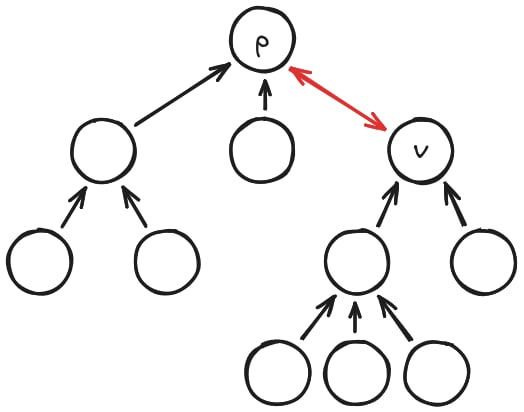

---
tags:
  - Original
---

# Tree Rerooting (All-Roots Dynamic Programming)

## Introduction

Many tree problems ask you to compute a value for every node as if it were the root. For example: "What is the sum of distances from node $v$ to all other nodes?" If you solve this naively by running a separate DFS from each node, you get $O(n^2)$ time, which is too slow for large trees.

Tree rerooting exploits a key insight: when you "shift" the root from a node to one of its neighbors, only one edge changes direction. Instead of recomputing everything from scratch, you can update your answer in $O(1)$ time by adjusting for what changed. This lets you compute the answer for all $n$ roots in $O(n)$ total time.

**Prerequisites:**

- [Introduction to Dynamic Programming](../dynamic_programming/intro-to-dp.md)
- [Depth-first search on trees](../graph/depth-first-search.md)

---

## Two Views of Rerooting

There are two main ways to think about the rerooting technique. Both achieve $O(n)$ time, but they differ in what mathematical properties they require.

### View 1: The Inverse Operation Approach

In this view, you first solve the problem for a fixed root (say, node 0). Then you traverse the tree and "move" the root from parent to child, updating the answer as you go.

When you move the root from node $p$ to its child $c$:

- You **remove** $c$'s contribution from $p$'s answer (this requires an inverse operation, like subtraction).
- You **add** the contribution from the rest of the tree (now seen from $c$'s perspective).

This view is fast and simple, but it only works when your combining operation has an inverse. Addition has subtraction. Multiplication has division (if no zeros). XOR is its own inverse. But operations like **max** or **gcd** have no inverse, so this view doesn't apply to them.

<figure style="text-align:center">
  
  <figcaption><em>Moving the root from p to c: the edge (p, c) reverses direction.</em></figcaption>
</figure>

### View 2: The Prefix/Suffix Approach

In this view, you think about computing a result for every **directed edge**. For each directed edge $u \to v$, you compute the answer for the subtree on the $u$-side when that edge is "cut."

The key challenge: to compute the contribution going from $u$ toward $v$, you need to combine the contributions from **all neighbors of $u$ except $v$**.

If you had to do this naively, it would cost $O(\deg(u))$ for each neighbor, leading to $O(\deg(u)^2)$ total for node $u$—too slow for high-degree nodes.

The solution is **prefix and suffix arrays**. For a node with neighbors $[n_0, n_1, \ldots, n_{k-1}]$:

- `pref[i]` = combined result from neighbors $n_0, n_1, \ldots, n_{i-1}$
- `suf[i]` = combined result from neighbors $n_i, n_{i+1}, \ldots, n_{k-1}$

Then "all except $n_i$" = `pref[i]` combined with `suf[i+1]`, computed in $O(1)$.

This view works for **any associative operation**, including non-invertible ones like max, min, and gcd.

<figure style="text-align:center">
  
  <figcaption><em>Prefix/suffix arrays let us efficiently compute "all neighbors except one."</em></figcaption>
</figure>

---

## Concrete Example 1: Sum of Distances

**Problem:** Given a tree with $n$ nodes, for each node $v$, compute the sum of distances from $v$ to all other nodes.

$$
\text{ans}[v] = \sum_{u=0}^{n-1} \text{dist}(v, u)
$$

We will solve this problem using both views.

---

### Solution 1: Inverse Operation Approach

**Step 1: Root the tree at node 0.**

Run a DFS to compute:

- `sz[v]` = number of nodes in the subtree rooted at $v$
- `ans[0]` = sum of distances from node 0 to all other nodes (just sum up depths)

**Step 2: Move the root from parent to child.**

When you move the root from $p$ to its child $c$:

- The `sz[c]` nodes in $c$'s subtree each become **1 step closer** (they were at distance $d$, now at distance $d-1$).
- The remaining `n - sz[c]` nodes each become **1 step farther**.

So the update formula is:

$$
\text{ans}[c] = \text{ans}[p] - \text{sz}[c] + (n - \text{sz}[c]) = \text{ans}[p] + n - 2 \cdot \text{sz}[c]
$$

**Full C++ Code:**

```cpp
#include <bits/stdc++.h>
using namespace std;

int main() {
    ios::sync_with_stdio(false);
    cin.tie(nullptr);

    int n;
    cin >> n;

    vector<vector<int>> adj(n);
    for (int i = 0; i < n - 1; i++) {
        int u, v;
        cin >> u >> v;
        adj[u].push_back(v);
        adj[v].push_back(u);
    }

    vector<long long> sz(n), ans(n);

    // DFS 1: Compute subtree sizes and ans[0]
    function<void(int, int, int)> dfs1 = [&](int v, int parent, int depth) {
        sz[v] = 1;
        ans[0] += depth;
        for (int u : adj[v]) {
            if (u != parent) {
                dfs1(u, v, depth + 1);
                sz[v] += sz[u];
            }
        }
    };
    dfs1(0, -1, 0);

    // DFS 2: Reroot from parent to child
    function<void(int, int)> dfs2 = [&](int v, int parent) {
        for (int u : adj[v]) {
            if (u != parent) {
                ans[u] = ans[v] + n - 2 * sz[u];
                dfs2(u, v);
            }
        }
    };
    dfs2(0, -1);

    for (int i = 0; i < n; i++) {
        cout << ans[i] << " \n"[i == n - 1];
    }

    return 0;
}
```

---

### Solution 2: Prefix/Suffix Approach

For this approach, we track two values per node: the **sum of distances** and the **count of nodes**. When we "lift" a subtree result across an edge (passing it from child to parent), every node in that subtree becomes 1 step farther.

**State:** `pair<long long, int>` where `.first` = sum of distances, `.second` = count of nodes.

**Lifting across an edge:** If a subtree has state `{sum, cnt}`, then from the parent's perspective, all `cnt` nodes are 1 step farther, so the lifted state is `{sum + cnt, cnt}`.

**Algorithm:**

1. Build parent array and traversal order using BFS/DFS from node 0.
2. **Post-order pass:** For each node (leaves to root), compute `down[v]` = contribution from $v$'s subtree.
3. **Pre-order pass:** For each node (root to leaves), use prefix/suffix arrays to compute `up[v]` = contribution from the parent side, and `ans[v]` = total.

**Full C++ Code:**

```cpp
#include <bits/stdc++.h>
using namespace std;

int main() {
    ios::sync_with_stdio(false);
    cin.tie(nullptr);

    int n;
    cin >> n;

    vector<vector<int>> adj(n);
    for (int i = 0; i < n - 1; i++) {
        int u, v;
        cin >> u >> v;
        adj[u].push_back(v);
        adj[v].push_back(u);
    }

    // State: {sum of distances, count of nodes}
    vector<pair<long long, int>> down(n), up(n);
    vector<long long> ans(n);

    // Helper: lift a state across an edge (all nodes become 1 farther)
    auto lift = [](pair<long long, int> s) -> pair<long long, int> {
        return {s.first + s.second, s.second};
    };

    // Helper: combine two states
    auto combine = [](pair<long long, int> a, pair<long long, int> b) -> pair<long long, int> {
        return {a.first + b.first, a.second + b.second};
    };

    // DFS 1: Post-order (Compute 'down' values)
    function<void(int, int)> dfs_down = [&](int v, int p) {
        down[v] = {0, 1}; // Base: distance 0 to itself, count 1
        for (int u : adj[v]) {
            if (u != p) {
                dfs_down(u, v);
                down[v] = combine(down[v], lift(down[u]));
            }
        }
    };
    dfs_down(0, -1);

    // DFS 2: Pre-order (Compute 'up' and 'ans')
    function<void(int, int)> dfs_up = [&](int v, int p) {
        // ans[v] includes children (down[v]) and parent (up[v])
        // Note: down[v] already includes v itself.
        // We only add the parent contribution if it exists.
        ans[v] = down[v].first;
        if (p != -1) {
            ans[v] += lift(up[v]).first;
        }

        // Collect all contributions for prefix/suffix
        // We need contributions from:
        // 1. All children u (value is lift(down[u]))
        // 2. The parent p (value is lift(up[v]))
        vector<pair<long long, int>> contribs;
        if (p != -1) contribs.push_back(lift(up[v])); // Parent contribution
        for (int u : adj[v]) {
            if (u != p) contribs.push_back(lift(down[u])); // Child contributions
        }

        int m = contribs.size();
        vector<pair<long long, int>> pref(m + 1, {0, 0});
        vector<pair<long long, int>> suf(m + 1, {0, 0});

        for (int i = 0; i < m; i++) pref[i + 1] = combine(pref[i], contribs[i]);
        for (int i = m - 1; i >= 0; i--) suf[i] = combine(contribs[i], suf[i + 1]);

        // Distribute to children
        int child_idx = (p != -1 ? 1 : 0); // Skip parent index in contribs if it exists
        for (int u : adj[v]) {
            if (u != p) {
                // up[u] needs all neighbors of v EXCEPT u
                // plus v itself (dist 0, count 1)
                pair<long long, int> without_u = combine(pref[child_idx], suf[child_idx + 1]);
                without_u.second += 1; 
                up[u] = without_u;
                
                dfs_up(u, v);
                child_idx++;
            }
        }
    };
    dfs_up(0, -1);

    for (int i = 0; i < n; i++) {
        cout << ans[i] << " \n"[i == n - 1];
    }

    return 0;
}
```

---

## Concrete Example 2: Maximum Distance (Tree Eccentricity)

**Problem:** For each node $v$, find the maximum distance to any other node.

$$
\text{ans}[v] = \max_{u} \text{dist}(v, u)
$$

**Why View 1 Fails:**
The `max` operation does not have an inverse. If you know that `max(A, B) = 10`, and you want to remove `A=10`, you cannot determine if `B` was 5, 9, or also 10. Therefore, the simple subtraction trick from Solution 1 **cannot be used**. We must use the **Prefix/Suffix** approach.

**Algorithm:**
1. `down[v]`: The maximum height of the subtree rooted at $v$.
2. `up[v]`: The maximum length of a path starting at $v$ and going upwards through the parent.
3. `merge(a, b)`: `max(a, b)`.
4. `lift(x)`: `x + 1` (moving one edge increases length by 1).

**Code (Maximum Distance):**

```cpp
#include <bits/stdc++.h>
using namespace std;

int main() {
    ios::sync_with_stdio(false);
    cin.tie(nullptr);

    int n;
    cin >> n;

    vector<vector<int>> adj(n);
    for (int i = 0; i < n - 1; i++) {
        int u, v;
        cin >> u >> v;
        adj[u].push_back(v);
        adj[v].push_back(u);
    }

    // down[v]: max distance in subtree of v
    // up[v]: max distance going up through parent
    // ans[v]: max distance to ANY node
    vector<int> down(n), up(n), ans(n);

    // DFS 1: Post-order (Compute down)
    function<void(int, int)> dfs_down = [&](int v, int p) {
        down[v] = 0; 
        for (int u : adj[v]) {
            if (u != p) {
                dfs_down(u, v);
                down[v] = max(down[v], down[u] + 1);
            }
        }
    };
    dfs_down(0, -1);

    // DFS 2: Pre-order (Compute up and ans)
    function<void(int, int)> dfs_up = [&](int v, int p) {
        ans[v] = max(down[v], up[v]);

        vector<int> contribs;
        if (p != -1) contribs.push_back(up[v] + 1); // From parent
        for (int u : adj[v]) {
            if (u != p) contribs.push_back(down[u] + 1); // From children
        }

        int m = contribs.size();
        vector<int> pref(m + 1, -1e9), suf(m + 1, -1e9);

        // Standard max prefix/suffix
        for (int i = 0; i < m; i++) pref[i + 1] = max(pref[i], contribs[i]);
        for (int i = m - 1; i >= 0; i--) suf[i] = max(suf[i + 1], contribs[i]);

        int child_idx = (p != -1 ? 1 : 0); 
        for (int u : adj[v]) {
            if (u != p) {
                // up[u] is the max path starting at v going towards ANY neighbor except u
                // Note: The 'contribs' array already added +1 to all neighbors.
                // So max(pref, suf) represents the longest path starting at v.
                // Since up[u] is 'max path starting at u going UP', we don't add +1 here yet.
                // It gets added when u uses it as a parent contribution in the next recursion.
                
                int longest_path_from_v = max(pref[child_idx], suf[child_idx + 1]);
                
                // If there were no other neighbors, longest path is 0 (v itself)
                if (longest_path_from_v < 0) longest_path_from_v = 0;
                
                up[u] = longest_path_from_v;
                
                dfs_up(u, v);
                child_idx++;
            }
        }
    };
    dfs_up(0, -1);

    for (int i = 0; i < n; i++) {
        cout << ans[i] << " \n"[i == n - 1];
    }

    return 0;
}

```

---

### Other Common Problems

Many rerooting problems fit one of these patterns

- **Sum-based:** Use View 1 (inverse) or View 2.
- **Max/Min-based:** Must use View 2 (no inverse for max/min).
- **Counting paths/subtrees:** Often View 1 with modular arithmetic.

---

## Practice Problems

These are the most common reroot patterns:

1. [CSES - Tree Distances II](https://cses.fi/problemset/task/1133)
2. [Codeforces - 1187E "Tree Painting"](https://codeforces.com/problemset/problem/1187/E)
3. [Codeforces - 219D "Choosing Capital for Treeland"](https://codeforces.com/problemset/problem/219/D)
4. [Codeforces - 543D "Road Improvement"](https://codeforces.com/problemset/problem/543/D)
5. [AtCoder DP Contest - V "Subtree"](https://atcoder.jp/contests/dp/tasks/dp_v?lang=en)
6. [Library Checker - Tree Path Composite Sum](https://judge.yosupo.jp/problem/tree_path_composite_sum)

---

## Advanced Note: Queries with Changing Root

Sometimes queries ask for a value "result for $v$ when the tree is rooted at $r$".
A common approach is:

- Precompute rerooting values for each directed edge $(u \to v)$,
- Combine it with [LCA](../graph/lca.md) / [binary lifting](../graph/lca_binary_lifting.md) to determine which neighbor of $v$ lies on the path to $r$,
  reducing each query to a constant number of precomputed directed-edge lookups.

(Only needed when the root changes per query.)
