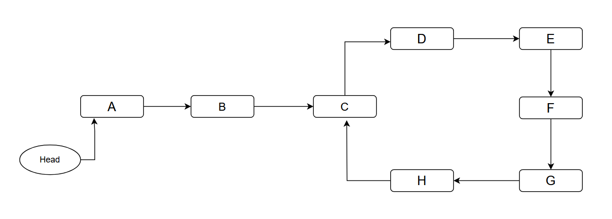

---
tags:
  - Original
---

# Floyd's Linked List Cycle Finding Algorithm

Given a linked list where the starting point of that linked list is denoted by **head**, and there may or may not be a cycle present. For instance:

<center></center>

Here we need to find out the point **C**, i.e the starting point of the cycle.

## Proposed algorithm
The algorithm is called **Floyd’s Cycle Algorithm or Tortoise And Hare algorithm**.
In order to figure out the starting point of the cycle, we need to figure out of the the cycle even exists or not.
So, it involved two steps:
1. Figure out the presence of the cycle.
2. Find out the starting point of the cycle.

### Step 1: Presence of the cycle
1. Take two pointers $slow$ and $fast$.
2. Both of them will point to head of the linked list initially.
3. $slow$ will move one step at a time.
4. $fast$ will move two steps at a time. (twice as speed as $slow$ pointer).
5. Check if at any point they point to the same node before any one(or both) reach null.
6. If they point to any same node at any point of their journey, it would indicate that the cycle indeed exists in the linked list.
7. If we get null, it would indicate that the linked list has no cycle.

<center></center>

Now, that we have figured out that there is a cycle present in the linked list, for the next step we need to find out the starting point of cycle, i.e., **C**.
### Step 2: Starting point of the cycle
1. Reset the $slow$ pointer to the **head** of the linked list.
2. Move both pointers one step at a time.
3. The point they will meet at will be the starting point of the cycle.

```java
// Presence of cycle
public boolean hasCycle(ListNode head) {
    ListNode slow = head;
    ListNode fast = head;

    while(fast != null && fast.next != null){
        slow = slow.next;
        fast = fast.next.next;
        if(slow==fast){
            return true;
        }
    }

    return false;
}
```

```java
// Assuming there is a cycle present and slow and fast are point to their meeting point
slow = head;
while(slow!=fast){
	slow = slow.next;
	fast = fast.next;
}

return slow; // the starting point of the cycle.
```

## Why does it work

### Step 1: Presence of the cycle
Since the pointer $fast$ is moving with twice as speed as $slow$, we can say that at any point of time, $fast$ would have covered twice as much distance as $slow$.
We can also deduce that the difference between the distance covered by both of these pointers is increasing by $1$. 
```
slow: 0 --> 1 --> 2 --> 3 --> 4 (distance covered)
fast: 0 --> 2 --> 4 --> 6 --> 8 (distance covered)
diff: 0 --> 1 --> 2 --> 3 --> 4 (difference between distance covered by both pointers)
```
Let $L$ denote the length of the cycle, and $a$ represent the number of steps required for the slow pointer to reach the entry of cycle. There exists a positive integer $k$ ($k > 0$) such that $k \cdot L \geq a$.
When the slow pointer has moved $k \cdot L$ steps, and the fast pointer has covered $2 \cdot k \cdot L$ steps, both pointers find themselves within the cycle. At this point, there is a separation of $k \cdot L$ between them. Given that the cycle's length remains $L$, this signifies that they meet at the same point within the cycle, resulting in their encounter.

### Step 2: Starting point of the cycle

Lets try to calculate the distance covered by both of the pointers till they point they met within the cycle.

<center></center>

$slowDist = a + xL + b$            , $x\ge0$

$fastDist = a + yL + b$            , $y\ge0$

- $slowDist$ is the total distance covered by slow pointer.
- $fastDist$ is the total distance covered by fast pointer.
- $a$ is the number of steps both pointers need to take to enter the cycle.
- $b$ is the distance between **C** and **G**, i.e., distance between the starting point of cycle and meeting point of both pointers.
- $x$ is the number of times the slow pointer has looped inside the cycle, starting from and ending at **C**.
- $y$ is the number of times the fast pointer has looped inside the cycle, starting from and ending at **C**.

$fastDist = 2 \cdot (slowDist)$

$a + yL + b = 2(a + xL + b)$

Resolving the formula we get:

$a=(y-2x)L-b$

where $y-2x$ is an integer

This basically means that $a$ steps is same as doing some number of full loops in cycle and go $b$ steps backwards.
Since the fast pointer already is $b$ steps ahead of the entry of cycle, if fast pointer moves another $a$ steps it will end up at the entry of the cycle.
And since we let the slow pointer start at the start of the linked list, after $a$ steps it will also end up at the cycle entry. So, if they both move $a$ step they both will meet the entry of cycle.

# Problems:
- [Linked List Cycle (EASY)](https://leetcode.com/problems/linked-list-cycle/)
- [Find the Duplicate Number (Medium)](https://leetcode.com/problems/find-the-duplicate-number/)

