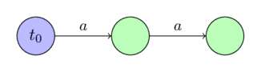
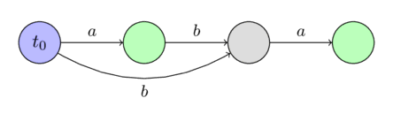
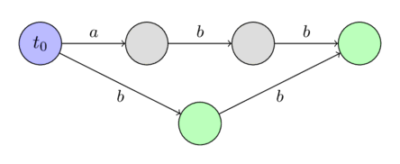

---
tags:
  - Translated
e_maxx_link: suffix_automata
---

# Suffix Automaton

A **suffix automaton** is a powerful data structure that allows solving many string-related problems. 

For example, you can search for all occurrences of one string in another, or count the amount of different substrings of a given string.
Both tasks can be solved in linear time with the help of a suffix automaton.

Intuitively a suffix automaton can be understood as a compressed form of **all substrings** of a given string.
An impressive fact is, that the suffix automaton contains all this information in a highly compressed form.
For a string of length $n$ it only requires $O(n)$ memory.
Moreover, it can also be built in $O(n)$ time (if we consider the size $k$ of the alphabet as a constant), otherwise both the memory and the time complexity will be $O(n \log k)$.

The linearity of the size of the suffix automaton was first discovered in 1983 by Blumer et al., and in 1985 the first linear algorithms for the construction was presented by Crochemore and Blumer.

## Definition of a suffix automaton

A suffix automaton for a given string $s$ is a minimal **DFA** (deterministic finite automaton / deterministic finite state machine) that accepts all the suffixes of the string $s$.

In other words:

 -  A suffix automaton is an oriented acyclic graph.
    The vertices are called **states**, and the edges are called **transitions** between states.
 -  One of the states $t_0$ is the **initial state**, and it must be the source of the graph (all other states are reachable from $t_0$).
 -  Each **transition** is labeled with some character.
    All transitions originating from a state must have **different** labels.
 -  One or multiple states are marked as **terminal states**.
    If we start from the initial state $t_0$ and move along transitions to a terminal state, then the labels of the passed transitions must spell one of the suffixes of the string $s$.
    Each of the suffixes of $s$ must be spellable using a path from $t_0$ to a terminal state.
 -  The suffix automaton contains the minimum number of vertices among all automata satisfying the conditions described above.

### Substring property

The simplest and most important property of a suffix automaton is, that it contains information about all substrings of the string $s$.
Any path starting at the initial state $t_0$, if we write down the labels of the transitions, forms a **substring** of $s$.
And conversely every substring of $s$ corresponds to a certain path starting at $t_0$.

In order to simplify the explanations, we will say that the substring **corresponds** to that path (starting at $t_0$ and the labels spell the substring).
And conversely we say that any path **corresponds** to the string spelled by its labels.

One or multiple paths can lead to a state.
Thus, we will say that a state **corresponds** to the set of strings, which correspond to these paths.

### Examples of constructed suffix automata

Here we will show some examples of suffix automata for several simple strings.

We will denote the initial state with blue and the terminal states with green.

For the string $s =~ \text{""}$:


For the string $s =~ \text{"a"}$:


For the string $s =~ \text{"aa"}$:



For the string $s =~ \text{"ab"}$:


For the string $s =~ \text{"aba"}$:



For the string $s =~ \text{"abb"}$:



For the string $s =~ \text{"abbb"}$:


## Construction in linear time

Before we describe the algorithm to construct a suffix automaton in linear time, we need to introduce several new concepts and simple proofs, which will be very important in understanding the construction.

### End positions $endpos$ {data-toc-label="End positions"}

Consider any non-empty substring $t$ of the string $s$.
We will denote with $endpos(t)$ the set of all positions in the string $s$, in which the occurrences of $t$ end. For instance, we have $endpos(\text{"bc"}) = \{2, 4\}$ for the string $\text{"abcbc"}$.

We will call two substrings $t_1$ and $t_2$ $endpos$-equivalent, if their ending sets coincide: $endpos(t_1) = endpos(t_2)$.
Thus all non-empty substrings of the string $s$ can be decomposed into several **equivalence classes** according to their sets $endpos$.

It turns out, that in a suffix machine $endpos$-equivalent substrings **correspond to the same state**.
In other words the number of states in a suffix automaton is equal to the number of equivalence classes among all substrings, plus the initial state.
Each state of a suffix automaton corresponds to one or more substrings having the same value $endpos$.

We will later describe the construction algorithm using this assumption.
We will then see, that all the required properties of a suffix automaton, except for the minimality, are fulfilled.
And the minimality follows from Nerode's theorem (which will not be proven in this article).

We can make some important observations concerning the values $endpos$:

**Lemma 1**:
Two non-empty substrings $u$ and $w$ (with $length(u) \le length(w)$) are $endpos$-equivalent, if and only if the string $u$ occurs in $s$ only in the form of a suffix of $w$.

The proof is obvious.
If $u$ and $w$ have the same $endpos$ values, then $u$ is a suffix of $w$ and appears only in the form of a suffix of $w$ in $s$.
And if $u$ is a suffix of $w$ and appears only in the form as a suffix in $s$, then the values $endpos$ are equal by definition.

**Lemma 2**:
Consider two non-empty substrings $u$ and $w$ (with $length(u) \le length(w)$).
Then their sets $endpos$ either don't intersect at all, or $endpos(w)$ is a subset of $endpos(u)$.
And it depends on if $u$ is a suffix of $w$ or not.

$$\begin{cases}
endpos(w) \subseteq endpos(u) & \text{if } u \text{ is a suffix of } w \\\\
endpos(w) \cap endpos(u) = \emptyset & \text{otherwise}
\end{cases}$$

Proof:
If the sets $endpos(u)$ and $endpos(w)$ have at least one common element, then the strings $u$ and $w$ both end in that position, i.e. $u$ is a suffix of $w$.
But then at every occurrence of $w$ also appears the substring $u$, which means that $endpos(w)$ is a subset of $endpos(u)$.

**Lemma 3**:
Consider an $endpos$-equivalence class.
Sort all the substrings in this class by decreasing length.
Then in the resulting sequence each substring will be one shorter than the previous one, and at the same time will be a suffix of the previous one.
In other words, in a same equivalence class, the shorter substrings are actually suffixes of the longer substrings, and they take all possible lengths in a certain interval $[x; y]$.

Proof:
Fix some $endpos$-equivalence class.
If it only contains one string, then the lemma is obviously true.
Now let's say that the number of strings in the class is greater than one.

According to Lemma 1, two different $endpos$-equivalent strings are always in such a way, that the shorter one is a proper suffix of the longer one.
Consequently, there cannot be two strings of the same length in the equivalence class.

Let's denote by $w$ the longest, and through $u$ the shortest string in the equivalence class.
According to Lemma 1, the string $u$ is a proper suffix of the string $w$.
Consider now any suffix of $w$ with a length in the interval $[length(u); length(w)]$.
It is easy to see, that this suffix is also contained in the same equivalence class.
Because this suffix can only appear in the form of a suffix of $w$ in the string $s$ (since also the shorter suffix $u$ occurs in $s$ only in the form of a suffix of $w$).
Consequently, according to Lemma 1, this suffix is $endpos$-equivalent to the string $w$.

### Suffix links $link$ {data-toc-label="Suffix links"}

Consider some state $v \ne t_0$ in the automaton.
As we know, the state $v$ corresponds to the class of strings with the same $endpos$ values.
And if we denote by $w$ the longest of these strings, then all the other strings are suffixes of $w$.

We also know the first few suffixes of a string $w$ (if we consider suffixes in descending order of their length) are all contained in this equivalence class, and all other suffixes (at least one other - the empty suffix) are in some other classes.
We denote by $t$ the biggest such suffix, and make a suffix link to it.

In other words, a **suffix link** $link(v)$ leads to the state that corresponds to the **longest suffix** of $w$ that is in another $endpos$-equivalence class.

Here we assume that the initial state $t_0$ corresponds to its own equivalence class (containing only the empty string), and for convenience we set $endpos(t_0) = \{-1, 0, \dots, length(s)-1\}$.

**Lemma 4**:
Suffix links form a **tree** with the root $t_0$.

Proof:
Consider an arbitrary state $v \ne t_0$.
A suffix link $link(v)$ leads to a state corresponding to strings with strictly smaller length (this follows from the definition of the suffix links and from Lemma 3).
Therefore, by moving along the suffix links, we will sooner or later come to the initial state $t_0$, which corresponds to the empty string.

**Lemma 5**:
If we construct a tree using the sets $endpos$ (by the rule that the set of a parent node contains the sets of all children as subsets), then the structure will coincide with the tree of suffix links.

Proof:
The fact that we can construct a tree using the sets $endpos$ follows directly from Lemma 2 (that any two sets either do not intersect or one is contained in the other).

Let us now consider an arbitrary state $v \ne t_0$, and its suffix link $link(v)$.
From the definition of the suffix link and from Lemma 2 it follows that

$$endpos(v) \subseteq endpos(link(v)),$$

which together with the previous lemma proves the assertion:
the tree of suffix links is essentially a tree of sets $endpos$.

Here is an **example** of a tree of suffix links in the suffix automaton build for the string $\text{"abcbc"}$.
The nodes are labeled with the longest substring from the corresponding equivalence class.


### Recap

Before proceeding to the algorithm itself, we recap the accumulated knowledge, and introduce a few auxiliary notations.

- The substrings of the string $s$ can be decomposed into equivalence classes according to their end positions $endpos$.
- The suffix automaton consists of the initial state $t_0$, as well as of one state for each $endpos$-equivalence class.
- For each state $v$ one or multiple substrings match.
  We denote by $longest(v)$ the longest such string, and through $len(v)$ its length.
  We denote by $shortest(v)$ the shortest such substring, and its length with $minlen(v)$.
  Then all the strings corresponding to this state are different suffixes of the string $longest(v)$ and have all possible lengths in the interval $[minlen(v); len(v)]$.
- For each state $v \ne t_0$ a suffix link is defined as a link, that leads to a state that corresponds to the suffix of the string $longest(v)$ of length $minlen(v) - 1$.
  The suffix links form a tree with the root in $t_0$, and at the same time this tree forms an inclusion relationship between the sets $endpos$.
- We can express $minlen(v)$ for $v \ne t_0$ using the suffix link $link(v)$ as:
  
$$minlen(v) = len(link(v)) + 1$$

- If we start from an arbitrary state $v_0$ and follow the suffix links, then sooner or later we will reach the initial state $t_0$.
  In this case we obtain a sequence of disjoint intervals $[minlen(v_i); len(v_i)]$, which in union forms the continuous interval $[0; len(v_0)]$.

### Algorithm

Now we can proceed to the algorithm itself.
The algorithm will be **online**, i.e. we will add the characters of the string one by one, and modify the automaton accordingly in each step.

To achieve linear memory consumption, we will only store the values $len$, $link$ and a list of transitions in each state.
We will not label terminal states (but we will later show how to arrange these labels after constructing the suffix automaton).

Initially the automaton consists of a single state $t_0$, which will be the index $0$ (the remaining states will receive the indices $1, 2, \dots$).
We assign it $len = 0$ and $link = -1$ for convenience ($-1$ will be a fictional, non-existing state).

Now the whole task boils down to implementing the process of **adding one character** $c$ to the end of the current string.
Let us describe this process:

  - Let $last$ be the state corresponding to the entire string before adding the character $c$.
    (Initially we set $last = 0$, and we will change $last$ in the last step of the algorithm accordingly.)
  - Create a new state $cur$, and assign it with $len(cur) = len(last) + 1$.
    The value $link(cur)$ is not known at the time.
  - Now we do the following procedure:
    We start at the state $last$.
    While there isn't a transition through the letter $c$, we will add a transition to the state $cur$, and follow the suffix link.
    If at some point there already exists a transition through the letter $c$, then we will stop and denote this state with $p$.
  - If we haven't found such a state $p$, then we reached the fictitious state $-1$, then we can just assign $link(cur) = 0$ and leave.
  - Suppose now that we have found a state $p$, from which there exists a transition through the letter $c$.
    We will denote the state, to which the transition leads,  with $q$.
  - Now we have two cases. Either $len(p) + 1 = len(q)$, or not.
  - If $len(p) + 1 = len(q)$, then we can simply assign $link(cur) = q$ and leave.
  - Otherwise it is a bit more complicated.
    It is necessary to **clone** the state $q$:
    we create a new state $clone$, copy all the data from $q$ (suffix link and transition) except the value $len$.
    We will assign $len(clone) = len(p) + 1$.

    After cloning we direct the suffix link from $cur$ to $clone$, and also from $q$ to clone.

    Finally we need to walk from the state $p$ back using suffix links as long as there is a transition through $c$ to the state $q$, and redirect all those to the state $clone$.

  - In any of the three cases, after completing the procedure, we update the value $last$ with the state $cur$.

If we also want to know which states are **terminal** and which are not, we can find all terminal states after constructing the complete suffix automaton for the entire string $s$.
To do this, we take the state corresponding to the entire string (stored in the variable $last$), and follow its suffix links until we reach the initial state.
We will mark all visited states as terminal.
It is easy to understand that by doing so we will mark exactly the states corresponding to all the suffixes of the string $s$, which are exactly the terminal states.

In the next section we will look in detail at each step and show its **correctness**.

Here we only note that, since we only create one or two new states for each character of $s$, the suffix automaton contains a **linear number of states**.

The linearity of the number of transitions, and in general the linearity of the runtime of the algorithm is less clear, and they will be proven after we proved the correctness.

### Correctness

  - We will call a transition $(p, q)$ **continuous** if $len(p) + 1 = len(q)$.
    Otherwise, i.e. when $len(p) + 1 < len(q)$, the transition will be called **non-continuous**.

    As we can see from the description of the algorithm, continuous and non-continuous transitions will lead to different cases of the algorithm.
    Continuous transitions are fixed, and will never change again.
    In contrast non-continuous transition may change, when new letters are added to the string (the end of the transition edge may change).

  - To avoid ambiguity we will denote the string, for which the suffix automaton was built before adding the current character $c$, with $s$.

  - The algorithm begins with creating a new state $cur$, which will correspond to the entire string $s + c$.
    It is clear why we have to create a new state.
    Together with the new character a new equivalence class is created.

  - After creating a new state we traverse by suffix links starting from the state corresponding to the entire string $s$.
    For each state we try to add a transition with the character $c$ to the new state $cur$.
    Thus we append to each suffix of $s$ the character $c$.
    However we can only add these new transitions, if they don't conflict with an already existing one.
    Therefore as soon as we find an already existing transition with $c$ we have to stop.

  - In the simplest case we reached the fictitious state $-1$.
    This means we added the transition with $c$ to all suffixes of $s$.
    This also means, that the character $c$ hasn't been part of the string $s$ before.
    Therefore the suffix link of $cur$ has to lead to the state $0$.

  - In the second case we came across an existing transition $(p, q)$.
    This means that we tried to add a string $x + c$ (where $x$ is a suffix of $s$) to the machine that **already exists** in the machine (the string $x + c$ already appears as a substring of $s$).
    Since we assume that the automaton for the string $s$ is built correctly, we should not add a new transition here.

    However there is a difficulty.
    To which state should the suffix link from the state $cur$ lead?
    We have to make a suffix link to a state, in which the longest string is exactly $x + c$, i.e. the $len$ of this state should be $len(p) + 1$.
    However it is possible, that such a state doesn't yet exists, i.e. $len(q) > len(p) + 1$.
    In this case we have to create such a state, by **splitting** the state $q$.

  - If the transition $(p, q)$ turns out to be continuous, then $len(q) = len(p) + 1$.
    In this case everything is simple.
    We direct the suffix link from $cur$ to the state $q$.

  - Otherwise the transition is non-continuous, i.e. $len(q) > len(p) + 1$.
    This means that the state $q$ corresponds to not only the suffix of $s + c$ with length $len(p) + 1$, but also to longer substrings of $s$.
    We can do nothing other than **splitting** the state $q$ into two sub-states, so that the first one has length $len(p) + 1$.

    How can we split a state?
    We **clone** the state $q$, which gives us the state $clone$, and we set $len(clone) = len(p) + 1$.
    We copy all the transitions from $q$ to $clone$, because we don't want to change the paths that traverse through $q$.
    Also we set the suffix link from $clone$ to the target of the suffix link of $q$, and set the suffix link of $q$ to $clone$.

    And after splitting the state, we set the suffix link from $cur$ to $clone$.

    In the last step we change some of the transitions to $q$, we redirect them to $clone$.
    Which transitions do we have to change?
    It is enough to redirect only the transitions corresponding to all the suffixes of the string $w + c$ (where $w$ is the longest string of $p$), i.e. we need to continue to move along the suffix links, starting from the vertex $p$ until we reach the fictitious state $-1$ or a transition that leads to a different state than $q$.

### Linear number of operations

First we immediately make the assumption that the size of the alphabet is **constant**.
If this is not the case, then it will not be possible to talk about the linear time complexity.
The list of transitions from one vertex will be stored in a balanced tree, which allows you to quickly perform key search operations and adding keys.
Therefore if we denote with $k$ the size of the alphabet, then the asymptotic behavior of the algorithm will be $O(n \log k)$ with $O(n)$ memory.
However if the alphabet is small enough, then you can sacrifice memory by avoiding balanced trees, and store the transitions at each vertex as an array of length $k$ (for quick searching by key) and a dynamic list (to quickly traverse all available keys).
Thus we reach the $O(n)$ time complexity for the algorithm, but at a cost of $O(n k)$ memory complexity.

So we will consider the size of the alphabet to be constant, i.e. each operation of searching for a transition on a character, adding a transition, searching for the next transition - all these operations can be done in $O(1)$.

If we consider all parts of the algorithm, then it contains three places in the algorithm in which the linear complexity is not obvious:

  - The first place is the traversal through the suffix links from the state $last$, adding transitions with the character $c$.
  - The second place is the copying of transitions when the state $q$ is cloned into a new state $clone$.
  - Third place is changing the transition leading to $q$, redirecting them to $clone$.

We use the fact that the size of the suffix automaton (both in the number of states and in the number of transitions) is **linear**.
(The proof of the linearity of the number of states is the algorithm itself, and the proof of linearity of the number of states is given below, after the implementation of the algorithm).

Thus the total complexity of the **first and second places** is obvious, after all each operation adds only one amortized new transition to the automaton.

It remains to estimate the total complexity of the **third place**, in which we redirect transitions, that pointed originally to $q$, to $clone$.
We denote $v = longest(p)$.
This is a suffix of the string $s$, and with each iteration its length decreases - and therefore the position $v$ as the suffix of the string $s$ increases monotonically with each iteration.
In this case, if before the first iteration of the loop, the corresponding string $v$ was at the depth $k$ ($k \ge 2$) from $last$ (by counting the depth as the number of suffix links), then after the last iteration the string $v + c$ will be a $2$-th suffix link on the path from $cur$ (which will become the new value $last$).

Thus, each iteration of this loop leads to the fact that the position of the string $longest(link(link(last))$ as a suffix of the current string will monotonically increase.
Therefore this cycle cannot be executed more than $n$ iterations, which was required to prove.

### Implementation

First we describe a data structure that will store all information about a specific transition ($len$, $link$ and the list of transitions).
If necessary you can add a terminal flag here, as well as other information.
We will store the list of transitions in the form of a $map$, which allows us to achieve total $O(n)$ memory and $O(n \log k)$ time for processing the entire string.

```{.cpp file=suffix_automaton_struct}
struct state {
    int len, link;
    map<char, int> next;
};
```

The suffix automaton itself will be stored in an array of these structures $state$.
We store the current size $sz$ and also the variable $last$, the state corresponding to the entire string at the moment.

```{.cpp file=suffix_automaton_def}
const int MAXLEN = 100000;
state st[MAXLEN * 2];
int sz, last;
```

We give a function that initializes a suffix automaton (creating a suffix automaton with a single state).

```{.cpp file=suffix_automaton_init}
void sa_init() {
    st[0].len = 0;
    st[0].link = -1;
    sz++;
    last = 0;
}
```

And finally we give the implementation of the main function - which adds the next character to the end of the current line, rebuilding the machine accordingly.

```{.cpp file=suffix_automaton_extend}
void sa_extend(char c) {
    int cur = sz++;
    st[cur].len = st[last].len + 1;
    int p = last;
    while (p != -1 && !st[p].next.count(c)) {
        st[p].next[c] = cur;
        p = st[p].link;
    }
    if (p == -1) {
        st[cur].link = 0;
    } else {
        int q = st[p].next[c];
        if (st[p].len + 1 == st[q].len) {
            st[cur].link = q;
        } else {
            int clone = sz++;
            st[clone].len = st[p].len + 1;
            st[clone].next = st[q].next;
            st[clone].link = st[q].link;
            while (p != -1 && st[p].next[c] == q) {
                st[p].next[c] = clone;
                p = st[p].link;
            }
            st[q].link = st[cur].link = clone;
        }
    }
    last = cur;
}
```

As mentioned above, if you sacrifice memory ($O(n k)$, where $k$ is the size of the alphabet), then you can achieve the build time of the machine in $O(n)$, even for any alphabet size $k$.
But for this you will have to store an array of size $k$ in each state (for quickly jumping to the transition of the letter), and additional a list of all transitions (to quickly iterate over the transitions them).

## Additional properties

### Number of states

The number of states in a suffix automaton of the string $s$ of length $n$ **doesn't exceed** $2n - 1$ (for $n \ge 2$).

The proof is the construction algorithm itself, since initially the automaton consists of one state, and in the first and second iteration only a single state will be created, and in the remaining $n-2$ steps at most $2$ states will be created each.

However we can also **show** this estimation **without knowing the algorithm**.
Let us recall that the number of states is equal to the number of different sets $endpos$.
In addition theses sets $endpos$ form a tree (a parent vertex contains all children sets in his set).
Consider this tree and transform it a little bit:
as long as it has an internal vertex with only one child (which means that the set of the child misses at least one position from the parent set), we create a new child with the set of the missing positions.
In the end we have a tree in which each inner vertex has a degree greater than one, and the number of leaves does not exceed $n$.
Therefore there are no more than $2n - 1$ vertices in such a tree.

This bound of the number of states can actually be achieved for each $n$.
A possible string is:

$$\text{"abbb}\dots \text{bbb"}$$

In each iteration, starting at the third one, the algorithm will split a state, resulting in exactly $2n - 1$ states.

### Number of transitions

The number of transitions in a suffix automaton of a string $s$ of length $n$ **doesn't exceed** $3n - 4$ (for $n \ge 3$).

Let us prove this:

Let us first estimate the number of continuous transitions.
Consider a spanning tree of the longest paths in the automaton starting in the state $t_0$.
This skeleton will consist of only the continuous edges, and therefore their number is less than the number of states, i.e. it does not exceed $2n - 2$.

Now let us estimate the number of non-continuous transitions.
Let the current non-continuous transition be $(p, q)$ with the character $c$.
We take the correspondent string $u + c + w$, where the string $u$ corresponds to the longest path from the initial state to $p$, and $w$ to the longest path from $q$ to any terminal state.
On one hand, each such string $u + c + w$ for each incomplete strings will be different (since the strings $u$ and $w$ are formed only by complete transitions).
On the other hand each such string $u + c + w$, by the definition of the terminal states, will be a suffix of the entire string $s$.
Since there are only $n$ non-empty suffixes of $s$, and none of the strings $u + c + w$ can contain $s$ (because the entire string only contains complete transitions), the total number of incomplete transitions does not exceed $n - 1$.

Combining these two estimates gives us the bound $3n - 3$.
However, since the maximum number of states can only be achieved with the test case $\text{"abbb\dots bbb"}$ and this case has clearly less than $3n - 3$ transitions, we get the tighter bound of $3n - 4$ for the number of transitions in a suffix automaton.

This bound can also be achieved with the string:

$$\text{"abbb}\dots \text{bbbc"}$$

## Applications

Here we look at some tasks that can be solved using the suffix automaton.
For the simplicity we assume that the alphabet size $k$ is constant, which allows us to consider the complexity of appending a character and the traversal as constant.

### Check for occurrence

Given a text $T$, and multiple patterns $P$.
We have to check whether or not the strings $P$ appear as a substring of $T$.

We build a suffix automaton of the text $T$ in $O(length(T))$ time.
To check if a pattern $P$ appears in $T$, we follow the transitions, starting from $t_0$, according to the characters of $P$.
If at some point there doesn't exists a transition, then the pattern $P$ doesn't appear as a substring of $T$.
If we can process the entire string $P$ this way, then the string appears in $T$.

It is clear that this will take $O(length(P))$ time for each string $P$.
Moreover the algorithm actually finds the length of the longest prefix of $P$ that appears in the text.

### Number of different substrings

Given a string $S$.
You want to compute the number of different substrings.

Let us build a suffix automaton for the string $S$.

Each substring of $S$ corresponds to some path in the automaton.
Therefore the number of different substrings is equal to the number of different paths in the automaton starting at $t_0$.

Given that the suffix automaton is a directed acyclic graph, the number of different ways can be computed using dynamic programming.

Namely, let $d[v]$ be the number of ways, starting at the state $v$ (including the path of length zero).
Then we have the recursion:

$$d[v] = 1 + \sum_{w : (v, w, c) \in DAWG} d[w]$$

I.e. $d[v]$ can be expressed as the sum of answers for all ends of the transitions of $v$.

The number of different substrings is the value $d[t_0] - 1$ (since we don't count the empty substring).

Total time complexity: $O(length(S))$


Alternatively, we can take advantage of the fact that each state $v$ matches to substrings of length $[minlen(v),len(v)]$.
Therefore, given $minlen(v) = 1 + len(link(v))$, we have total distinct substrings at state $v$ being $len(v) - minlen(v) + 1 = len(v) - (1 + len(link(v))) + 1 = len(v) - len(link(v))$.

This is demonstrated succinctly below:

```cpp
long long get_diff_strings(){
    long long tot = 0;
    for(int i = 1; i < sz; i++) {
        tot += st[i].len - st[st[i].link].len;
    }
    return tot;
}
```

While this is also $O(length(S))$, it requires no extra space and no recursive calls, consequently running faster in practice.

### Total length of all different substrings

Given a string $S$.
We want to compute the total length of all its various substrings.

The solution is similar to the previous one, only now it is necessary to consider two quantities for the dynamic programming part:
the number of different substrings $d[v]$ and their total length $ans[v]$.

We already described how to compute $d[v]$ in the previous task.
The value $ans[v]$ can be computed using the recursion:

$$ans[v] = \sum_{w : (v, w, c) \in DAWG} d[w] + ans[w]$$

We take the answer of each adjacent vertex $w$, and add to it $d[w]$ (since every substring is one character longer when starting from the state $v$).

Again this task can be computed in $O(length(S))$ time.

Alternatively, we can, again, take advantage of the fact that each state $v$ matches to substrings of length $[minlen(v),len(v)]$.
Since $minlen(v) = 1 + len(link(v))$ and the arithmetic series formula $S_n = n \cdot \frac{a_1+a_n}{2}$ (where $S_n$ denotes the sum of $n$ terms, $a_1$ representing the first term, and $a_n$ representing the last), we can compute the length of substrings at a state in constant time.  We then sum up these totals for each state $v \neq t_0$ in the automaton. This is shown by the code below:

```cpp
long long get_tot_len_diff_substings() {
    long long tot = 0;
    for(int i = 1; i < sz; i++) {
        long long shortest = st[st[i].link].len + 1;
        long long longest = st[i].len;
        
        long long num_strings = longest - shortest + 1;
        long long cur = num_strings * (longest + shortest) / 2;
        tot += cur;
    }
    return tot;
}
```

This approach runs in  $O(length(S))$ time, but experimentally runs 20x faster than the memoized dynamic programming version on randomized strings. It requires no extra space and no recursion.

### Lexicographically $k$-th substring {data-toc-label="Lexicographically k-th substring"}

Given a string $S$.
We have to answer multiple queries.
For each given number $K_i$ we have to find the $K_i$-th string in the lexicographically ordered list of all substrings.

The solution to this problem is based on the idea of the previous two problems.
The lexicographically $k$-th substring corresponds to the lexicographically $k$-th path in the suffix automaton.
Therefore after counting the number of paths from each state, we can easily search for the $k$-th path starting from the root of the automaton.

This takes $O(length(S))$ time for preprocessing and then $O(length(ans) \cdot k)$ for each query (where $ans$ is the answer for the query and $k$ is the size of the alphabet).

### Smallest cyclic shift

Given a string $S$.
We want to find the lexicographically smallest cyclic shift.

We construct a suffix automaton for the string $S + S$.
Then the automaton will contain in itself as paths all the cyclic shifts of the string $S$.

Consequently the problem is reduced to finding the lexicographically smallest path of length $length(S)$, which can be done in a trivial way: we start in the initial state and greedily pass through the transitions with the minimal character.

Total time complexity is $O(length(S))$.

### Number of occurrences

For a given text $T$.
We have to answer multiple queries.
For each given pattern $P$ we have to find out how many times the string $P$ appears in the string $T$ as a substring.

We construct the suffix automaton for the text $T$.

Next we do the following preprocessing:
for each state $v$ in the automaton we calculate the number $cnt[v]$ that is equal to the size of the set $endpos(v)$.
In fact all strings corresponding to the same state $v$ appear in the text $T$ an equal amount of times, which is equal to the number of positions in the set $endpos$.

However we cannot construct the sets $endpos$ explicitly, therefore we only consider their sizes $cnt$.

To compute them we proceed as follows.
For each state, if it was not created by cloning (and if it is not the initial state $t_0$), we initialize it with $cnt = 1$.
Then we will go through all states in decreasing order of their length $len$, and add the current value $cnt[v]$ to the suffix links:

$$cnt[link(v)] \text{ += } cnt[v]$$

This gives the correct value for each state.

Why is this correct?
The total number of states obtained _not_ via cloning is exactly $length(T)$, and the first $i$ of them appeared when we added the first $i$ characters.
Consequently for each of these states we count the corresponding position at which it was processed.
Therefore initially we have $cnt = 1$ for each such state, and $cnt = 0$ for all other.

Then we apply the following operation for each $v$: $cnt[link(v)] \text{ += } cnt[v]$.
The meaning behind this is, that if a string $v$ appears $cnt[v]$ times, then also all its suffixes appear at the exact same end positions, therefore also $cnt[v]$ times.

Why don't we overcount in this procedure (i.e. don't count some positions twice)?
Because we add the positions of a state to only one other state, so it can not happen that one state directs its positions to another state twice in two different ways.

Thus we can compute the quantities $cnt$ for all states in the automaton in $O(length(T))$ time.

After that answering a query by just looking up the value $cnt[t]$, where $t$ is the state corresponding to the pattern, if such a state exists.
Otherwise answer with $0$.
Answering a query takes $O(length(P))$ time.

### First occurrence position

Given a text $T$ and multiple queries.
For each query string $P$ we want to find the position of the first occurrence of $P$ in the string $T$ (the position of the beginning of $P$).

We again construct a suffix automaton.
Additionally we precompute the position $firstpos$ for all states in the automaton, i.e. for each state $v$ we want to find the position $firstpos[v]$ of the end of the first occurrence.
In other words, we want to find in advance the minimal element of each set $endpos$ (since obviously cannot maintain all sets $endpos$ explicitly).

To maintain these positions $firstpos$ we extend the function `sa_extend()`.
When we create a new state $cur$, we set:

$$firstpos(cur) = len(cur) - 1$$

And when we clone a vertex $q$ as $clone$, we set:

$$firstpos(clone) = firstpos(q)$$

(since the only other option for a value would be $firstpos(cur)$ which is definitely too big)

Thus the answer for a query is simply $firstpos(t) - length(P) + 1$, where $t$ is the state corresponding to the string $P$.
Answering a query again takes only $O(length(P))$ time.

### All occurrence positions

This time we have to display all positions of the occurrences in the string $T$.

Again we construct a suffix automaton for the text $T$.
Similar as in the previous task we compute the position $firstpos$ for all states.

Clearly $firstpos(t)$ is part of the answer, if $t$ is the state corresponding to a query string $P$.
So we took into account the state of the automaton containing $P$.
What other states do we need to take into account?
All states that correspond to strings for which $P$ is a suffix.
In other words we need to find all the states that can reach the state $t$ via suffix links.

Therefore to solve the problem we need to save for each state a list of suffix references leading to it.
The answer to the query then will then contain all $firstpos$ for each state that we can find on a DFS / BFS starting from the state $t$ using only the suffix references.

Overall, this requires $O(length (T))$ for preprocessing and $O(length(P) + answer(P))$ for each request, where $answer(P)$ — this is the size of the answer.

First, we walk down the automaton for each character in the pattern to find our starting node requiring $O(length(P))$.  Then, we use our workaround which will work in time $O(answer(P))$, because we will not visit a state twice (because only one suffix link leaves each state, so there cannot be two different paths leading to the same state).

We only must take into account that two different states can have the same $firstpos$ value.
This happens if one state was obtained by cloning another.
However, this doesn't ruin the complexity, since each state can only have at most one clone.

Moreover, we can also get rid of the duplicate positions, if we don't output the positions from the cloned states.
In fact a state, that a cloned state can reach, is also reachable from the original state.
Thus if we remember the flag `is_cloned` for each state, we can simply ignore the cloned states and only output $firstpos$ for all other states.

Here are some implementation sketches:

```cpp
struct state {
    ...
    bool is_clone;
    int first_pos;
    vector<int> inv_link;
};

// after constructing the automaton
for (int v = 1; v < sz; v++) {
    st[st[v].link].inv_link.push_back(v);
}

// output all positions of occurrences
void output_all_occurrences(int v, int P_length) {
    if (!st[v].is_clone)
        cout << st[v].first_pos - P_length + 1 << endl;
    for (int u : st[v].inv_link)
        output_all_occurrences(u, P_length);
}
```

### Shortest non-appearing string

Given a string $S$ and a certain alphabet.
We have to find a string of the smallest length, that doesn't appear in $S$.

We will apply dynamic programming on the suffix automaton built for the string $S$.

Let $d[v]$ be the answer for the node $v$, i.e. we already processed part of the substring, are currently in the state $v$, and want to find the smallest number of characters that have to be added to find a non-existent transition.
Computing $d[v]$ is very simple.
If there is not transition using at least one character of the alphabet, then $d[v] = 1$.
Otherwise one character is not enough, and so we need to take the minimum of all answers of all transitions:

$$d[v] = 1 + \min_{w:(v,w,c) \in SA} d[w].$$

The answer to the problem will be $d[t_0]$, and the actual string can be restored using the computed array $d[]$.

### Longest common substring of two strings

Given two strings $S$ and $T$.
We have to find the longest common substring, i.e. such a string $X$ that appears as a substring in $S$ and also in $T$.

We construct a suffix automaton for the string $S$.

We will now take the string $T$, and for each prefix look for the longest suffix of this prefix in $S$.
In other words, for each position in the string $T$, we want to find the longest common substring of $S$ and $T$ ending in that position.

For this we will use two variables, the **current state** $v$, and the **current length** $l$.
These two variables will describe the current matching part: its length and the state that corresponds to it.

Initially $v = t_0$ and $l = 0$, i.e. the match is empty.

Now let us describe how we can add a character $T[i]$ and recalculate the answer for it.

  - If there is a transition from $v$ with the character $T[i]$, then we simply follow the transition and increase $l$ by one.
  - If there is no such transition, we have to shorten the current matching part, which means that we need to follow the suffix link: $v = link(v)$.
    At the same time, the current length has to be shortened.
    Obviously we need to assign $l = len(v)$, since after passing through the suffix link we end up in state whose corresponding longest string is a substring.
  - If there is still no transition using the required character, we repeat and again go through the suffix link and decrease $l$, until we find a transition or we reach the fictional state $-1$ (which means that the symbol $T[i]$ doesn't appear at all in $S$, so we assign $v = l = 0$).

The answer to the task will be the maximum of all the values $l$.

The complexity of this part is $O(length(T))$, since in one move we can either increase $l$ by one, or make several passes through the suffix links, each one ends up reducing the value $l$.

Implementation:

```cpp
string lcs (string S, string T) {
    sa_init();
    for (int i = 0; i < S.size(); i++)
        sa_extend(S[i]);
 
    int v = 0, l = 0, best = 0, bestpos = 0;
    for (int i = 0; i < T.size(); i++) {
        while (v && !st[v].next.count(T[i])) {
            v = st[v].link ;
            l = st[v].len;
        }
        if (st[v].next.count(T[i])) {
            v = st [v].next[T[i]];
            l++;
        }
        if (l > best) {
            best = l;
            bestpos = i;
        }
    }
    return T.substr(bestpos - best + 1, best);
} 
```

### Largest common substring of multiple strings

There are $k$ strings $S_i$ given.
We have to find the longest common substring, i.e. such a string $X$ that appears as substring in each string $S_i$.

We join all strings into one large string $T$, separating the strings by a special characters $D_i$ (one for each string):

$$T = S_1 + D_1 + S_2 + D_2 + \dots + S_k + D_k.$$

Then we construct the suffix automaton for the string $T$.

Now we need to find a string in the machine, which is contained in all the strings $S_i$, and this can be done by using the special added characters.
Note that if a substring is included in some string $S_j$, then in the suffix automaton exists a path starting from this substring containing the character $D_j$ and not containing the other characters $D_1, \dots, D_{j-1}, D_{j+1}, \dots, D_k$.

Thus we need to calculate the attainability, which tells us for each state of the machine and each symbol $D_i$ if there exists such a path.
This can easily be computed by DFS or BFS and dynamic programming.
After that, the answer to the problem will be the string $longest(v)$ for the state $v$, from which the paths were exists for all special characters.

## Practice Problems

  - [CSES - Finding Patterns](https://cses.fi/problemset/task/2102)
  - [CSES - Counting Patterns](https://cses.fi/problemset/task/2103)
  - [CSES - String Matching](https://cses.fi/problemset/task/1753)
  - [CSES - Patterns Positions](https://cses.fi/problemset/task/2104)
  - [CSES - Distinct Substrings](https://cses.fi/problemset/task/2105)
  - [CSES - Word Combinations](https://cses.fi/problemset/task/1731)
  - [CSES - String Distribution](https://cses.fi/problemset/task/2110)
  - [AtCoder - K-th Substring](https://atcoder.jp/contests/abc097/tasks/arc097_a)
  - [SPOJ - SUBLEX](https://www.spoj.com/problems/SUBLEX/)
  - [Codeforces - Cyclical Quest](https://codeforces.com/problemset/problem/235/C)
  - [Codeforces - String](https://codeforces.com/contest/128/problem/B)
